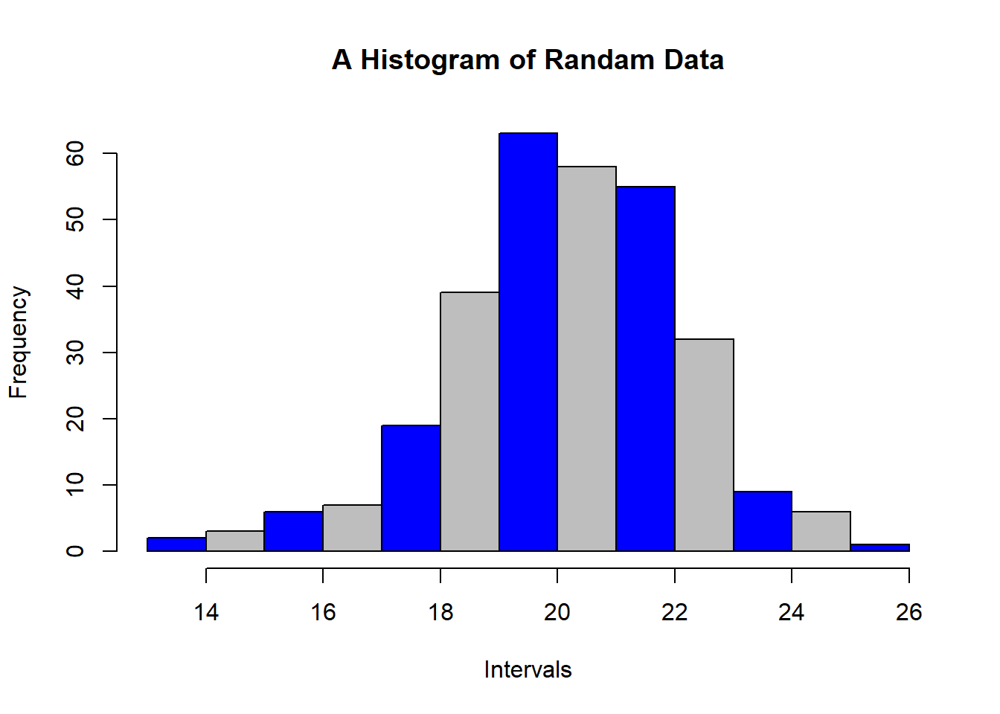

# Statistics {#stat}

## Preliminary Concepts 

### Statistics: What & How


### Topics

- What is statistics?
- How Statistics works?
- Probability and Statistics
- Application of Statistics
- Example Problem

### What is statistics?

Three Meanings

- Plural of statistic
- Table of data
- Methodology

### How Statistics works?

Takes a sample from a population. 


There are many sampling techniques.  

### Probability and Statistics

### Application of Statistics


### Examples{.la}
- Identification of unwanted spam messages in e-mail

- Segmentation of customer behavior for targeted advertising

- Forecasts of weather behavior and long-term climate changes

- Prediction of popular election outcomes

- Development of algorithms for auto-piloting drones and self-driving cars

- Optimization of energy use in homes and office buildings

- Projection of areas where criminal activity is most likely

- Discovery of genetic sequences linked to diseases

### Chapter Overview
- Definition
- Population and sample
- Variable and its types
- Scale of measurement
- Use of summation sign
- Main Discussion

### Definition

**Coxton and Crowden** 

*Statistics may be defined as the science of collection, presentation, analysis and interpretation of numerical data.*


### Mechanism
- Data Collection
- Organization
- Analysis
- Interpretation
- Presentation

### Population and Sample

**Population: A set of similar items or events which is of interest**
**Sample: Any subset of population**


- Finite
- Infinite

### Variable and Constant

- Variable
- Random Variable
- Constant

**Examples**

- Income of a regular employee
- Income of a freelancer
- Any unchanging number, e.g, $\pi$  
- Result of a die throw
- Father's name
- Mark of a subject
- GPA of a student

### Types of Variable{#bluetext}

- Qualitative
- Quantitative
- Discrete: Limited and pre-specified 
- Continuous: Can take on any values between any two given number

### Univariate, Multivariate

### Scale of Measurement

Describes nature of information within the values. 

- Nominal: Name of Insignificant number, e.g., color, Street no., 
- Ordinal: Order matters, e.g., rating
- Interval: Zero may not be zero, like temperature
- Ratio: Zero is 0; most variables fall in this category

### Examples

- Gender
- Religion
- Temperature
- Income group (Lower class, Low, Middle, High)
- Income
- Distance of stars
- Radius of screws
- Diameter of trees
- Room no. 

### Another Example

Match as per suitable scale

|Movie Rating        | Scale           | 
| ------------- |-------------:| 
| Poor, bad, good, excellent     | ratio      | 
| **In a scale of -10 to 10:** -10, -2, 0, 5, 10 | interval     | 
| Awesome, Amazing, Mind-blowing, Stunning | nominal |
| **In a scale of 0 to 10:** 0, 5, 8, 10 | ordinal      | 

### Operation with scales


### Shifting origin and scale

Say we have values, $x_1, x_2, \cdot \cdot \cdot , x_n$

- Origin shift: Adding/Subtracting 
- $y_1 = x_1-a \space or \space x_1+a$
- Scale shift: Multiplying/Division
- $y_1 = b \cdot x_1  \space or \space x_1/b$
- both: $y_i = \frac{x_i-a}{b}$

### Use of Summation sign

$$x_1 + x_2 + x_3 + x_4 = \sum_{i=1}^4 x_i$$

$$x_1 + x_2 + ... x_n = \sum_{i=1}^n x_i$$


$$x_1 + x_2 + ... x_{10} = ?$$


### Theorem 01

$$\sum_{i=1}^n bx_i=b \sum_{i=1}^n x_i$$


### Theorem 02
$$\sum_{i=1}^n (ax_i-b)=a \sum_{i=1}^n x_i-nb$$

### Quick tips

- $\sum_{i=1}^n a = na$
- Can you prove it? 

### Theorem 03

$$\sum_{i=1}^n (ax_i^2-bx_i+c)=a\sum_{i=1}^n x_i^2-b\sum_{i=1}^n x_i + nc$$

### Theorem 04

$$\sum_{i=1}^n (ax_i-by_i)=a\sum_{i=1}^n x_i - b \sum_{i=1}^n y_i$$

### Theorem 05

$$\sum_{i=1}^n (ax_i-b)^2=a^2 \sum_{i=1}^n x_i^2 - 2ab \sum_{i=1}^n x_i + nb^2$$

### Theorem 06

$$(\sum_{i=1}^n x_i)^2=\sum_{i=1}^n x_i^2 + \sum_{i \ne j}^n\sum x_ix_j$$

### Quick Tip

$$\prod_{i=1}^k x_i = x_1 \times x_2 \times \cdot \cdot \cdot \times x_n$$

### Theorem 07

$$\prod_{i=1}^k x_iy_i = (\prod_{i=1}^k x_i)(\prod_{i=1}^k y_i)$$

### Theorem 08
$$\sum_{i=1}^m \sum_{i=1}^n (x_i+y_j)=n\sum_{i=1}^m x_i + m \sum_{i=1}^n y_j$$


### Theorem 09
m$\sum_{i=1}^m \sum_{i=1}^n (x_iy_j)=(\sum_{i=1}^n x_i) (\sum_{i=1}^n y_j)$

### Example

Given 

$f_1=2, f_2 = 4, f_3 = 6$

$x_1 = -3, x_2 =7, x_3 = 4$

Find the values of 

i. $\sum f_ix_i$
ii. $\sum f_ix_i^2$
iii. $\sum f_i(x_i-5)^2$

### Textbook Exercise -01

13. Find the value of $\sum_{i=1}^{10} (x_i-4)$

where $\sum_{i=1}^{10} x_i = 20$


### Exercise-01

- 7. Discrete vs continuous variable
- 10. Prove 
$$\sum_{i=1}^k abx_i = ab \sum_{i=1}^k x_i$$

### Exercise -01
Prove 
$$\prod_{i=1}^n c =c^n$$

### Exercise -01
13. Find the value of 
$$\sum_{i=1}^{10} (x_i-4)$$
where
$$\sum_{i=1}^{10}=20$$

### Creative Question

Given below are the daily income and expense of ten workers.

<section>
  <table>
      <thead><tr>
            <th>Income (x)</th>
            <th>120</th>
            <th>130</th>
        </tr></thead>
        <tbody><tr>
            <td>Expense (y)</td>
            <td>80</td>
            <td>120</td>
        </tr>
</tbody>
    </table>
</section>


From above data, prove 

- $$\sum_{i=1}^{2}x_iy_i \ne (\sum_{i=1}^{2}x_i)(\sum_{i=1}^{2}y_j)$$
<br/>
- $$\sum_{i=1}^{2} \sum_{j=1}^{2}x_iy_j=(\sum_{i=1}^{2}x_i)(\sum_{j=1}^{2}y_j)$$
<br/>
- $$\sum_{i=1}^{2} \sum_{j=1}^{2}(x_i-y_j)=2 \times \sum_{i=1}^{2}x_i- 2 \times \sum_{j=1}^{2}y_j$$


### Creative Question -07

Given below are the daily income and expense of ten workers.

<section>
  <table>
      <thead><tr>
            <th>Income (x)</th>
            <th>120</th>
            <th>130</th>
            <th>88</th>
            <th>150</th>
            <th>175</th>
            <th>144</th>
            <th>180</th>
            <th>200</th>
            <th>160</th>
            <th>155</th>
        </tr></thead>
        <tbody><tr>
            <td>Expense (y)</td>
            <td>80</td>
            <td>120</td>
            <td>70</td>
            <td>100</td>
            <td>160</td>
            <td>114</td>
            <td>170</td>
            <td>195</td>
            <td>140</td>
            <td>131</td>
        </tr>
</tbody>
    </table>
</section>


a. What do you mean by bivariate data?
b. From above data, prove 

$$\sum_{i=1}^{10} \sum_{j=1}^{10}x_iy_j=(\sum_{i=1}^{10}x_i)(\sum_{j=1}^{10}y_j)$$
c. $$\sum_{i=1}^{10} \sum_{j=1}^{10}(x_i-y_j)=10 \times \sum_{i=1}^{10}x_i- 10 \times \sum_{j=1}^{10}y_j$$
d. Prove $$\sum_{i=1}^{10}x_iy_i \ne (\sum_{i=1}^{10}x_i)(\sum_{i=1}^{10}y_j)$$


## Collection, Presentation, and Organization of Data

### Types of Data

- Qualitative
- Quantitative

### Sources of Data

- Primary: Obtained directly (not collected from someone else)

- Secondary: Using pre-collected data from someone else/some organization

**Example** (Guess Types) 

- A researcher buys data from BMD to build a model of rainfall behavior
- A researcher runs an experiment to measure speed of light using a novel technique.
- A researcher makes use of the data generated by the one in example 2


### Method of Data Collection

- Direct personal Inquiry
- Indirect oral inquiry
- Mail
- Telephone etc.

- <div class ="bluetext">Each method has its own advantages and disadvantages;</div>

### Sources of Secondary Data

- Published: Scientific Journals, Newspapers etc.
- Unpublished: BBS, WHO, IMF, FAO, ICDDR,B

### Disadvantages of Secondary Data

- Purpose might be different
- Suitability
- Reliability
- Unit 

### Tabluation


### Data Classification

- Geographical
- Chronological
- Quantitative
- Qualitative

### Example

<section>
Geographical
  <table>
      <thead><tr>
            <th>Country</th>
            <th>Bangladesh</th>
            <th>USA</th>
        </tr></thead>
        <tbody><tr>
            <td>GDP(m)</td>
            <td>120</td>
            <td>500</td>
        </tr>
</tbody>
    </table>
</section>

<section>
*Chronological (Time series data)*
  <table>
      <thead><tr>
            <th>Year</th>
            <th>2015</th>
            <th>2016</th>
        </tr></thead>
        <tbody><tr>
            <td>GDP(m)</td>
            <td>120</td>
            <td>500</td>
        </tr>
</tbody>
    </table>
    </section>
    
<section>
*Quantitative Classification*
  <table>
      <thead><tr>
            <th>Income level</th>
            <th>40,000-50,000</th>
            <th>50,000-1,00,000</th>
        </tr></thead>
        <tbody><tr>
            <td>Frequency</td>
            <td>120</td>
            <td>34</td>
        </tr>
</tbody>
    </table>
    </section>

### Histogram

- Inclusive vs exclusive

What does it tell us


### Histogram Intervals

Can these intervals be readily used? 

(5-10); (10-15); (15-20)

(5-9); (10-14); (15-20)

If not, what should we do?

### Stem and Leaf

- key in stem and leaf plot 
- How to interpret stem and leaf plot 


```r
data <- c(16, 26, 12, 10, 27, 30, 14,  1, 25, 20)
stem(data)
```

```
## 
##   The decimal point is 1 digit(s) to the right of the |
## 
##   0 | 1
##   1 | 0246
##   2 | 0567
##   3 | 0
```

### How to interpret cf and rf

| Class | Frequency | Cumulative <br><br>Frequency (cf) | Relative <br><br>Frequency (rf) | Cumulative <br><br>Relative <br><br>Frequency (crf) |
|:-:|:-:|:-:|:-:|:-:|
| 30-35 | 4 | 4 | 0.09 | 0.09 |
| 35-40 | 10 | 14 | 0.23 | 0.32 |
| 40-45 | 20 | 34 | 0.45 | 0.77 |
| 45-50 | 8 | 42 | 0.18 | 0.95 |
| 50-55 | 2 | 44 | 0.04 | 1 |
|  | n=44 | n=44 |  |  |
    

### What Ogives tell us


### Bar vs Pie
- When to use which? 
- How to calculate angles? 
- Can we draw on 180 degrees?


### Choose Diagram
<div class="container">

<div class="col">
| year | Sales ($) |
|-|-|
| 1996 | 76 |
| 1997 | 58 |
| 1998 | 95 |
| 1999 | 85 |


</div>

<div class="col">
| Category | Cost(Tk.) |
|-|-|
| House rent | 10,000 |
| Utility Bill | 3,000 |
| Telecom | 2000 | 


</div>

</div>

### Bar Diagram vs Histogram


## Measures of Central Tendency

## Measures of Dispersion

## Moments, Skewness, and Kurtosis

### Central Moments

Central Moments: $\mu_r=\frac{\sum(x_i-\bar x)^r}{n}$

- $\mu_1=\frac{\sum(x_i-\bar x)}{n}=\frac{\sum x_i}{n}-\frac{n \bar x}{n}=\frac{n \bar x}{n}-\frac{n \bar x}{n}=0$

- $\mu_2=\frac{\sum(x_i-\bar x)^2}{n}=\sigma^2$
- $\mu_3=\frac{\sum(x_i-\bar x)^3}{n}$
- $\mu_4=\frac{\sum(x_i-\bar x)^4}{n}$
- For grouped data: $\mu_r=\frac{\sum f_i(x_i-\bar x)^3}{n}$


### Raw Moments

 $\mu_r=\frac{\sum(x_i-a)^r}{n}$; a is arbitrary number
 
## Correlation & Regression

### Why This Chapter is Important

<div class="container">
<div class="col">
We knew the universe is expanding from the knowledge of this chapter! 


</div>
<div class="col">
We learn in this chapter

- How to make bread without wheat/flour
- 
</div>
</div>

### Scatter Plot

 

### Sequence

Scatter Plot $\rightarrow$ Correlation $\rightarrow$ Regression

| Scatter Plot                                  | Correlation                  | Regression                                            |
|-----------------------------------------------|------------------------------|-------------------------------------------------------|
| Preliminary idea  about relationship          | Measures linear relationship | Measures Influence                                    |
| Either variable can be  independent (usually) | Does not clarify dependency  | Predicts dependent variable based on independent one. |

### Correlation

Linear relationship between two variables

Corrleation, $r = \frac{\sum (x_i - \bar x)(y_i - \bar y)}{\sqrt{\frac{\sum(x_i - \bar x)^2}{n}\frac{\sum(y_i - \bar y)^2}{n}}}; -1 \le r \le 1$

- $r = \frac{Cov(x,y)}{\sigma_x \sigma_y}$

- Compare with $$\sigma ^2 = \sum_{i=1}^n \frac{(x_i-\bar x)^2}{n}$$

### Scatter Plot And Correlation

<div class="container">
<div class="col">

</div>
<div class="col">
$r^2=R^2 \rightarrow$ Coefficient of determination

$R^2 = 80\% \rightarrow$ 80% of total variation in Y (say, brightness of stars) can be explained by X (say, distance).
</div>
</div>

### r: Estimating Mechanism

Make a table with columns for

- $(x_i-\bar x)$ 
- $(y_i-\bar y)$
- $(x_i-\bar x)(y_i-\bar y)$
- $(x_i-\bar x)^2$
- $(y_i-\bar y)^2$

Then sum them and put in the formula

### Example of r


### Features of r

- Independent of origin and scale
- $-1 \le r \le 1$
- $r = \sqrt{b_{yx} \cdot b_{xy}}$ (Concerning GM of regression coeff)
- $\frac{b_{yx}+b_{xy}}{2} \ge r$ (About AM)
- $r = 0 \rightarrow$ no linear relationship

### Rank Correlation


| Competitor| Judge_1| Judge_2| rank_1| rank_2|
|----------:|-------:|-------:|------:|------:|
|          1|      20|      15|      1|      4|
|          2|      18|      20|      3|      1|
|          3|      16|      14|      5|      5|
|          4|      17|      13|      4|      6|
|          5|      15|      18|      6|      2|
|          6|      12|      10|      9|      8|
|          7|      11|      17|     10|      3|
|          8|      19|       9|      2|      9|
|          9|      14|      12|      7|      7|
|         10|      13|       8|      8|     10|

Coefficient, $\rho = 1- \frac{6 \sum d_i^2}{n(n^2-1)}$

### Linear Equation/ Straight Lines

$Y = c + mx;$ m is slope c is intercept

$m = \frac{dy}{dx} = tan \theta=$ Change in y due to change in x. 

Bread without sour or wheat! 

### Purity of Coefficients

- $r = \frac{\sum (x_i - \bar x)(y_i - \bar y)}{\sqrt{\frac{\sum(x_i - \bar x)^2}{n}\frac{\sum(y_i - \bar y)^2}{n}}}$
- $\rho = 1- \frac{6 \sum d_i^2}{n(n^2-1)}$
- b or $\beta$

# Probability {#prob}
