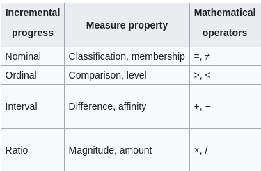
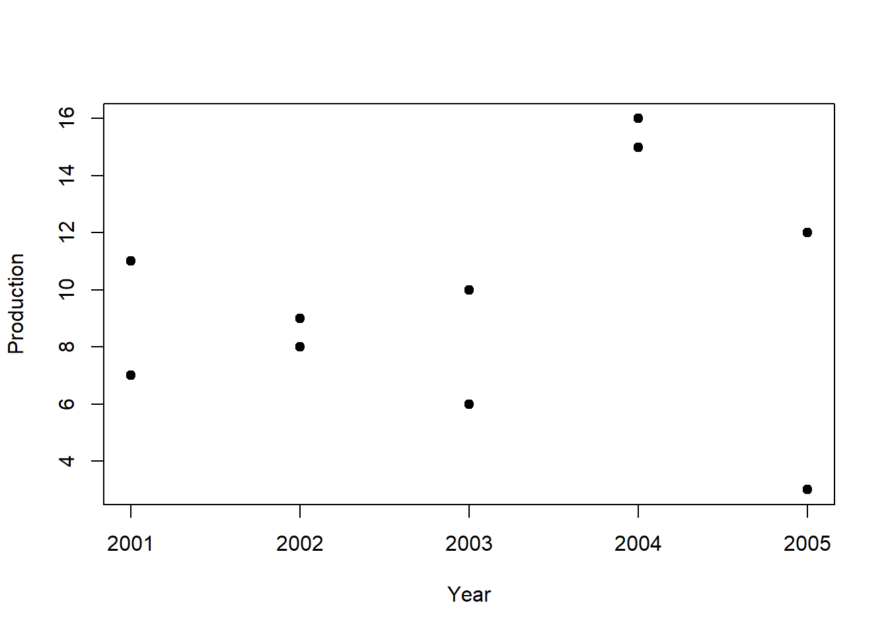

# (PART) Statistics {-} 

# Preliminary Concepts 

## Statistics: What & How


## Topics

- What is statistics?
- How Statistics works?
- Probability and Statistics
- Application of Statistics
- Example Problem

## What is statistics?

Three Meanings

- Plural of statistic
- Table of data
- Methodology

## How Statistics works?

Takes a sample from a population. 


There are many sampling techniques.  

## Probability and Statistics

## Application of Statistics


## Examples{.la}
- Identification of unwanted spam messages in e-mail

- Segmentation of customer behavior for targeted advertising

- Forecasts of weather behavior and long-term climate changes

- Prediction of popular election outcomes

- Development of algorithms for auto-piloting drones and self-driving cars

- Optimization of energy use in homes and office buildings

- Projection of areas where criminal activity is most likely

- Discovery of genetic sequences linked to diseases

## Chapter Overview
- Definition
- Population and sample
- Variable and its types
- Scale of measurement
- Use of summation sign
- Main Discussion

## Definition

**Coxton and Crowden** 

*Statistics may be defined as the science of collection, presentation, analysis and interpretation of numerical data.*


## Mechanism
- Data Collection
- Organization
- Analysis
- Interpretation
- Presentation

## Population and Sample

**Population: A set of similar items or events which is of interest**
**Sample: Any subset of population**


- Finite
- Infinite

## Variable and Constant

- Variable
- Random Variable
- Constant

**Examples**

- Income of a regular employee
- Income of a freelancer
- Any unchanging number, e.g, $\pi$  
- Result of a die throw
- Father's name
- Mark of a subject
- GPA of a student

## Types of Variable{#bluetext}

- Qualitative
- Quantitative
- Discrete: Limited and pre-specified 
- Continuous: Can take on any values between any two given number

## Univariate, Multivariate

## Scale of Measurement

Describes nature of information within the values. 

- Nominal: Name of Insignificant number, e.g., color, Street no., 
- Ordinal: Order matters, e.g., rating
- Interval: Zero may not be zero, like temperature
- Ratio: Zero is 0; most variables fall in this category

## Examples

- Gender
- Religion
- Temperature
- Income group (Lower class, Low, Middle, High)
- Income
- Distance of stars
- Radius of screws
- Diameter of trees
- Room no. 

## Another Example

Match as per suitable scale

|Movie Rating        | Scale           | 
| ------------- |-------------:| 
| Poor, bad, good, excellent     | ratio      | 
| **In a scale of -10 to 10:** -10, -2, 0, 5, 10 | interval     | 
| Awesome, Amazing, Mind-blowing, Stunning | nominal |
| **In a scale of 0 to 10:** 0, 5, 8, 10 | ordinal      | 

## Operation with scales


## Shifting origin and scale

Say we have values, $x_1, x_2, \cdot \cdot \cdot , x_n$

- Origin shift: Adding/Subtracting 
- $y_1 = x_1-a \space or \space x_1+a$
- Scale shift: Multiplying/Division
- $y_1 = b \cdot x_1  \space or \space x_1/b$
- both: $y_i = \frac{x_i-a}{b}$

## Use of Summation sign

$$x_1 + x_2 + x_3 + x_4 = \sum_{i=1}^4 x_i$$

$$x_1 + x_2 + ... x_n = \sum_{i=1}^n x_i$$


$$x_1 + x_2 + ... x_{10} = ?$$


## Theorems

1. $$\sum_{i=1}^n bx_i=b \sum_{i=1}^n x_i$$
2. $$\sum_{i=1}^n (ax_i-b)=a \sum_{i=1}^n x_i-nb$$
3. $$\sum_{i=1}^n (ax_i^2-bx_i+c)=a\sum_{i=1}^n x_i^2-b\sum_{i=1}^n x_i + nc$$
4. $$\sum_{i=1}^n (ax_i-by_i)=a\sum_{i=1}^n x_i - b \sum_{i=1}^n y_i$$
5. $$\sum_{i=1}^n (ax_i-b)^2=a^2 \sum_{i=1}^n x_i^2 - 2ab \sum_{i=1}^n x_i + nb^2$$
6. $$(\sum_{i=1}^n x_i)^2=\sum_{i=1}^n x_i^2 + \sum_{i \ne j}^n\sum x_ix_j$$
7. $$\prod_{i=1}^k x_iy_i = (\prod_{i=1}^k x_i)(\prod_{i=1}^k y_i)$$
8. $$\sum_{i=1}^m \sum_{i=1}^n (x_i+y_j)=n\sum_{i=1}^m x_i + m \sum_{i=1}^n y_j$$
9. m$\sum_{i=1}^m \sum_{i=1}^n (x_iy_j)=(\sum_{i=1}^n x_i) (\sum_{i=1}^n y_j)$

## Quick tips

- $\sum_{i=1}^n a = na$
- Can you prove it? 
- $$\prod_{i=1}^k x_i = x_1 \times x_2 \times \cdot \cdot \cdot \times x_n$$

## Example

Given 

$f_1=2, f_2 = 4, f_3 = 6$

$x_1 = -3, x_2 =7, x_3 = 4$

Find the values of 

i. $\sum f_ix_i$
ii. $\sum f_ix_i^2$
iii. $\sum f_i(x_i-5)^2$

## Textbook Exercise -01

13. Find the value of $\sum_{i=1}^{10} (x_i-4)$

where $\sum_{i=1}^{10} x_i = 20$


## Exercises

Discrete vs continuous variable

Prove 

$$\sum_{i=1}^k abx_i = ab \sum_{i=1}^k x_i$$
 
Prove 

$$\prod_{i=1}^n c =c^n$$

Find the value of 

$$\sum_{i=1}^{10} (x_i-4)$$

where

$$\sum_{i=1}^{10}=20$$

## Creative Questions

Given below are the daily income and expense of ten workers.

<section>
  <table>
      <thead><tr>
            <th>Income (x)</th>
            <th>120</th>
            <th>130</th>
        </tr></thead>
        <tbody><tr>
            <td>Expense (y)</td>
            <td>80</td>
            <td>120</td>
        </tr>
</tbody>
    </table>
</section>


From above data, prove 

- $$\sum_{i=1}^{2}x_iy_i \ne (\sum_{i=1}^{2}x_i)(\sum_{i=1}^{2}y_j)$$
<br/>
- $$\sum_{i=1}^{2} \sum_{j=1}^{2}x_iy_j=(\sum_{i=1}^{2}x_i)(\sum_{j=1}^{2}y_j)$$
<br/>
- $$\sum_{i=1}^{2} \sum_{j=1}^{2}(x_i-y_j)=2 \times \sum_{i=1}^{2}x_i- 2 \times \sum_{j=1}^{2}y_j$$


**Question 02**

Given below are the daily income and expense of ten workers.

<section>
  <table>
      <thead><tr>
            <th>Income (x)</th>
            <th>120</th>
            <th>130</th>
            <th>88</th>
            <th>150</th>
            <th>175</th>
            <th>144</th>
            <th>180</th>
            <th>200</th>
            <th>160</th>
            <th>155</th>
        </tr></thead>
        <tbody><tr>
            <td>Expense (y)</td>
            <td>80</td>
            <td>120</td>
            <td>70</td>
            <td>100</td>
            <td>160</td>
            <td>114</td>
            <td>170</td>
            <td>195</td>
            <td>140</td>
            <td>131</td>
        </tr>
</tbody>
    </table>
</section>


a. What do you mean by bivariate data?
b. From above data, prove 

$$\sum_{i=1}^{10} \sum_{j=1}^{10}x_iy_j=(\sum_{i=1}^{10}x_i)(\sum_{j=1}^{10}y_j)$$
c. $$\sum_{i=1}^{10} \sum_{j=1}^{10}(x_i-y_j)=10 \times \sum_{i=1}^{10}x_i- 10 \times \sum_{j=1}^{10}y_j$$
d. Prove $$\sum_{i=1}^{10}x_iy_i \ne (\sum_{i=1}^{10}x_i)(\sum_{i=1}^{10}y_j)$$


# Collection, Presentation, and Organization of Data

## Types of Data

- Qualitative
- Quantitative

## Sources of Data

- Primary: Obtained directly (not collected from someone else)

- Secondary: Using pre-collected data from someone else/some organization

**Example** (Guess Types) 

- A researcher buys data from BMD to build a model of rainfall behavior
- A researcher runs an experiment to measure speed of light using a novel technique.
- A researcher makes use of the data generated by the one in example 2


## Method of Data Collection

- Direct personal Inquiry
- Indirect oral inquiry
- Mail
- Telephone etc.

- <div class ="bluetext">Each method has its own advantages and disadvantages;</div>

## Sources of Secondary Data

- Published: Scientific Journals, Newspapers etc.
- Unpublished: BBS, WHO, IMF, FAO, ICDDR,B

## Disadvantages of Secondary Data

- Purpose might be different
- Suitability
- Reliability
- Unit 

## Tabluation


## Data Classification

- Geographical
- Chronological
- Quantitative
- Qualitative

## Example

<section>
Geographical
  <table>
      <thead><tr>
            <th>Country</th>
            <th>Bangladesh</th>
            <th>USA</th>
        </tr></thead>
        <tbody><tr>
            <td>GDP(m)</td>
            <td>120</td>
            <td>500</td>
        </tr>
</tbody>
    </table>
</section>

<section>
*Chronological (Time series data)*
  <table>
      <thead><tr>
            <th>Year</th>
            <th>2015</th>
            <th>2016</th>
        </tr></thead>
        <tbody><tr>
            <td>GDP(m)</td>
            <td>120</td>
            <td>500</td>
        </tr>
</tbody>
    </table>
    </section>
    
<section>
*Quantitative Classification*
  <table>
      <thead><tr>
            <th>Income level</th>
            <th>40,000-50,000</th>
            <th>50,000-1,00,000</th>
        </tr></thead>
        <tbody><tr>
            <td>Frequency</td>
            <td>120</td>
            <td>34</td>
        </tr>
</tbody>
    </table>
    </section>

## Histogram

- Inclusive vs exclusive

What does it tell us


## Histogram Intervals

Can these intervals be readily used? 

(5-10); (10-15); (15-20)

(5-9); (10-14); (15-20)

If not, what should we do?

## Stem and Leaf

- key in stem and leaf plot 
- How to interpret stem and leaf plot 


```r
data <- c(16, 26, 12, 10, 27, 30, 14,  1, 25, 20)
stem(data)
```

```
## 
##   The decimal point is 1 digit(s) to the right of the |
## 
##   0 | 1
##   1 | 0246
##   2 | 0567
##   3 | 0
```

## How to interpret cf and rf

| Class | Frequency | Cumulative <br><br>Frequency (cf) | Relative <br><br>Frequency (rf) | Cumulative <br><br>Relative <br><br>Frequency (crf) |
|:-:|:-:|:-:|:-:|:-:|
| 30-35 | 4 | 4 | 0.09 | 0.09 |
| 35-40 | 10 | 14 | 0.23 | 0.32 |
| 40-45 | 20 | 34 | 0.45 | 0.77 |
| 45-50 | 8 | 42 | 0.18 | 0.95 |
| 50-55 | 2 | 44 | 0.04 | 1 |
|  | n=44 | n=44 |  |  |
    

## What Ogives tell us


## Bar vs Pie
- When to use which? 
- How to calculate angles? 
- Can we draw on 180 degrees?


## Choose Diagram
<div class="container">

<div class="col">
| year | Sales ($) |
|-|-|
| 1996 | 76 |
| 1997 | 58 |
| 1998 | 95 |
| 1999 | 85 |


</div>

<div class="col">
| Category | Cost(Tk.) |
|-|-|
| House rent | 10,000 |
| Utility Bill | 3,000 |
| Telecom | 2000 | 


</div>

</div>

## Bar Diagram vs Histogram


# Measures of Central Tendency

## What is Central Tendency?


Why needed?

<div class="container">
<div class="col">

```
##                    mpg cyl  disp  hp drat
## Mazda RX4         21.0   6 160.0 110 3.90
## Mazda RX4 Wag     21.0   6 160.0 110 3.90
## Datsun 710        22.8   4 108.0  93 3.85
## Hornet 4 Drive    21.4   6 258.0 110 3.08
## Hornet Sportabout 18.7   8 360.0 175 3.15
## Valiant           18.1   6 225.0 105 2.76
## Duster 360        14.3   8 360.0 245 3.21
## Merc 240D         24.4   4 146.7  62 3.69
```

```
##       mpg             cyl           disp      
##  Min.   :14.30   Min.   :4.0   Min.   :108.0  
##  1st Qu.:18.55   1st Qu.:5.5   1st Qu.:156.7  
##  Median :21.00   Median :6.0   Median :192.5  
##  Mean   :20.21   Mean   :6.0   Mean   :222.2  
##  3rd Qu.:21.75   3rd Qu.:6.5   3rd Qu.:283.5  
##  Max.   :24.40   Max.   :8.0   Max.   :360.0
```
</div>
<div class="col">
- Summary
- Comparison
- A value to represent all
</div>
</div>

## Criteria for a Good Measure of Central Tendency{data-transition="convex"}

- Well-defined

> - Understandable
> - Considers all values
> - Suitable for further analysis
> - Not affected by sample fluctuation

## Measures (Averages)

- Arithmetic Mean (AM)
- Geometric Mean (GM)
- Harmonic Mean (HM)
- Median 
- Mode
- Partition Values (Quartiles, Deciles, Percentiles etc.)

## AM

$AM=\bar x=\frac{\sum x}{n}$

If there are frequencies or weights

$\bar x=\frac{\sum f_i x_i}{\sum f_i} \space or \space \frac{\sum w_i x_i}{w_i=n}$

## Find AM 


```
##  [1] 10 55 38 48 51 25 14 44 23 22
```

<div onclick="klikaj('rad1')"><span style="color: blue;">Answer (click to see)</span></div>
<div id="rad1" style="visibility: hidden">

```
## [1] 33
```
</div>
<script>
function klikaj(i) {
    document.getElementById(i).style.visibility='visible';
}
</script>

Find AM: 2, 2, 3, 3, 5, 5, 5, 8, 8, 9

There are 2 ways. 

$\bar x = \frac{2+2+...+9}{10}$
<div onclick="klikaj('rad2')"><span style="color: blue;">Answer (click to see)</span></div>
<div id="rad2" style="visibility: hidden">

```
## [1] 5
```
</div>
<script>
function klikaj(i) {
    document.getElementById(i).style.visibility='visible';
}
</script>

## Mean Using Frequency

For grouped data

| Working hours<br>(x) | Employee<br>(f) | fx |
|:-:|:-:|:-:|
| 2 | 2 | 4 |
| 3 | 2 | 6 |
| 5 | 3 | 15 |
| 8 | 2 | 10 |
| 9 | 1 | 9 |
|  | $\sum f =10$ | $\sum fx = 50$ |

$\therefore \bar x = \frac{\sum fx}{\sum f} =\frac{50}{10}=5$

## Freuency vs Weight

<div class="container">
<div class="col">
Suppose, different judges give different scores, but not all evaluation has same weight. 

| Judge | Rating<br>(x) | Weight<br>(w) | wx |
|:-:|:-:|:-:|:-:|
| 1 | 8 | 2 | 16 |
| 2 | 7 | 3 | 21 |
| 3 | 4 | 5 | 20 |
| 4 | 5 | 1 | 5 |
| 5 | 7 | 3 | 21 |
|  |  | $\sum w_i = 14$ | $\sum w_ix_i = 83$ |
</div>
<div class="col">
$\therefore \bar x = \frac{\sum w_ix_i}{\sum w_i}$


<div onclick="klikaj('rad3')"><span style="color: blue;">Answer (click to see)</span></div>
<div id="rad3" style="visibility: hidden">
$\frac{83}{14}$

```
## [1] 5.93
```
</div>
<script>
function klikaj(i) {
    document.getElementById(i).style.visibility='visible';
}
</script>
</div>
</div>

## Shortcut Method for AM

<div class="container">
<div class="col">
Calculate the mean in a smart way


```
## [1] 1009 1037 1047 1024 1013 1043
```
</div>
<div class="col">
<div onclick="klikaj('rad4')"><span>Show (click to see)</span></div>
<div id="rad4" style="visibility: hidden">
<small>Subtract a number from all, say 1020</small>

```
## [1] "The new values are"
```

```
## [1] -11  17  27   4  -7  23
```


```
## [1] "Mean of y is 8.83"
```

```
## [1] "Mean of x is 1028.83"
```
</div>
<script>
function klikaj(i) {
    document.getElementById(i).style.visibility='visible';
}
</script> 

</div>
</div>

## Shortcut Method Formula

<div class="container">
<div class="col">
Consider the values: 1005, 1010, 1015 

If 1000 is subtracted: 5, 10, 15

If again divided by 5: 1, 2, 3

Converted Mean = 2 

Original Mean = $2 \times 5 + 1000=1010$
</div>
<div class="col">
<div onclick="klikaj('rad5')"><span style="color: blue;">Show (click to see)</span></div>
<div id="rad5" style="visibility: hidden">
x = 1005, 1010, 1015 

> - a = 1000
> - c = 5 
> - y = 1, 2, 3
> - $\bar x = 2 \times 5 + 1000=1010 = a+\bar y \times c$
> - $\bar x = a+\frac{\sum y}{n} \times c$
</div>
<script>
function klikaj(i) {
    document.getElementById(i).style.visibility='visible';
}
</script>
</div>
</div>

## Properties of AM

- $\sum (x_i-\bar x)=0$; can you prove it? 

> - $\sum (x_i-\bar x)^2 \le \sum (x_i-a)^2, \space a \ne \bar x$
> - Depends on change of origin and scale?
> - $\bar x + \bar y =\frac{\sum x+\sum y}{n_x+n_y}$
> - Combined mean: $\bar x_c=\frac{n_1 \bar x_1+n_2 \bar x_2+...+n_k \bar x_k}{n_1+n_2+...+n_k}$
> - $AM\ge GM \ge HM$ & $AM \times HM = (GM)^2$
> - AM of first n natural numbers = $\frac{n+1}{2}$

## (Dis)advantages of AM

> - Well-defined
> - Less affected by sample fluctuation
> - Comparison among sets is easy
> - Uses all values
> - <span>Suitable for further analysis.<span>
> - <span style="color:red;">Affected by outliers

## Geometric Mean (GM)

$GM=(x_1 \times x_2 \times ... \times x_n)^{(1/n)}$ or
$GM=(x_1^{f_1} \times x_2^{f_2} \times ... \times x_n^{f_n})^{(1/\sum f_i)}$

Find GM: 2, 4, 6


<div onclick="klikaj('rad6')"><span style="color: blue;">Answer (click to see)</span></div>
<div id="rad6" style="visibility: hidden">
3.63
</div>
<script>
function klikaj(i) {
    document.getElementById(i).style.visibility='visible';
}
</script>

Try this one: 20020, 30080, 50086, 40130

## Concept of Logarithm

<small>

> "An admirable artifice which, by reducing to a few days the labour of many months, doubles the life of the astronomer, and spares him the errors and disgust inseparable from long calculations."
>
> --- Pierre-Simon Laplace 

</small>

- Log and Antilog
- $log_24=?$
- if $log_2x=3$, then x=?


## GM Easier Formula

x = 20020, 30080, 50086, 40130


> - log x = 9.9, 10.31, 10.82, 10.6
> - Mean of logx = $\frac{\sum logx}{n}$
> - Original Mean = $antilog(\frac{\sum logx}{n})$

<div onclick="klikaj('rad7')"><span style="color: blue;">Answer (click to see)</span></div>
<div id="rad7" style="visibility: hidden">
33168.96
</div>
<script>
function klikaj(i) {
    document.getElementById(i).style.visibility='visible';
}
</script>

## Calculate GM

<div class="container">
<div class="col">
| Marks | # Students |
|:-:|:-:|
| 10-12 | 4 |
| 12-14 | 5 |
| 14-16 | 3 |
| 16-18 | 5 |
| 18-20 | 7 |
| 20-22 | 2 |
</div>
<div class="col">
Make a table using these columns: $x_i, f_i, logx_i, f_ilogx_i$

> - $GM =antilog(\frac{\sum f_i logx_i}{\sum f_i})$

<div onclick="klikaj('rad8')"><span style="color: blue;">Answer (click to see)</span></div>
<div id="rad8" style="visibility: hidden">
15.5865773
</div>
<script>
function klikaj(i) {
    document.getElementById(i).style.visibility='visible';
}
</script>
</div>
</div>

## (Dis)advantages of GM

- [x] Not affected by outliers

  x = 5, 10, 15, 20, 100, 1000
  
  log(x) = 0.7, 1, 1.18, 1.3, 2, 3

- [x] Less affected by sample fluctuation
- [x] Suitable for further analysis
- [ ] <span style="color:ff1a1a;">What if one or some x = 0?</span>
- [ ] <span style="color:ff1a1a;">What if one or some x < 0? </span>


## Story of Oil Scam 

<div class="container">
<div class="col">

S = 150 km

$v_1=\space 10 km/h, v_2=\space 15 km/h, v_3=\space 20 km/h$

What is the average speed? 

> - $AM=\frac{10+15+20}{3}=15 \space km/h$
> - Think more fundamentally
> - $\sum S=3\times 150=450$
> - $t_1=15h, t_2=10h, t_3=7.5h$
> - $\bar v = \frac{\sum S}{\sum t}=\frac{450}{32.5}=13.84 \lt AM$


</div>
<div class="col">
> - $=\frac{450}{15+10+7.5}$
> - $=\frac{450}{\frac{150}{10}+\frac{150}{15}+\frac{150}{20}}$
> - $=\frac{450}{150(\frac{1}{10}+\frac{1}{15}+\frac{1}{20})}$
> - $=\frac{3}{\frac{1}{10}+\frac{1}{15}+\frac{1}{20}}$
> - $=\frac{3}{\frac{1}{v_1}+\frac{1}{v_2}+\frac{1}{v_3}}$
</div>
</div>

## Harmonic Mean

<div class="container">
<div class="col">
Formula: Reciprocal of Mean of $\frac{1}{x_i}$

Reciprocal of $\frac{\frac{1}{x_1}+\frac{1}{x_2}+...+\frac{1}{x_n}}{n}$

Thus, $HM = \frac{n}{\sum \frac{1}{x_i}}$

Calculate: 2, 4, 8

<div onclick="klikaj('rad9')"><span style="color: blue;">Answer (click to see)</span></div>
<div id="rad9" style="visibility: hidden">

3.43
</div>
<script>
function klikaj(i) {
    document.getElementById(i).style.visibility='visible';
}
</script>
</div>
<div class="col">
For grouped data

> - $HM=\frac{\sum f}{\sum \frac{f}{x}}$
> - For wighted data: $\frac{\sum w}{\sum \frac{w}{x}}$
</div>
</div>

## Why and When HM

- When there are rates associated, say speed, and numerator is fixed. 
- $Speed, v = \frac{S}{t}$; HM if S is fixed
- Example: A man travels 120 km the first day at 12 kph, the same distance at 10 kph on the 2nd day, and at 8 kph on the 3rd day. Find his average speed. 

## Wighted AM vs Weighted HM

Suppose, a bus travels 10 km at 10 kph, another 15 km at 20 kph, and another 20 km at 25 kph. What is the average speed. 

HM $\rightarrow$ consider distances as weights

AM $\rightarrow$ consider times as weights

Time, $t=\frac d v=$ 1, 0.75, 0.8


> - $WHM = \frac{10+15+20}{\frac{10}{10}+\frac{15}{20}+\frac{20}{25}}$=17.65
> - $WAM = \frac{1\times 10 + 0.75 \times 20 + 0.80 \times 25}{1+0.75+0.80}$ = 17.65
> - True mean, $\bar v=\frac{\sum d}{\sum t}=\frac{45}{2.55}=$ 17.65

## HM Example 2

- A passerby travels 10 km at 20 kph, 5 km at 15 kph, and 4 km at 12 kph. What is the average speed? (Use weighted HM)

- Here, distances are different. Consider them weights. 

> - $HM=\frac{w_1+w_2+w_3}{\frac{w_1}{x_1}+\frac{w_2}{x_2}+\frac{w_3}{x_3}}$


> - HM = 16.286

## Quadratic Mean

$QM=\sqrt{\frac{x_1^2+x_2^2+...+x_n^2}{n}}=\sqrt{\frac{\sum x_i^2}{n}}$

> - Also known as Root mean square
> - More at: https://en.wikipedia.org/wiki/Root_mean_square#Uses
> - For grouped data? 

## Partition Values

## Find medians

x = 4,5,6,8,9,11,16

y = 4,5,6,8,9,11,16,19


> - Median of x is 8
> - Median of y is 8.5
> - Formula for odd n = $\frac{n+1}{2}th \space value$
> - Formula for even n = $\frac{\frac{n}{2}th+(\frac{n}{2}+1)th}{2}$


## Dis(advantages) of Median

- Unaffected by outliers (extreme values)
- Graphically estimable
- Affected by sample fluctuation
- Not based on all values
- Not suitable for further mathematical analysis 

## Quartiles, Deciles, and Percentiles

$Q_1= \frac{(n+1)}{4}th \space$

$Q_2, Q_3=?$

Find $Q_1, Q_2, Q_3$ 

X = 4, 6, 7, 10, 12, 13, 14, 15, 16, 17, 19

> - 4, 8.5, 13, 12.0909091, 15.5, 19
> - What are the formulae for Deciles ($D_i$ and $P_i$)

## General Formula for Partition Values

<div class="container">
<div class="col">
For odd n, 

$A_i= \frac{i \times (n+1)}{k}th \space value$ 
</div>
<div class="col">
For even n, 

$A_i=\frac{\frac{i \times n}{k}th+(\frac{i\times n}{k}+1)th}{k}$
</div>
</div>

where, k = no. of partitions

For median, for example, k = 2. 

> - What if we divide the data set into 20 segments? 


## Find Deciles and Percentiles

X = 4, 6, 7, 10, 12, 13, 14, 15, 16, 17, 19

Find $D_3, D_8, P_{17}, P_{56}, P_{93}$

## Averages from Grouped Data

<div class="container">
<div class="col">
|  Age  | # Employees | CF |
|:-----:|:-----------:|----|
| 20-24 |      40     |    |
| 25-29 |      60     |    |
| 30-34 |     200     |    |
| 35-39 |     180     |    |
| 40-44 |     150     |    |
| 45-49 |     110     |    |
| 50-54 |     175     |    |
| 55-59 |      60     |    |
| 60-64 |      25     |    |
</div>
<div class="col">
Median: $Me = L + \frac{\frac{n}{2}-F_c}{f_m}\times c$

Mode: $M_o=L+\frac{\Delta_1}{\Delta_1+\Delta_2}\times c$

Quartiles: $Q_i = L + \frac{\frac{in}{4}-F_c}{f}\times c$

Find AM, Me, Mo, Q, and $P_{30}$
</div>
</div>

## Partition Values from Graph

- Draw an Ogive
- Draw a straight line parallel to X-axis at the point $\frac n 2$ of Y-axis. - Draw a perpendicular on X-axis from the intersection point.


## Comparison of Averages

| Property | AM | GM | HM | Median | Mode |
|-|-|-|-|-|-|
| Formula | Easy to<br>understand | <strike><br>Easy<br></strike> | <strike><br>Easy<br></strike> | <strike><br>Easy<br></strike> | <strike><br>Easy<br></strike> |
| Considers<br>values | All | All | All | Middle term(s) | Highest frequency |
| Computaion | Easy | <strike><br>Easy<br></strike> | <strike><br>Easy<br></strike> | Easy | Easy |
| Effect of<br>Outliers | Highly affected | Less affected<br>than AM | Less affected<br>than GM | Unaffected | Can be highly<br>affected |
| Effect of Sampling<br>Flcutuation | Less affected | Less affected | Less affected | Can be highly<br>affected | Can be highly<br>affected |
| Suitability for <br>further analysis | Possible | Possible | Possible | <strike><br>Possible<br></strike> | <strike><br>Possible<br></strike> |

## When AM = GM = HM

If $x_1=x_2=x_3$; prove it 

## Theorems

1. $$\sum_{i=0}^n (x_i-\bar x)=0$$
2. $$\sum_{i=0}^n f_i(x_i-\bar x)=0$$
3. $$\sum_{i=1}^n (x_i-\bar x)^2 \lt \sum_{i=1}^n (x_i-a)^2; a\ne\bar x$$ 
4. $$\sum_{i=1}^n f_i(x_i-\bar x)^2 \lt \sum_{i=1}^n f_i(x_i-a)^2; a\ne\bar x$$ 
5. (AM~origin & scale)

	Prove that AM depends on origin and scale
	Use frequency as well i.e, 

	- $$\bar x=\frac {\sum_{i=1}^nx_i}{n}$$ 
	- $$\bar x=\frac {\sum_{i=1}^n f_ix_i}{n}$$ 


6. If the GM of $n_1$ va;ues is $G_1$, and of $n_2$ values is $G_2$, show GM of $n_1+n_2$ values is $G=\sqrt{G_1G_2}$
7. For two non-zero positive numbers, prove $AM \ge GM \ge HM$

	<small>

	<div class="container">
	<div class="col">

	Let, the numbers be a, b

	$\therefore AM = \frac{a+b}{2}$ 

	$GM = \sqrt{ab}$ 

	$HM = \frac{2}{\frac 1 a +\frac 1 b}$ 
	</div>

	<div class="col">
	We know, 
	\begin{eqnarray}
	&  &(a-b)^2\ge 0    \nonumber \\
	& \Rightarrow & (a+b)^2-4ab \ge 0    \nonumber \\
	& \Rightarrow & (a+b)^2 \ge 4ab   \nonumber \\
	& \Rightarrow & (a+b) \ge 2 \sqrt{ab}   \nonumber \\
	& \Rightarrow & \frac{a+b} 2 \ge \sqrt{ab}   \nonumber \\
	& \Rightarrow & AM \ge GM   \nonumber \\
	\end{eqnarray}
	</div>
	<div class="col">
	Similarly, 
	\begin{eqnarray}
	&  &(\frac{1}{a}-\frac{1}{b})^2\ge 0    \nonumber \\
	& \Rightarrow & (\frac{1}{a}+\frac{1}{b})^2 -4 \cdot \frac 1 a \cdot \frac 1 b\ge 0    \nonumber \\
	& \Rightarrow & (\frac{1}{a}+\frac{1}{b})^2\ge \frac 4 {ab}   \nonumber \\
	& \Rightarrow & (\frac{1}{a}+\frac{1}{b}) \ge \frac 2 {\sqrt{ab}}  \nonumber \\
	& \Rightarrow & \sqrt{ab}(\frac{1}{a}+\frac{1}{b}) \ge 2   \nonumber \\
	& \Rightarrow & \sqrt{ab} \ge \frac{2}{(\frac{1}{a}+\frac{1}{b})}   \nonumber \\
	& \Rightarrow & GM \ge HM   \nonumber \\
	\end{eqnarray}
	</div>
	</div>
	</small>

	
8. For two non-zero positive numbers, $AM \times HM =(GM)^2$
9. Mean and Median of first n natural numbers are $\frac {n+1} 2$ 
10. If $\bar x_1$ and $\bar x_2$ are means of 2 data sets of sizes $n_1$ and $n_2$, respectively, the combined mean is $\bar x_c=\frac{n_1 \bar x_1+n_2 \bar x_2}{n_1+n_2}$
11. If $u=x+y, \bar u=\bar x + \bar y$; if $n_1=n_2=n$

	Given $u=x+y$

	\begin{eqnarray}
	\bar u &=&  \frac{\sum u}{n}   \nonumber \\
	&=& \frac{\sum (x+y)}{n}   \nonumber \\
	&=& \frac{\sum x}{n}+  \frac{\sum y}{n}   \nonumber \\
	&=& \bar x + \bar y   \nonumber \\
	\end{eqnarray}

12. For equal number of observations, GM of two variables is equal to the product of their individual means. 
13. $GM=Antilog(\frac{\sum \log x_i}{n})$ or $Antilog(\frac{\sum f_i \log x_i}{\sum f_i})$ 
14.If $y = a + bx, \bar y = a + b \bar x$
15. If $z_i=ax_i+by_i, \bar z=a \bar x + b \bar y$

## Example Problems

AM and GM of two positive numbers are 25 and 15, respectively. Find HM and the numbers. 
<div class="container">
<div class="col">
<div onclick="klikaj('ep1.1')"><span>Solution (i) (click to see)</span></div>
<div id="ep1.1" style="visibility: hidden">
We know, $AM \times HM=(GM)^2$

> - Thus, $HM=$ 9
</div>
<script>
function klikaj(i) {
    document.getElementById(i).style.visibility='visible';
}
</script>
</div>
<div class="col">
<div onclick="klikaj('ep1.2')"><span>Solution (ii) (click to see)</span></div>
<div id="ep1.2" style="visibility: hidden">
If the numbers are $a, b; a>b$
$\frac{a+b}{2}=25$ and $\sqrt{ab}=15$

Thus, $a+b=50$, and $ab=15^2=225$

$\therefore (a-b)^2=(a+b)^2-4ab$
$\Rightarrow a-b =$ 40

> - Thus, a = 45, b = 5
</div>
<script>
function klikaj(i) {
    document.getElementById(i).style.visibility='visible';
}
</script>
</div>
</div>

** Example Problem 15**

The mean of 200 numbers was 50. Later it was revealed that two observations were incorrectly given as 92 and 8, instead of 192 and 88, respectively. Find the correct mean. 

<div onclick="klikaj('ep15')"><span>Solution(click to see)</span></div>
<div id="ep15" style="visibility: hidden">
$n=200, \bar x = 200$

$\therefore$ Incorrect total, $\sum x = n \times \bar x=$ 10000

Correct total, $\sum x'=10,000-92-8+192+88=$ 10180

Correct mean, $\bar x'=\frac{10180}{200}=$ 50.9
</div>
<script>
function klikaj(i) {
    document.getElementById(i).style.visibility='visible';
}
</script>


** Example Problem** 

If $\sum f_i(x_i-k)=0$, what is the value of `k`?

<div onclick="klikaj('ep22')"><span>Answer (click to see)</span></div>
<div id="ep22" style="visibility: hidden">
Given $\sum f_i(x_i-k)=0$

$\Rightarrow \sum f_i x_i - k \sum f_i =0$

$\Rightarrow k = \frac{\sum f_i x_i}{\sum f_i}$

> - = $\bar x$
</div>
<script>
function klikaj(i) {
    document.getElementById(i).style.visibility='visible';
}
</script>


# Measures of Dispersion 

# Moments, Skewness, and Kurtosis

## Central Moments

Central Moments: $\mu_r=\frac{\sum(x_i-\bar x)^r}{n}$

- $\mu_1=\frac{\sum(x_i-\bar x)}{n}=\frac{\sum x_i}{n}-\frac{n \bar x}{n}=\frac{n \bar x}{n}-\frac{n \bar x}{n}=0$

- $\mu_2=\frac{\sum(x_i-\bar x)^2}{n}=\sigma^2$
- $\mu_3=\frac{\sum(x_i-\bar x)^3}{n}$
- $\mu_4=\frac{\sum(x_i-\bar x)^4}{n}$
- For grouped data: $\mu_r=\frac{\sum f_i(x_i-\bar x)^3}{n}$


## Raw Moments

 $\mu_r=\frac{\sum(x_i-a)^r}{n}$; a is arbitrary number
 
# Correlation & Regression

## Why This Chapter is Important

<div class="container">
<div class="col">
We knew the universe is expanding from the knowledge of this chapter! 


</div>
<div class="col">
We learn in this chapter

- How to make bread without wheat/flour
- 
</div>
</div>

## Scatter Plot

 

## Sequence

Scatter Plot $\rightarrow$ Correlation $\rightarrow$ Regression

| Scatter Plot                                  | Correlation                  | Regression                                            |
|-----------------------------------------------|------------------------------|-------------------------------------------------------|
| Preliminary idea  about relationship          | Measures linear relationship | Measures Influence                                    |
| Either variable can be  independent (usually) | Does not clarify dependency  | Predicts dependent variable based on independent one. |

## Correlation

Linear relationship between two variables

Corrleation, $r = \frac{\sum (x_i - \bar x)(y_i - \bar y)}{\sqrt{\frac{\sum(x_i - \bar x)^2}{n}\frac{\sum(y_i - \bar y)^2}{n}}}; -1 \le r \le 1$

- $r = \frac{Cov(x,y)}{\sigma_x \sigma_y}$

- Compare with $$\sigma ^2 = \sum_{i=1}^n \frac{(x_i-\bar x)^2}{n}$$

## Scatter Plot And Correlation

<div class="container">
<div class="col">

</div>
<div class="col">
$r^2=R^2 \rightarrow$ Coefficient of determination

$R^2 = 80\% \rightarrow$ 80% of total variation in Y (say, brightness of stars) can be explained by X (say, distance).
</div>
</div>

## r: Estimating Mechanism

Make a table with columns for

- $(x_i-\bar x)$ 
- $(y_i-\bar y)$
- $(x_i-\bar x)(y_i-\bar y)$
- $(x_i-\bar x)^2$
- $(y_i-\bar y)^2$

Then sum them and put in the formula

## Example of r


## Features of r

- Independent of origin and scale
- $-1 \le r \le 1$
- $r = \sqrt{b_{yx} \cdot b_{xy}}$ (Concerning GM of regression coeff)
- $\frac{b_{yx}+b_{xy}}{2} \ge r$ (About AM)
- $r = 0 \rightarrow$ no linear relationship

## Rank Correlation


| Competitor| Judge_1| Judge_2| rank_1| rank_2|
|----------:|-------:|-------:|------:|------:|
|          1|      20|      15|      1|      4|
|          2|      18|      20|      3|      1|
|          3|      16|      14|      5|      5|
|          4|      17|      13|      4|      6|
|          5|      15|      18|      6|      2|
|          6|      12|      10|      9|      8|
|          7|      11|      17|     10|      3|
|          8|      19|       9|      2|      9|
|          9|      14|      12|      7|      7|
|         10|      13|       8|      8|     10|

Coefficient, $\rho = 1- \frac{6 \sum d_i^2}{n(n^2-1)}$

## Linear Equation/ Straight Lines

$Y = c + mx;$ m is slope c is intercept

$m = \frac{dy}{dx} = tan \theta=$ Change in y due to change in x. 

Bread without sour or wheat! 

## Purity of Coefficients

- $r = \frac{\sum (x_i - \bar x)(y_i - \bar y)}{\sqrt{\frac{\sum(x_i - \bar x)^2}{n}\frac{\sum(y_i - \bar y)^2}{n}}}$
- $\rho = 1- \frac{6 \sum d_i^2}{n(n^2-1)}$
- b or $\beta$

To be continued ...

# Time Series

## What is Time Series Data?

<div class="container">
<div class="col">
Data arranged chronologically

$Y_t = f(t); t = t_1, t_2, t_3, \cdots, t_n$
</div>
<div class="col">
Example


| Year| Production|
|----:|----------:|
| 2001|         11|
| 2002|          9|
| 2003|         10|
| 2004|         16|
| 2005|         12|
</div>
</div>

## Components of Time Series

Four Components

> -  Trend (increase/decrease)
> - Seasonal variation
> - Cyclic variation
> - Irregular/Random variation

## Uses

> - Analyze past behavior
> - Forecasting
> - Comparison by time/place
> - Segregation of components
> - Performance measure

## Symbols

$Y_t =$ Values of series at time t

$T_t =$ Trend

$S_t =$ Seasonal 

$C_t =$ Cyclic

$R_t =$ Random/irregular

## Models

<div class="container">
<div class="col">
**Additive Model**

$Y_t = T_t + S_t + C_t + R_t$

- $C_t$ and $S_t$ can be $\pm$ve
- $R_t$ can also be $\pm$ve, but in the long run, $\sum R_t = 0$
</div>
<div class="col">
**Multiplicative Model**

> - $Y_t = T_t \times S_t \times C_t \times R_t$
> - $S_t, C_t, R_t$ refer to deviation from unit
> - $S_t$ equals unity in 1 year, $C_t$ in a cycle, and GM of $R_t$ is unity (1). 
</div>
</div>

## Comparison of Models

- Components in additive models are independent. 
- In multiplicative models, components are interwined.

## Measuring Trend

## Graphical/Free-hand Method

<div class="container">
<div class="col">


| Year| Production|
|----:|----------:|
| 2001|         11|
| 2002|          9|
| 2003|         10|
| 2004|         16|
| 2005|         12|
| 2001|          7|
| 2002|          8|
| 2003|          6|
| 2004|         15|
| 2005|          3|

</div>
<div class="col">

</div>
</div>

## Sem-average

<div class="container">
<div class="col">

| Year| Production|
|----:|----------:|
| 2001|         11|
| 2002|          9|
| 2003|         10|
| 2004|         16|
| 2005|         12|
| 2001|          7|
| 2002|          8|
| 2003|          6|
| 2004|         15|
| 2005|          3|
</div>
<div class="col">
**Steps**

1. Separate the data into two equal parts (if odd-numbered, omit middle-most)
2. Estimate averages of each group
3. Put these two values on the scatter plot and extend
</div>
</div>

## Moving Average

| Year | Production |   3-Yearly Moving  Average  |
|:----:|:----------:|:---------------------------:|
| 2001 |     412    |              NA             |
| 2002 |     438    | ${412+438+446}\over{3}=432$ |
| 2003 |     446    |  $\frac{438+446+454}3=446$  |
| 2004 |     454    |             457             |
| 2005 |     470    |             469             |
| 2006 |     483    |  $\frac{470+483+490}3=481$  |
| 2007 |     490    |              NA             |

<div class="container">
<div class="col">

</div>
<div class="col">

</div>
</div>
