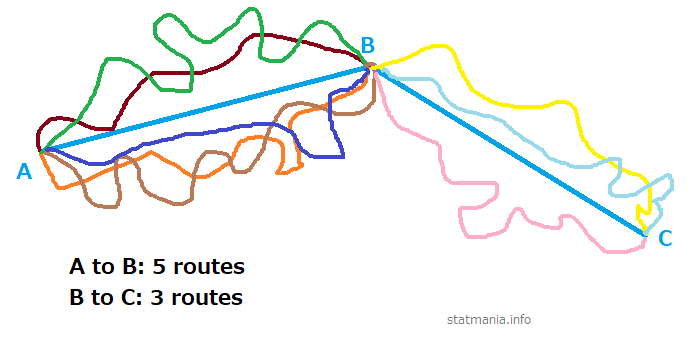

# (PART) Probability {-} 

# Introduction to Probability

## Important concepts

> - Trial 
> - Experiment 
> - Random experiment
> - Sample space
> - event

## Three Definitions 

### Classical

$P (A) = \frac{n(A)}{n(S)}$

### Relative frequency

$$\lim_{n(S) \to \infty} \frac{n(A)}{n(S)}$$

### Axiomatic

Three axioms

Say, S is sample space and A is an event 

> - $0 \le P (A) \le 1$ (NOT $P(A) \ge 0$)
> - At least one of S will occur. P (S) = 1; Certain event. 
> - $P(A_1 U A_2 U ... U A_n)=P(A_1) + P(A_2) + ... + P(A_n)$ or  
> - $$P\left(\cup _{i=1}^{\infty }E_{i}\right)=\sum _{i=1}^{\infty }P(E_{i})$$

## Permutaion vs Combination

There are 15 cricketers in BD preliminary team. We got to select  11. C or P? 

> - Where is P used? 

## Dependency and Mutual Exclusivity

If two events $A$ and $B$ do not affect each other, they are called independent events. 

Let the events,

$A$ = Head appears when a coin is tossed

$B$ = Head appears when the coin is tossed again

These two events are independent, assuming the first toss does not alter the properties of the coin. 

Consider another set of two events:

$A$ = An ace appears when a card is drawn from a deck of 52 cards

$B$ = An ace appears if another card is drawn from the same deck, without putting the first card back. 

In this case the $P(B)$ will depend on $A$. 

Clearly, $P(A) = \frac 4 {52}$, but $P(B) = \frac 4 {51}$

If event $B$ did not depend event $A$, $P(B)$ too would be $\frac 4 {52}$, so it turns out $B$ depends on $A$. 

Theoretically speaking, dependent events are described the Bayes\' Theorem. If the event A depends on B, the the probability that A would happen if B happens is:

$P(A|B) = \frac{P(A \cap B)}{P(B)}$

$\Rightarrow P(A \cap B) = P(A|B) \times P(B)$

Now, if A does not really depend on B, then $P(A|B) = P(A)$, i.e., $A$ does not really care about $B$. 

Thus, if A and B are independent, $P(A \cap B) = P(A) \times P(B)$

Now, two events are called **mutually exclusive** when occurrence of one prevents other from happening, i.e,, they cannot occur simultaneously.  

If a die is thrown once, one of 1-6 will face up. If 1 appears, 2, or any other number from the rest cannot appear. Thus, Getting these numbers are mutually exclusive or disjoint events. Mutually exclusive sets do not have any common elements between themselves. 

Now, merging the concepts of dependency and mutual exclusivity is tricky. 

**Events cannot be independent and mutually exclusive simultaneously**, although the opposite seems intuitive. 

Common sense tells us *events which are mutually exclusive should be independent*, **but common sense is mistaken here.** 

Consider throwing a die. 

$S = \{1, 2, 3, 4, 5, 6\}$

Let, $A = \{1, 3, 5\}$ and $B = \{2, 4, 6\}$

There are no common elements, so events A and B are disjoint or mutually exclusive. 

It might seem, since the sets $A$ and $B$ have no common elemts, they are independent. 

Let us check mathematically:

From the given information, $P(A)= \frac 1 2, P(B) = \frac 1 2$

$P(A \cap B) = 0$ (since there are no common elements) 

And $P(A) \cdot P(B) = \frac 1 2 \cdot \frac 1 2 = \frac 1 4$

$\therefore P(A \cap B) \ne P(A) \cdot P(B)$, which proves event $A$ and event $B$ are not independent, a result which is counterintuitive. Upon second thought, however, it becomes intuitive. First note that $A$ and $B$ both belong to $S$. That they are disjoint means one cannot happen if the other happens, which means one is preventing another from happening, a behavior which can explained as dependency: one event cares about the other, i.e., if one happens, another refrains from happening. 

Mathematically,

$P(A|B) = \frac{P(A \cap B)}{P(B)} = \frac 0 {\frac 1 2} = 0$

In summary, reducing the probability of another event to zero is also a kind of influence, i.e., 

Now, let us see another example, where we have two non mutually exclusive sets. 

Let, $A = \{1, 3, 5\}$ and $B = \{1, 3, 4, 6\}$ (observe that there are some common elements) 

$P(A) = \frac 1 2, P(B) = \frac 4 6 = \frac 2 3$

$P(A \cap B) = \frac 2 6 = \frac 1 3$, and $P(A) \cdot P(B) = \frac 1 2 \cdot \frac 2 3 = \frac 1 3$

$\therefore P(A \cap B) = P(A) \cdot P(B)$, which proves A and B are independent. 

Using Bayes theorem, 

$P(A|B) = \frac{P(A \cap B)}{P(B)} = \frac{\frac 1 3}{\frac 2 3} = \frac 1 2 = P(A)$

$\therefore P(A|B) = P(A)$, which means $A$ does not what happens to $B$. 

Thus, if A and B have common elements, they may be independent of each other. But are they always? No, because it may happen that $P(A \cap B) \ne P(A) \cdot P(B)$, in which case they are dependent events.

So we have three possible cases when we combine depend with disjointness:

1. If two events have no common sample points (elements) (mutually exclusive or disjoint), they are always dependent events. 
2. If two sets have some common sample points, they may be dependent or independent. 
	a. Independet if $P(A \cap B) = P(A) \cdot P(B)$
	b. Dependet if $P(A \cap B) \ne P(A) \cdot P(B)$

Now, let us prove the relationship theoretically. 

Let $P(A) \ne 0, P(B\ne 0$ 

If $A$ and $B$ are independent, $P(A \cap B) = P(A) \cdot P(B)$

Since $P(A)$ and $P(B)$ are both non-zero numbers, $P(A) \cdot P(B) \ne 0$

$\therefore P(A \cap B) \ne 0$ , i.e., there are some common elements between the sets. 

Thus, independent events cannot be mutually exclusive, i.e., they would always have common elements. 

Finally, in general, we can say: **Mutually exclsuive events are dependent events, while non mutually exclusive events may or may not be dependent.** 

In other word, ***all mutually exclsuive events are dependent events, but not all dependent events are mutually exclusive.*** 

## Types of Problems

- Miscellaneous  
- Coin
- Die
- Playing Card
- At Once vs One by One 
- Box
- Conditional 
- Set Theoretic 
- Digit 

## Miscellaneous

### Misc Problem #01

What is the probability that in a leap year, there are 53 Fridays? 

> - In a leap year, there are 366 days, i.e., 52 weeks and 2 days. In each week is a Fridays, so there are no less than 52 Fridays. The remaining two days could be:
> - (Sat, Sun); (Sun, Mon); (Mon, Tue); (Tue, Wedn); (Wedn, Thu); (Thu, Fri); (Fri, Sat) = 7
> - Total possible outcome = 7 and favorable outcomes = 2
> - $P = \frac{2}{7}$

### Misc Problem #02

Out of the natural numbers 10 through 30, a number is chosen randomly; what is the probability that the number is 

i. a prime number
ii. a prime number or multiple of 5
iii. a prime number or an odd number
iv. not a perfect square

### Misc Problem #03

What is the probability that the product of three positive integers chosen from 1 through 100 is an even number?  

> - Three possible cases
> - All three are even
> - Two odd and one even number
> - Two even and one odd
> - $P=\frac{^{50}C_3}{^{100}C_3}+...$
> - 0.88

## Coin And Die Problem

### Tossing A Coing Twice

<table class="tg">
<thead>
  <tr>
    <th class="tg-c3ow" colspan="2" rowspan="2"></th>
    <th class="tg-7btt" colspan="2">First Coin</th>
  </tr>
  <tr>
    <td class="tg-c3ow">H</td>
    <td class="tg-c3ow">T</td>
  </tr>
</thead>
<tbody>
  <tr>
    <td class="tg-7btt" rowspan="2">Second Coin</td>
    <td class="tg-c3ow">H</td>
    <td class="tg-rvyq">HH</td>
    <td class="tg-rvyq">HT</td>
  </tr>
  <tr>
    <td class="tg-c3ow">T</td>
    <td class="tg-rvyq">TH</td>
    <td class="tg-rvyq">TT</td>
  </tr>
</tbody>
</table>

***Tossing a coin twice is equivalent to tossing two coins at once***

What is the probability that 

1. The Head appears at the first draw?
2. At least one Head appears?
3. Less than two Heads appear?
4. Only Tails appears?

### Flipping A Coin Thrice

<table class="tg">
<thead>
  <tr>
    <th class="tg-2k8k" colspan="2" rowspan="2"></th>
    <th class="tg-2k8k" colspan="4">First Two Flips</th>
  </tr>
  <tr>
    <td class="tg-2k8k">HH</td>
    <td class="tg-2k8k">HT</td>
    <td class="tg-wrlh">TH</td>
    <td class="tg-wrlh">TT</td>
  </tr>
</thead>
<tbody>
  <tr>
    <td class="tg-2k8k" rowspan="2">Third Flip</td>
    <td class="tg-2k8k">H</td>
    <td class="tg-x10j">HHH</td>
    <td class="tg-x10j">HHT</td>
    <td class="tg-chpi">HTH</td>
    <td class="tg-chpi">HTT</td>
  </tr>
  <tr>
    <td class="tg-2k8k">T</td>
    <td class="tg-x10j">THH</td>
    <td class="tg-x10j">THT</td>
    <td class="tg-chpi">TTH</td>
    <td class="tg-chpi">TTT</td>
  </tr>
</tbody>
</table>

What is the probability that 

1. All three are Heads?
2. There are more than one Head?
3. The second draw gives a Head?
4. The third draw does not give a head?
5. The first draw gives a Tail but the the Draw does not? 
6. At most one Head appears? 

### Flinging Two Dice at Once

<table class="tg">
<thead>
  <tr>
    <th class="tg-lvro" colspan="2" rowspan="2">Tossing Two Dice at Once</th>
    <th class="tg-2k8k" colspan="6">First Die</th>
  </tr>
  <tr>
    <td class="tg-2k8k">1</td>
    <td class="tg-2k8k">2</td>
    <td class="tg-b2ze">3</td>
    <td class="tg-b2ze">4</td>
    <td class="tg-1fmd">5</td>
    <td class="tg-1fmd">6</td>
  </tr>
</thead>
<tbody>
  <tr>
    <td class="tg-2k8k">Second Die</td>
    <td class="tg-2k8k">1</td>
    <td class="tg-x10j">1,1</td>
    <td class="tg-x10j">1,2</td>
    <td class="tg-1fmd">1,3</td>
    <td class="tg-1fmd">1,4</td>
    <td class="tg-1fmd">1,5</td>
    <td class="tg-1fmd">1,6</td>
  </tr>
  <tr>
    <td class="tg-2k8k"></td>
    <td class="tg-2k8k">2</td>
    <td class="tg-x10j">2,1</td>
    <td class="tg-x10j">2,2</td>
    <td class="tg-1fmd">2,3</td>
    <td class="tg-1fmd">2,4</td>
    <td class="tg-1fmd">2,5</td>
    <td class="tg-1fmd">2,6</td>
  </tr>
  <tr>
    <td class="tg-387r"></td>
    <td class="tg-1fmd">3</td>
    <td class="tg-1fmd">3,1</td>
    <td class="tg-1fmd">3,2</td>
    <td class="tg-1fmd">3,3</td>
    <td class="tg-1fmd">3,4</td>
    <td class="tg-1fmd">3,5</td>
    <td class="tg-1fmd">3,6</td>
  </tr>
  <tr>
    <td class="tg-387r"></td>
    <td class="tg-1fmd">4</td>
    <td class="tg-1fmd">4,1</td>
    <td class="tg-1fmd">4,2</td>
    <td class="tg-1fmd">4,3</td>
    <td class="tg-1fmd">4,4</td>
    <td class="tg-1fmd">4,5</td>
    <td class="tg-1fmd">4,6</td>
  </tr>
  <tr>
    <td class="tg-387r"></td>
    <td class="tg-1fmd">5</td>
    <td class="tg-1fmd">5,1</td>
    <td class="tg-1fmd">5,2</td>
    <td class="tg-1fmd">5,3</td>
    <td class="tg-1fmd">5,4</td>
    <td class="tg-1fmd">5,5</td>
    <td class="tg-1fmd">5,6</td>
  </tr>
  <tr>
    <td class="tg-387r"></td>
    <td class="tg-1fmd">6</td>
    <td class="tg-1fmd">6,1</td>
    <td class="tg-1fmd">6,2</td>
    <td class="tg-1fmd">6,3</td>
    <td class="tg-1fmd">6,4</td>
    <td class="tg-1fmd">6,5</td>
    <td class="tg-1fmd">6,6</td>
  </tr>
</tbody>
</table>

What is the probability that

1. The first numbers is odd?
2. The summation of numbers in two draws is a prime number?
3. Both numbers are same?
4. The second number is bigger? 

## Playing Card

### Concepts (Playing Card)

 
Each rank has 13 cards. 

- Ace (A)
- King (K)
- Queen (Q)
- Jack (J)
- Numbers: 2, 3, 4, 5, 6, 7, 8, 9, 10

> - 4+9 numbers = 13 cards. 

### Card Problem #01

3 cards are drawn from a pack of 52 cards. What is the probability that they are all Kings?

There are 4 Kings. We've to draw 3 cards. 

> - $P(K) =\frac{^4C_3}{{^52}C_3}$ 

### Card Problem #02

If a card is drawn from a deck of 52 cards with 4 aces, what is the probability that an ace will not show up? 

Let, P(A) = Ace appears 

> - $1-P(A)$
> - $1-\frac 1 {13}$

### Card Problem #03

Two cards are drawn with replacement; What is the probability that they are

i. Kings of same color
ii. Kings of different color
iii. Not Kings at all

> - i. $P(BUR) =P(B)+P(R)$
> - $\frac{^2C_1 \times ^2C_1}{^{52}C_1\times ^{52}C_1}+\frac{^2C_1 \times ^2C_1}{^{52}C_1\times ^{52}C_1}$ Why not $^{52}C_2$, $^4C_2$

> - ii. $1-P(B \cup R)$
> - $P(K)= \frac{^4C_1 \times ^4C_1}{^{52}C_1\times ^{52}C_1}$
> - iii. $1-P(K)$

### Card Problem #04

A card is drawn from a pack of 52 cards. What is the probability that it is

i. an Ace
ii. A Spade
iii. A Hearts or a King

### Card Problem #05

## Box

### Box Problem #01

In a box, there are 5 blue marbles, 7 green marbles, and 8 yellow marbles. If two marbles are randomly selected, what is the probability that both will be green or yellow, if taken

i. with replacement

ii. without replacement

> - Correct or not: $\frac{^7C_2}{^{20}C_2}+\frac{^8C_2}{^{20}C_2}$
> - $\frac{^7C_1 \times ^7C_1}{^{20}C_1 \times ^{20}C_1}+\frac{^8C_1 \times ^8C_1}{^{20}C_1 \times ^{20}C_1}$
> - Without replacement: $\frac{^7C_1 \times ^6C_1}{^{20}C_1 \times ^{20}C_1}+\frac{^8C_1 \times ^7C_1}{^{20}C_1 \times ^{20}C_1}$

### Box Problem #02

There are some balls in a box as below

| Color  | # Balls |
|--------|---------|
| White  | 3       |
| Black  | 6       |
| Red    | 7       |
| Green  | 5       |
| Yellow | 4       |
| Violet | 9       |
| Blue   | 8       |

If three balls are drawn at random, what is the probability there are all red or green? 

> - $\frac{^7C_3}{^{42}C_3}+\frac{^5C_3}{^{42}C_3}$
> - 0.039

### Box Problem #02

There are 9 red and 7 white balls in a box. 6 balls are picked randomly. What is the probability that 3 balls are red and 3 balls are white? 

Which one is the answer? 

- [ ] $\frac{^9C_3 \times ^7C_3}{^{16}C_6}$
- [ ] $\frac{^9C_3}{^{16}C_3} \times \frac{^7C_3}{^{16}C_3}$
- [ ] $\frac{^9C_3}{^{16}C_3} + \frac{^7C_3}{^{16}C_3}$
- [ ] $\frac{^9C_3}{^{16}C_6} \times \frac{^7C_3}{^{16}C_6}$

> - Whatever we draw together will be in $r$ in $^nC_r$
> - Answer: $\frac{^9C_3 \times ^7C_3}{^{16}C_6}$=0.367 

## Conditional Probability

### Conditional Formula

**Bayes Theorem**

$P(B|A)=\frac{P(A \cap B)}{P(A)}$

### Conditional Problem # 01

Probability that it rains today is 40%, that tomorrow is 50%, and that on both days is 30%. If it rains today, what is the probability that it would rain tomorrow? 

> - $P (T) = 0.4, P(M) = 0.5, P(T\cap M)=0.3$
> - $P(M|T)=?$
> - $P(M|T)=\frac{P(T\cap M)}{P(T)}$
> - $\frac{0.3}{0.4}$

### Conditional Problem # 02

In a college, there are 100 students, of whom 30 play football, 40 play cricket, and 20 play both. A student is selected randomly. If he plays cricket, what is the probability that he plays football? 

Solution (click to see)

$P(F)=0.3$

$P(C)=0.4$

$P(F \cap C)=0.2$

$P(F|C)=?$

> - $P(F|C)=\frac{P(F \cap C)}{P(C)}=$ 0.5  

### Conditional Problem # 03

$S=$ {1, 2, 3, 4, 5, 6, 7, 8, 9, 10}

If a number is picked randomly and known it an even number, What is the probability that it is more than 6? 

### Conditional Problem # 04

In a city of 1 million inhabitants let there be 100 terrorists and 999,900 non-terrorists. The city has a facial recognition software. If the camera scans a terrorist, a bell will ring 99% of the time, and it will fail to ring 1% of the time. If the camera scans a non-terrorist, a bell will not ring 99% of the time, but it will ring 1% of the time.

If the bell rings, what is the probability that a terrorist is caught? 

About 99 of the 100 terrorists will trigger the alarm—and so will about 9,999 of the 999,900 non-terrorists. Therefore, about 10,098 people will trigger the alarm, among which about 99 will be terrorists. So, the probability that a person triggering the alarm actually is a terrorist, is only about 99 in 10,098, which is less than 1%

## Set Theoretic

### Concept 

Formulae

Think Why are they so?

- $P(A\cap B)=P(A)\times P(B)$, if A & B are independent (prove from Bayes theorem) 

> - $P(A\cup B)=P(A)+P(B)-P(A\cap B)$
> - $P(A\cap \bar B)=P(A)-P(A\cap B)$
> - $P(A|\bar B)=\frac{P(A \cap \bar B)}{P(\bar B)}=?$
> - Also recall De Morgan's Laws

### Set Problem # 01

The probability of Ronaldo scoring a goal is 0.4 and that of Messi 0.38. What is the probability that

i. Both Score
ii. Only Ronaldo scores
iii. Only Messi scores?
iv. At least one of them scores
v. Only one of them scores
vi. At most one of them scores

P(R) = 0.4 and P(M) = 0.38

> - 1. $P(R \cap M)=P(R) \times P(M)$ (since independent)
> - 2. $P(R \cap M')=?$
> - 3. $P(R' \cap M)=?$
> - 4. $P(R \cup M)$
> - 5. $P(R \cap M')+P(R' \cap M)$
> - 6. Same to 5

### Set Problem # 02

$S_1$={1,3,4,7,9,20}

$S_2$={12, 13, 14, 15, 16, 17, 18}

If a number is randomly chosen from each set, what is the probability that a prime number comes from $S_1$ and a multiple of 3 from $S_2$?

Solution (click to see)

Say, P = Prime from $S_1$

M = Multiple of 3 from $S_2$.

$P(P) = \frac 3 7$ and $P(M)=\frac 3 7$

What do we need to find out?

- [ ] $P(P \cup M)$
- [x] $P(P \cap M)$ 

> - Answer: $P(P \cap M) = P(P) \cdot P(M)$

### Set Problem # 03

Cup 01 contains 2 black, 3 red, and 1 pink ball. Cup 2 contains only 1 red ball. A cup is selected randomly. Next, a ball is randomly chosen from that randomly selected cup and placed into the other cup. A ball is then drawn randomly from that second cup. Find the probability that the last ball drawn is a pink one. 

> - 3 possible cases

1. > - 1st cup $\rightarrow$ pink ball $\rightarrow$ pink ball from 2nd cup

2. > - 1st cup $\rightarrow$ non-pink ball $\rightarrow$ pink ball from 2nd cup

3. > - 2nd cup $\rightarrow$ red ball $\rightarrow$ pink ball from 1st (other) cup

> - $(\frac 1 2 \times \frac 1 6 \times \frac 1 2 )+ (\frac 1 2 \times \frac 5 6 \times 0) + (\frac 1 2 \times 1 \times \frac 1 7)$

### Set problem # 04

If a senility researcher discovered that in a population of healthy and diseased elderly people, 14% of the people had senile dementia, 63% had arterioplerotic cerebral degeneration, and 11% had both. What is the probability that a person not having arterioplerotic cerebral degeneration has senile dementia?

### Set problem # 05

A candidate applied for three posts in an industry, having 3, 4, and 2 candidates respectively. What is the probability of getting a job by that candidate in at least one post? 

Answer

$P(F)+P(S)+P(T)-P(F\cap S)-P(S\cap T)-P(F\cap T)+P(F\cap S \cap T$

### Set problem # 06

A card is drawn from each of two well-shuffled pack of cards. Find the probability that at least one of them is an ace. 

Solution(click to see)

Let, 

A = Ace from 1st pack 

B = Ace from 2nd pack

$P(A \cup B)=?$

$P(A) = \frac{^4C_1}{^{52}C_1}$

$P(B) = P(A)$

$P(A\cap B) = P(A) \times P(B)$

> - $P(A \cup B)=P(A)+P(B) - P(A \cap B)$ 

### Set problem # 07

$P(A\cap B)= \frac 1 3, P(A \cup B) = \frac 5 6, and \space P(A) = \frac 1 2$

Find $P(B)$ and $P(B^c)$

### Set problem # 08

$P(A)= \frac 1 2, P(B) = \frac 1 5, \text{and} \space P(A|B) = \frac 3 8$

Find $P(A \cap B), P(B|A)$, and $P(A \cup B)$

 See a clue

$P(B|A) = \frac {P(A \cap B)}{P(A)}$

$P(A|B) = \frac {P(A \cap B)}{P(B)}$

$P(A \cap B) = P(A|B) \times P(B)$

$\therefore P(B|A) = \frac{P(A|B) \times P(B)}{P(A)}$

# (APPENDIX) Appendix {-} 

# Permutation 

In how many ways can we arrange 3 letters A, B, C?

- ABC
- ACB
- BAC
- BCA
- CAB
- CBA

> - That is, 6 ways. In short $3!=3 \times 2 \times 1 = 6$

## Arranging Subset

In how many ways can we arrange 2 letters from A, B, C?

- AB
- BA
- AC
- CA
- BC
- CB

> - Again 6 ways, but we get it using $^3P_2 = \frac{3!}{(3-2)!}=\frac {6}{1!}=6$

## What is 0!

Why is $3!\ne 3 \times 2 \times 1 \times 0$?

## Rule of Counting

How the counting rule works? 

(\#fig:crule)Counting Rule

How many possible routes, from A to B, are there?

## Example of counting rule

1.a. In how many ways can you select a team of 15 cricketers from a team of 23 cricketers and then from them a final team of 11 cricketers? 

1.b. Afterwards, if you arrange the cricketers in the field, in how many ways can you do the entire process? 

## Exercises of permutation 

1. **Find the value of n**

$^{n-1}P_3:^{n+1}P_3=5:12$

2. **Find the value of n**

$4 \times ^nP_3 = 5 \times ^{n-1} P_3$

How many different arrangements can you make by using any 3 items from n different items, without using the general formula and without using an item more than once? What if you can use one item multiple times?

How many words can be formed using the letters of the word **EQUATION**?

> - Answer = 8! = 4.032\times 10^{4}

**Find the n(arrangements) of the words**

i. committee
ii. infinitesimal
iii. proportion

**How many arrangements can be made using the letters from the word COURAGE? What if the arrangements must contain a vowel in the beginning? **

> - $4 \times 6!$

**Extra Problem 02**

How many arrangements are possible using the words

- **EYE**
- **CARAVAN**?

**There are (p+q) items, of which p items are homogeneous and q items are heterogeneous. How many arrangements are possible?**

**There are 10 letters, of which some are homogeneous while others are heterogeneous. The letters can be arranged in 30240 ways. How many homogeneous letters are there?**

Let, $m = \text{number of homogeneous items}$
 
> -  n(arrangements) = 30240 = $\frac {10!}{m!}$
> - $m! = \frac{10!}{30240}=120$
> - m = 5

**A library has 8 copies of one book, 3 copies of another two books each, 5 copies of another two books each and single copy of 10 books. In how many ways can they be arranged?**

Total books = $1 \times 8+3 \times 2+5 \times 2 + 8 \times 1 + 10$ = 42

> - n(arrangements) = $\frac{42}{8!(3!)^2(5!)^2}$

**A man has one white, two red, and three green flags; how many different signals can he produce, each containing five flags and one above another?**

Flags: W = 2, R = 2, G = 3, Total = 7

Answer

Total arrangements = 38 

**A man has one white, two red, and three green flags. How many different signals can he make, if he uses five flags, one above another?**

**How many different arragnements can be made using the letters of the word ENGINEERING? In how many of them do the three E's stand together? In how many do the E's stand first? **

i

Answer:

ii

Consider E's to be a single word
$\frac{9!}{3!2!2!}=$ 1.512\times 10^{4}

iii

<small>
They stand still; don't get shuffled at all. 

Answer $=\frac{8!}{3!2!2!}=$ 1680

What if in last position or in middle?
</small>

 

**In how many ways can the letters of the word CHITTAGONG be arranged, so that all vowels are together?**

> - Vowels are like one single letter
> - They can switch places between themselves
> - Answer = $\frac{8!}{2!2!} \times 3!=$ 6.048\times 10^{4}
> - What about TECHNOLOGY, DEPRESSION?

**In how many ways may 7 green, 4 blue, and 2 red counters be arranged in a row? How many arrangements will have two red counters side by side?**

i

As usually  = 2.574\times 10^{4}

ii

> - Consider reds to be one
> - 3960

**Five Math books, three Physics books, and two Statistics books are to be arranged in a shelf. In how many ways can they be arranged, if books on same subject are put together?**

> - They are like 3 books.
> - Books on individual subjects can still be arranged among themselves.
> - $3!5!3!2!=$ 8640

**Arrange the letters of the word ARRANGE so that two R's are not together.**

> - n(total arrangements) - n(arrangements with T's together)
> - $\frac{7!}{2!2!}-\frac{6!}{2!}=$ 900

**ENGINEERING (E's together, first)**

In how may are E's together? In how many are they at the beginning?

Total letters: 11, N=3, G=2, I=2, E=3

Together

Consider 3 E's one single letter

> - $\frac{9!}{3!2!2!}$

Beginning

Placing 3 E's at the beginning, we have 8 remaining positions.

<table style="border: 1px solid">
<tr>
<td height="30px">E</td>
<td height="30px">E</td>
<td height="30px">E</td>
<td height="30px">Other Letters</td>
</table>

**BALLS APART**

**There are 7 red and 2 white balls. Arrange by keeping white balls apart.**

## Without Changing Position

- Without changing order $\rightarrow$  Consider them homogeneous
- Without changing position $\rightarrow$ Arrange other letters

i. PERMUTAION, without changing positions of vowels
ii. DIRECTOR, without changing order of vowels
iii. DIRECTOR, without changing positions of vowels
iv. DIRECTOR, without changing relative positions of vowels & consonants

## Specific Word at First/Last

a. MILLENNIUM: M at first & last
b. IMMEDIATE: T first & A last
c. DAUGHTER: starts with D
d. DAUGHTER: starts with D but does not end with R 

## Even/Odd/middle positions

<small>

Questions

a. POSTAGE: vowels at even positions
b. ARTICLE: vowels at odd positions
c. SECOND: Use 1 vowel and 2 consonants & vowel in middle. □ □ □
d. Make 3-letters words from 7 consonants and 3 vowels so vowels are in middle.
e. CAMBRIDGE: Use 5 letters including all vowels.
f. EQUATION: 4-letters words keeping Q excluding N.

Answers

> - 3!4! 
> - $^4P_3 \times 4!=576$
> - $^2P_1 \times \space ^4P_2$
> - $^3P_1 \times \space ^7P_2=126$
> - $^5P_3 \times \space ^6P_2$
> - $^4P_1 \times \space ^6P_3$

</small>

## Digit Problems

<small>

a. Use $3,4,5,6,7,8$ to make digits between 5,000 & 6,000.
a. 2, 3, 4, 5, 6, 7: 6-digit numbers not divisible by 5
b. 5, 6, 7, 8, 0: Five digit numbers divisible by 4.
c. Make 7-digit numbers using 3, 4, 5, 5, 3, 4, 5, 6, keeping odd digits at odd positions, without using digits more than its frequency.
c. Use 1, 2, 3, 4, 5, 6, 7, 8, 9 to make numbers with even digits at beginning and end, using each digit only one. 
c. Form numbers with 0, 3, 5, 6, 8 greater than 4000, without repeating any digit.

> - 4-digits and starts with 5 $\rightarrow 1 \times \space ^5P_3$
> - □ □ □ □ □ □ $\rightarrow 5!  \times \space ^5P_1$ or 6!-5!
> - Last two: 56,68, 76 and 60, 08, 80  $\rightarrow 3! \times ^3P_1 + ^2P_1 \times 2! \times ^3P_1=18+12=30$ 
> - Odd positions = 4, even = 3;   there are repetitions. $\rightarrow \frac {4!}{2!2!} \times \frac{3!}{2!}=18$
> - $^4P_1 \times ^3P_1 \times 7! = 60480$ or $^4P_2 \times 7!$
> - □ □ □ □ + □ □ □ □ □ $\rightarrow ^3P_1 \times ^4P_3 + ^4P_1 \times 4! = 168$
  

</small>

<small>

a. Make meaningful odd numbers using the digits 6, 5, 2, 3, 0 once in each number.
b. Make meaningful even numbers using 5, 3, 2, 6, 0.
c. Use 1, 2, 3, 4 to make 3 or less-digit numbers by using digits more than once/any no. of times 

> - $^2P_1 \times ^3P_1 \times 3!=36$ 
> - 2 at end, 6 at end, 0 at end $\rightarrow 2 (1 \times 4!-3!)+4!$
> - 1-digit + 2-digit+3-digit (□ □ □) $\rightarrow ^4P_1+4 \times 4 + 4^3$

</small>

## Summation Basics

<small>

$123 = 3 \times 1 + 2 \times 10 + 1 \times 100$ 

- [x] Value of a number depends on digits it consists of

Arrangements of 1, 2, 3

123

132

231

213

312

321

In all places, each digit is repeated twice (2!)

Sum = 2!(1+2+3)1+2!(1+2+3)10+2!(1+2+3)100 = 2!(1+2+3)(1+10+100)

</small>

## Sum-Average

<small>

1. Find summation of 3-digits numbers made using 1, 2, & 3 and 4-digits numbers using 1, 2, 3, 4. 
2. Find summation of all possible numbers above 100,00, made using the digits 0, 2, 4, 6, 8. 
3. Sum of all possible numbers using 1, 2, 3, 4, each just once. 
4. Make the general formula to find sum of all possible numbers
5. Average of 9-digit numbers made using 5 five times and 4 four times.
6. Find sum of numbers greater than 10,000, using 1, 3, 5, 7, 9
7. Find sum of all possible numbers, using 1, 3, 5, 7, 9

> - 1. 2!(1+2+3)(1+10+100) & 3!(1+2+3)1111
> - 2. 4!(0+2+4+6+8)(1+10+100+1000+10000)-3!(2+4+6+8)(1+10+100+1000)
> - 3. $3! (1+2+3+4)(1111)+^3P_2 \times 10 \times 111+ ^3P_1 \times 10 \times 11 + 10$
> - 4. $(n-1)! \times D \times \sum_{i=0}^n 10^i$; (D = Sum of digits, n = no. of digits in the numbers made)
> - 5. $n=\frac{9!}{5!4!}, \bar X=\frac{}{n}$
> - 6. All 5-digit numbers: 4!(1+3+5+7+9)11111=6666600
> - 7. 1, 2, 3, o4 4 digit numbers: 4!(1+3+5+7+9)11111+...

</small>

## Specific Items Apart/First/Last
<small>

a. Arrange 5 items out of 10, always keeping 2 specific items. 
a. Make 5-letters words from English alphabet always keeping A & L
a. Arrange n books keeping two specific books apart. 
b. Arrange n items where two specific items are not at first or last. 
c. Arrange r items from n items so two specific items are neither at first nor at last. 

 
<table style="border: 1px solid">
<tr>
<td height="30px"></td>
<td height="30px">(n-2)</td>
<td height="30px"></td>
</table>

 

> - $^5P_2 \times \space ^8P_3$
> - $^5P_2 \times \space ^{24}P_3$
> - n!-2!(n-1)! = (n-1)!(n-2)
> - $^{n-2}P_2 \times \space (n-2)!$
> - $^{n-2}P_2 \times \space ^{n-2}P_{r-2}$

</small>

## Arranging in Seats/Positions

<small>

1. Arrange 10 BSC and  14 ISC students so no two BSC students are together.
2. Arrange p +ve and q $-ve$ signs ($p\lt q$) so $-ve$ signs are apart.
3. Arrange a 15-members committee in 15 seats, keeping the chief guest in middle. 
4. Arrange x boys and y girls (x>y), keeping no two girls together.
5. IDENTITY: I's and T's together
6. Arrange 6 exam scripts so that the best and worst scripts are not together.
7. Arrange 11 objects (5 black, 6 white) so that a black item is in middle.

> - 1. $^{15}P_{10} \times \space 14!$
> - 2. $\frac{^{q+1}P_p}{p!}$
> - 3. □ $\cdot$ □ $\rightarrow$ (7+7)!
> - 4. $^{(x+1)}P_y \cdot x!$
> - 5. 6!
> - 6. 6! - 5!2!
> - 7. □ □ □ $^5P_1 \cdot ^{10}P_2$

</small>

## Circular Combination
<small>

a. Arrange 8 dancers in circular fashion. 
b. Use 8 pearls in a band to make a necklace. 
a. Arrange 8 science and 7 arts students circularly so no two arts students are together.

> - 7!
> - $\frac{(8-1)!}{2}$
> - $^8P_7 \times \space 7!$

</small>

# Combination

## Concept

A, B, C

In how many ways can we select 2?

> - AB, AC, BC
> - When making teams $AB \equiv BA$

## Formulae And Notation

Formulae (Don't Memorize!)

> - $^nC_r = {n! \over r!(n-r)!}$
> - $^nC_r \times ^rP_r = ^nP_r = ^nP_r \times r!$ (Permutation-combination relationship)
> - $^{n+1}C_r = ^nC_r + ^nC_{r-1}$
> - $^nC_r=?$ (from above, expanding twice up to n-2)
> - $^nC_r = ^nC_{n-r}$

Notation

- $^nC_r \equiv$ $n \choose r$
- Select 5 people from 6 $\rightarrow ^6C_5 =$ $6 \choose 5$

## Expaniosn of $^nC_r$

\begin{eqnarray} 
^{n+1}C_r &=& ^nC_r + ^nC_{r-1}      \nonumber \\
\Rightarrow ^nC_r &=& ^{n-1}C_r + ^{n-1}C_{r-1} \nonumber \\
\Rightarrow  ^{n+1}C_r &=&  ^{n-1}C_r + ^{n-1}C_{r-1} + ^{n-1}C_{r-1} + ^{n-1}C_{r-2} \nonumber \\
\Rightarrow  ^{n+1}C_r &=&   ^{n-1}C_r + 2^{n-1}C_{r-1} + ^{n-1}C_{r-2}  \nonumber \\
\end{eqnarray}

> - Similarly, $^nC_r = ^{n-2}C_r + 2^{n-2}C_{r-1} + ^{n-2}C_{r-2}$

## Theoretical Problems

1. Prove $^{n+1}C_r = ^nC_r + ^nC_{r-1}$
2. $^nP_3 + ^nC_3 = 70; n=?$
3. Prove $^nC_r = ^nC_{n-r}$
3. Arrange 11 players from 15 players.

> - 2. n = 5
> - 3. $^{15}C{11} \times 11! = ^{15}P_{11}$

## Repeated Items

If out of n items, p items are homogeneous (repeated), then taking r items ($r \ge p$)

Number of selection options, 

$N=\sum_{i=0}^p$ $^{n-p}C_{r-i}$

Example: Combine THESIS taking 4 letters 

Method 1

> - n = 6, p = 2, r = 4

Method 2 

> - Taking two S's + All different letters
> - $^4C_2 + ^5C_4 = 11$

## Repeated Items (Ctd.)

1. Professor: make words with 4 letters

> - 1. all different + 2 same, 2 diff + two of 1 kind + another 2 of another kind 
> - $^6C_4 + ^3C_1 \times ^5C_2 + ^3C_2 = 48$

## Conditional Capacity

<small>

1. Form 11-member committe from two groups of 6 & 8 players keeping at least 4 members from 6-members team. How many ways?
2. Allocate 9 people in 2 cars, whose capacity are 7 & 4.

| 6-members | 8-members | Total (11) |      Combination     |
|:---------:|:---------:|:----------:|:--------------------:|
|     4     |     7     |     11     | $^6C_4 \times ^*C_7$ |
|     5     |     6     |     11     |                      |
|     6     |     5     |     11     |                      |

</small>

## Always In(Ex)cluding

> - Combine r items from n, always including p $\rightarrow ^{n-p}C_{r-p}$
> - Combine r items from n, always excluding p $\rightarrow ^{n-p}C_{r}$
> - Explain logically

## Always In(Ex)cluding Problems

Select 5 books from 12 so 2 books are 

1. always present
2. never present

> - 1. $^{12-2}C_{5-2} = ^{10}C_3 = 120$
> - 2. $^{12-2}C_5 = ^{10}C_5 = 252$

## At least one

Out of n items, take at least one item each time.

> -  □ □ □ $\cdots$ □ Each item can or cannot be taken (having 2 options). 
> - $\rightarrow 2^n - 1$ (1 $\leftarrow$ no items included)

Alternative

> - ${n \choose 1} + {n \choose 2} + {n \choose 3} + \cdots + {n \choose n}$
> - $\{1 + ^nC_1 \cdot 1 + ^nC_2 \} \cdot 1^2+ \cdots 1^n \} -1$
> - $(1+1)^n-1$
> - $2^n - 1$

## At least one (Problems)

1. Make words with vowels
2. Invite at least 1 from 6 friends. 

> - 1. $2^5-1 = 31$
> - 2. $2^6-1$

