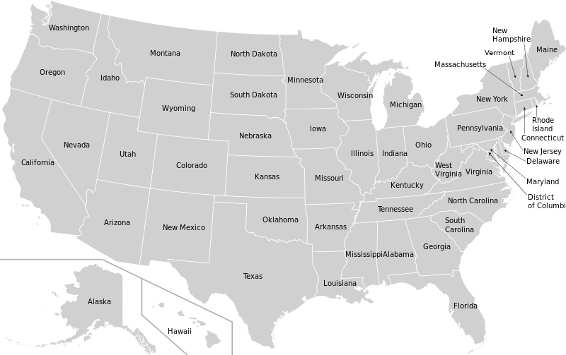

# Find The Item

## A Tourist Place in bangladesh

<div onclick="klikaj('tour')"><span>See Answer</span></div>
<div id="tour" style="visibility: hidden">
The Sundarbans
</div>
<script>
function klikaj(i) {
    document.getElementById(i).style.visibility='visible';
}
</script>

```{r, echo=FALSE}
library(countdown)
countdown(1,0, font_size = "3em")
```

## A Scientist

<div onclick="klikaj('Scientist')"><span>See Answer</span></div>
<div id="Scientist" style="visibility: hidden">
Galileo Galilei
</div>
<script>
function klikaj(i) {
    document.getElementById(i).style.visibility='visible';
}
</script>

```{r, echo=FALSE}
library(countdown)
countdown(1,0, font_size = "3em", top = 0)
```

## A Billionaire

<div onclick="klikaj('Scientist')"><span>See Answer</span></div>
<div id="Scientist" style="visibility: hidden">
Galileo Galilei
</div>
<script>
function klikaj(i) {
    document.getElementById(i).style.visibility='visible';
}
</script>

```{r, echo=FALSE}
library(countdown)
countdown(1,0, font_size = "3em")
```

## A Country

<div onclick="klikaj('Country')"><span>See Answer</span></div>
<div id="Country" style="visibility: hidden">
Kazakhstan
</div>
<script>
function klikaj(i) {
    document.getElementById(i).style.visibility='visible';
}
</script>

```{r, echo=FALSE}
library(countdown)
countdown(1,0, font_size = "3em")
```

## A Cadet (SCC)

<div onclick="klikaj('Cadet')"><span>See Answer</span></div>
<div id="Cadet" style="visibility: hidden">
Labib (XII)
</div>
<script>
function klikaj(i) {
    document.getElementById(i).style.visibility='visible';
}
</script>

```{r, echo=FALSE}
library(countdown)
countdown(1,0, font_size = "3em")
```

# Timer

```{r, echo=FALSE}
library(countdown)
countdown(1,0, class = "timer")
```

## US States

<div onclick="klikaj('us_states')"><span>Watch & Write as many as you can in one minute! [Hide]</span></div>
<div id="us_states" style="visibility: visible">

</div>
<script>
function klikaj(i) {
    document.getElementById(i).style.visibility='hidden';
}
</script>

```{r, echo=FALSE}
library(countdown)
countdown(1,0, class = "timer")
```

