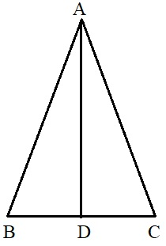

\begin{center}
\begin{large}
Pabna Cadet College
\end{large}

Term End Examination - 2020

Subject: Mathematics

Class: VII
\end{center}

Time: 20 minutes
\hfill
Full Marks: 20

\textbf{Answer all the questions}


1. In which way can the square root of a be expressed?

i.  $a \times a$ ii. $\sqrt[3]a$  iii.  $a2$ iv. $a^{\frac 1 2}$ 

2. Which one is a rational number?

i. $1.666...$  ii. $\sqrt 3$  iii. $\sqrt 7$  iv. $2.343$ 

3. 16:A::A:64. A = ?

i.  32  ii.  24 iii. 27  iv. 42

4. A book is bought at 40 tk. and sold at 50 tk. What is the percentage of profit?

i. 20  ii.  25  iii.  22 iv. 15

5. Speed of a boat against current is y km/hour. If the speed of the boat is x km/hour in still water, what is the speed of current (in km/hour)?

i. y - x  ii. x  iii. x + y  iv. x - y 

6. 100 sq. decimeter = how many sq.meters?

i. 0.01  ii.  1  iii.  0.10 iv. 10 

7. Area and length of a triangle are 5 sq. units and 4 units, respectively. What is the height of the triangle?

i.  2.5  ii.  5 iii.  2 iv. 3

8. A car burns 10 liters of diesel to run 80 km. How much diesel does it require to run 1 km?

i. 28  ii. 80  iii. 125   iv. 150

9. $a^2+b^2=?$

i.  $(a+b)^2-2ab$  ii. $a^2-2ab+b^2$  iii. $a^2+2ab+b^2$  iv. $(a-b)^2-2ab$ 

10. If $a^2 + \frac 1 {a^2} = 3,$  what is the value of $(a - \frac 1 a)^2$?

i.  0  ii. 1  iii. 2  iv. 3 

11. $(a - \frac 1 2 b)(a - \frac 1 3 b) = ?$

i.  $\frac 1 6 (6a^2+5ab+b^2)$ ii. $\frac 1 6 (6a^2-5ab-b^2)$  iii. $\frac 1 6 (6a^2-5ab+b^2)$   iv. $\frac 1 6 (a^2-5ab+b^2)$

12. $a^2-36$ and $a^2+a-30$ are two expressions. Which of the following is their common factor?

i.  m + 6  ii.  m - 6 iii.  m + 5 iv. m - 5

13. HCF of xyz, 7x, and 4xp is ---

i. xp  ii.  x  iii. 28xyzp  iv. xyz

</br>
</br>
</br>

14. $x^2-4=0$ is an equation.

a. There is only one variable in the equation.
b. The equation has more than one root.
c. The equation has a negative root. 

Which of the above are correct?

i. a & b  ii. b & c  iii. a & c  iv. a, b, & c 

15. What is the number, if 20 subtracted from it, the difference would be -15?

i. 10 ii. 5   iii. 20  iv. -5


16. If a line intersects two lines, how many pairs of corresponding angles can be made?

i.  5 ii. 4   iii. 2  iv. 3

17. In the figure, AD is the  bisector of $\angle ABC, AB = AC$

```{r trng, echo=FALSE, fig.align = 'center', out.width = '80%'}
knitr:: 
```

$\angle ABD = ?$

i.  $\angle ADB$ ii.  $\angle ADC$ iii. $\angle BAD$  iv. $\angle ACB$ 

18. If sides of two similar triangles are equal to each other, the triangles are -

i.  similar ii. congruent   iii.  symmetrical iv. asymmetrical

Answer the question 19 - 20 as per the following data

Marks of some students are given below.

| Interval | 11-15 | 16-20 | 21-25 | 26-30 | 31-35 |
|----------|-------|-------|-------|-------|-------|
| Frequency | 5     | 6     | 3     | 4     | 5     |

19. What is the interval of each class?

i. 4  ii. 5   iii. 6  iv. not equal for all classes

20. What is the percentage of students getting marks above 25?

i. 39%   ii. 22%  iii. 40%  iv. Cannot be determined from the given data


**Answers**

| Question | 1  | 2  | 3 | 4  | 5  | 6  | 7 | 8   | 9 | 10 | 11  | 12 | 13 | 14 | 15 | 16 | 17 | 18 | 19 | 20 |
|----------|----|----|---|----|----|----|---|-----|---|----|-----|----|----|----|----|----|----|----|----|----|
| Answer   | iv | iv | i | ii | iv | ii | i | iii | i | i  | iii | i  | ii | iv | ii | ii | iv | ii | ii | i  |


**Creative Questions**

Three friends Saleh, Tahmid, and Rasel collect 10710 tk. for a program. Rasel gives half of Saleh's amount, while Tahmid gives $\frac 5 3$ part of Rasel. 

a. $\space$ Determine the simple ratio of their amount.
c. $\space$ How many tk. did Rasel and Tahmid contribute?
d. $\space$ If 10,010 tk. is spent for the program, how much amount would each of them get back?

**Solution**

a. Ratio:  $Saleh:Tahmid:Rasel = 1:\frac 5 6 : \frac 1 2$

$\qquad$ Simple Ratio: $3:5:6$ (multiplying by 6)

b. $3+5+6 = 14$

$\qquad$ Rasel's amount = `r 3/14*10710`

$\qquad$ Tahmid's amount = `r 5/14*10710`

$\qquad$ Saleh's amount = `r 6/14*10710`

c. Remaining amount = `r (rem = 10710-10010)`

$\qquad$ Rasel would get back = `r 3/14*rem`

$\qquad$ Tahmid would get back = `r 5/14*rem`

$\qquad$ Saleh would get back = `r 6/14*rem`


\begin{center}
---Good Luck---
\end{center}
