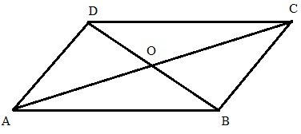

\begin{center}
\begin{large}
Pabna Cadet College
\end{large}

Term-End Examination - 2021

Subject: Mathematics

Class: VIII
\end{center}

Time: 3 hours
\hfill
Full Marks: 80

\textbf{Answer all the questions}

Creative Questions

1. Retailer Ashfaq sells an item at 252 taka, incurring 16% loss. He demanded 312 taka while selling the item.

a. What was the purchase price of the item? \hfill  2 
b. What would his profit in percent be, if he could the sell it at 312 taka? \hfill  4
c. How much the selling price is to be changed to get 20% profit?  \hfill  4

2. Three algebraic fractions are $\frac{1}{x+2y}, \frac{1}{x-2y}, \frac{2x}{x^2-4y^2}$

a. Add the first two terms \hfill 2
b. Subtract the second term from the first term, and then add the third term with the difference. \hfill 4
c. Add all the three terms and subtract $\frac{32xy^2}{x^4-16y^4}$ from the summation  \hfill 4

3. Answer the following question 

MCQ Questions ($30 \times 1 + 10 \times 2 = 50$)

1. 15 percent is-

i.  15
ii. 0.15%
iii. 1500
iv. 0.15 

2. Percentage of 65:125 is- 

i. 52\% 
ii. 5.2\%
iii. 0.52\%
iv. 5200 \%

3. 75 taka is 30\% of what amount of money? 

i. 2500
ii. 250 
iii. 25
iv. 2.5 

4. Mr. Raihan's salary increased from 6600 BDT to 7260 BDT. What is the increase in terms of percentage?

i. 100 taka 
ii. 10 taka 
iii. 20 taka 
iv. 200 taka 

5. 100 books are bought at 4500 taka and each is sold at 45.25 taka. What is the total profit or loss? 

i. 20 taka loss 
ii. 20 taka profit 
iii. 25 taka profit  
iv.  25 taka loss 

6. Area of a rectangular garden is 900 sq. meter. If its length is 36 m, what is its width? 

i. 25 cm
ii. 30 cm 
iii. 36 m 
iv. 2500 cm 

7. Area of a triangle is 216 sq. meter. If its base is 18 m, what is the height?

i. 12 m 
ii. 24 m 
iii. 36 m 
iv. 6 m 

8. A racer circled a 400 m track 24 times. How much distance has he covered? 

i. 9600 cm 
ii. 960 m 
iii. 9600 sq.m 
iv. 9.6 km 

9. 34, 36, 37, 39, 40 are five numbers; for what sixth number would median and average (arithmetic mean-AM) of six numbers be equal? (2 marks)

i. 33 
ii. 36 
iii. 40 
iv. 41 

10. AM of 6 numbers is 50. If 5 is added to all the numbers, how much will the AM increase? 

i. 50 
ii. 5  
iii. 55
iv. 10 

11. What is the median of the numbers: 10, 12, 9, 15, 20?

i. 15 
ii. 10 
iii. 12  
iv. 11 

12. Which statement is incorrect? (2 marks) 

i. $\bar X = \frac{\sum X_i}{n}$
ii. $\sum X_i = \bar X \times n$
iii. Arithmetic mean and median can never be equal. 
iv. If a value is removed from a data set, median changes. 

13. How many unknowns are there in simple equation? 

i. 1 
ii. 2 
iii. 3 
iv. 4

14. A number is 1.5 times another number and their summation is 25. Which one is the bigger number? 

i. 20 
ii. 15 
iii. 12 
iv. 10 

15. Which of the below is a simple equation? 

i. $5x + 4 = 14$
ii. $5x + 4 > 14$
iii. $5x + 4y = 14$
iv. $5x^2 + 4 = 14$

16. Root of the equation $\frac x 5 + 4 = \frac{3x}{10} + 6$ is

i. 20 
ii. -20 
iii. 10 
iv. -10 

17. $\frac x 8 + \frac x 6 - x = \frac 5 6 - \frac x 2$

a. LCM of the denominators is 24 
b. This is a simple equation 
c. Root of the equation is 4 

Which information are correct? 

i. a 
ii. a, b 
iii. b, c 
iv. a, b, c 

18. Five times of Salam's age equals to three times of Mahir's age. Sum of their ages is 24. What are their ages? (2 marks) 

i. 14, 10 
ii. 9, 15 
iii. 15, 9 
iv. 18, 6 

19. A quadrilateral with only one pair of sides parallel is called 

i. Rectangle
ii. Parallelogram
iii. Rhombus
iv. Trapezoid 

20. In the figure, AC and BD diagonals of ABCD parallelogram have intersected at O. Which of the following is correct? (2 marks) 

i. $\angle AOB = 90 \circ$
ii. AO = BO = CO = DO 
iii. $\angle AOB = \angle BOC$ 
iv. AO = CO and BO = DO 

21. A dozen bananas are bought at 37.50 and sold at 39.75. What is the percentage of profit? 

i. 2.25 % 
ii. 60%
iii. 6%
iv. 22.5% 

22. Electricty bill is 1080 taka. If vat is 15%, what is cost of total units used?  

i. 1065 
ii. 995 
iii. 918 
iv. 854 

23. Largest unit of length is 
 
i. km
ii. cm 
iii. dm 
iv. m 

24. 2, 5, 6, 7, 3, 7 

Which information is incorrect? (2 marks) 

i. Arithmetic mean is 5 
ii. Median is 6.5 
iii. Median is 5.6 
iv. Mode is 7 

25. Which measure do we use when we have extremely large or small values in a data set? 

i. Arithmetic mean 
ii. Median 
iii. Mode 
iv. Arithmetic mean in short-cut method 

26. (x,y) = {(1,5); (2,7); (3,9)}; which equation represents the coordinates? (2 marks) 

i. y = 2x + 3 
ii. y = 3x + 2 
iii. y = x + 4 
iv. y = 4x + 1

27. Length of a rectangular house is 4m grater than its width. If the perimeter is 32m, what is the area? (2 marks) 

i. 66
ii. 60 
iii. 160 
iv. 192 

28. A product is sold at 7200 BDT, with a 20% profit. What is purchase price? (2 marks) 

i. 6500 
ii. 7000
iii. 6000  
iv. 5600 

29. How many triangles are there in the figure?  (2 marks) 

i. 4 
ii. 6
iii. 8 
iv. 10 

30. Which two points have equal distance from X-axis? (2 marks)

i. (2,5); (2,3)
ii. (7,8); (0,8) 
iii. (1,3); (3,1) 
iv. (6,4); (4,0) 

31. 0.06 = 

i. 6% 
ii. 0.6%
iii. 66% 
iv. 60% 

32. What percentage of 150 pencils is 20 pencils? 

i. 3000%
ii. $133\frac{1}{3}\%$
iii. $13 \frac {1}{3}\%$  
iv. 300% 

33. A box of apple is sold at 750 taka causing 90 taka loss. What would be the loss of profit it it were sold at 850 taka? 

i. 10 taka loss
ii. 10 taka profit  
iii. 90 taka loss
iv. no loss or profit

34. There are 10 numbers. If two more numbers are included, one in each end (one smallest, one largest), the new median is

i. Greater
ii. Smaller
iii. Unchanged 
iv. not calculable 

35. x-y=1, x+y = 3; (x,y) = ? 

i. (1,2)
ii. (2,1)  
iii. (1,3)
iv. (3,1)

36. At most how many unknowns can there be in a set of two equations so that unknowns can be found out? 

i. 2  
ii. 1 
iii. 3 
iv. 4

37. A quadrilateral whose sides are equal and there are no right angles is called- 

i. Square
ii. Rectangle
iii. Parallelogram
iv. Rhombus  

38. Length, widt h, and height of a box are 2m, 1m, and 50 cm, respectively. What is the volume of the box? 

i. 3 cubic m
ii. 2 cubic m
iii. 1 cubic m  
iv. 4 cubic m

39. In ABCD Parallelogram, AB = CD and the diagonals intersect at O. 

i. AO = CO  
ii. AO = AC
iii. BO = AO 
iv. AO = DO 

40. In Latin, mili means

i. a tenth 
ii. a hundredth
iii. a thousandth  
iv. None of the above
