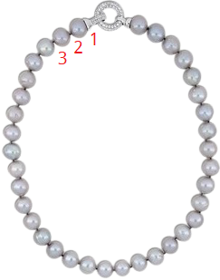

## Permutation

In how many ways can we arrange 3 letters A, B, C?

- ABC
- ACB
- BAC
- BCA
- CAB
- CBA

> - That is, 6 ways. In short $3!=3 \times 2 \times 1 = 6$

## Arranging Subset

In how many ways can we arrange 2 letters from A, B, C?

- AB
- BA
- AC
- CA
- BC
- CB

> - Again 6 ways, but we get it using $^3P_2 = \frac{3!}{(3-2)!}=\frac {6}{1!}=6$

## What is 0!

Why is $3!\ne 3 \times 2 \times 1 \times 0$?

## Rule of Counting

How the counting rule works? 

```{r crule, echo=FALSE, fig.cap = "Counting Rule", fig.align = 'center', out.width = '80%'}
knitr:: include_graphics("img/counting_rule.png")
```

How many possible routes, from A to B, are there?

## Example

1.a. In how many ways can you select a team of 15 cricketers from a team of 23 cricketers and then from them a final team of 11 cricketers? 

1.b. Afterwards, if you arrange the cricketers in the field, in how many ways can you do the entire process? 

# Exercises

## 1(a)

Find the value of n

$^{n-1}P_3:^{n+1}P_3=5:12$

## 1(b)

Find the value of n

$4 \times ^nP_3 = 5 \times ^{n-1} P_3$


## 1(c)

How many different arrangements can you make by using any 3 items from n different items, without using the general formula and without using an item more than once? What if you can use one item multiple times?


## 2(a)

How many words can be formed using the letters of the word **EQUATION**?

> - Answer = 8! = `r factorial(8)`

## 2(c)

Find the n(arrangements) of the words

i. committee
ii. infinitesimal
iii. proportion

## Extra 01

How many arrangements can be made using the letters from the word COURAGE? What if the arrangements must contain a vowel in the beginning? 

> - $4 \times 6!$

## Extra Problem 02

How many arrangements are possible using the words

- **EYE**
- **CARAVAN**?


## 3(a)

There are (p+q) items, of which p items are homogeneous and q items are heterogeneous. How many arrangements are possible?

## 2(j)

There are 10 letters, of which some are homogeneous while others are heterogeneous. The letters can be arranged in 30240 ways. How many homogeneous letters are there?

Let, $m = \text{number of homogeneous items}$
 
> -  n(arrangements) = 30240 = $\frac {10!}{m!}$
> - $m! = \frac{10!}{30240}=`r factorial(10)/30240`$
> - m = 5

## 2(k)

A library has 8 copies of one book, 3 copies of another two books each, 5 copies of another two books each and single copy of 10 books. In how many ways can they be arranged?

Total books = $1 \times 8+3 \times 2+5 \times 2 + 8 \times 1 + 10$ = `r (a=8+2*3+5*2+8+10)`

> - n(arrangements) = $\frac{`r a`}{8!(3!)^2(5!)^2}$

## 2(l)

A man has one white, two red, and three green flags; how many different signals can he produce, each containing five flags and one above another?

Flags: W = 2, R = 2, G = 3, Total = 7

<div onclick="klikaj('flag1')"><span>Answer</span></div>
<div id="flag1" style="visibility: hidden">
<div class="container">
<div class="col">

</div>
<div class="col">
Total arrangements = `r 12+12+4+4+6` 
</div>
</div>
</div>
<script>
function klikaj(i) {
    document.getElementById(i).style.visibility='visible';
}
</script>

## 2 (m)

A man has one white, two red, and three green flags. How many different signals can he make, if he uses five flags, one above another?

## 3(a)

How many different arragnements can be made using the letters of the word ENGINEERING? In how many of them do the three E's stand together? In how many do the E's stand first? 

<div class="container">
<div class="col">
<div onclick="klikaj('3a1')"><span>i</span></div>
<div id="3a1" style="visibility: hidden">
Answer:
</div>
<script>
function klikaj(i) {
    document.getElementById(i).style.visibility='visible';
}
</script>
</div>
<div class="col">
<div onclick="klikaj('3a2')"><span>ii</span></div>
<div id="3a2" style="visibility: hidden">
Consider E's to be a single word
$\frac{9!}{3!2!2!}=$ `r factorial(9)/(3*2*2*2)`
</div>
<script>
function klikaj(i) {
    document.getElementById(i).style.visibility='visible';
}
</script>
</div>
<div class="col">
<div onclick="klikaj('3a3')"><span>iii</span></div>
<div id="3a3" style="visibility: hidden">
<small>
They stand still; don't get shuffled at all. 

Answer $=\frac{8!}{3!2!2!}=$ `r factorial(8)/(3*2*2*2)`

What if in last position or in middle?
</small>
</div>
<script>
function klikaj(i) {
    document.getElementById(i).style.visibility='visible';
}
</script> 
</div>
</div>

## 3(b)

In how many ways can the letters of the word CHITTAGONG be arranged, so that all vowels are together?

> - Vowels are like one single letter
> - They can switch places between themselves
> - Answer = $\frac{8!}{2!2!} \times 3!=$ `r factorial(8)*6/4`
> - What about TECHNOLOGY, DEPRESSION?

## 3(e)

In how many ways may 7 green, 4 blue, and 2 red counters be arranged in a row? How many arrangements will have two red counters side by side?

<div class="container">
<div class="col">
<div onclick="klikaj('3e1')"><span>i</span></div>
<div id="3e1" style="visibility: hidden">
As usually  = `r factorial(13)/(factorial(7)*factorial(4)*factorial(2))`
</div>
<script>
function klikaj(i) {
    document.getElementById(i).style.visibility='visible';
}
</script>
</div>
<div class="col">
<div onclick="klikaj('3e2')"><span>ii</span></div>
<div id="3e2" style="visibility: hidden">
> - Consider reds to be one
> - `r factorial(12)/(factorial(7)*factorial(4))`
</div>
<script>
function klikaj(i) {
    document.getElementById(i).style.visibility='visible';
}
</script>
</div>
</div>

## 3(f)

Five Math books, three Physics books, and two Statistics books are to be arranged in a shelf. In how many ways can they be arranged, if books on same subject are put together?

> - They are like 3 books.
> - Books on individual subjects can still be arranged among themselves.
> - $3!5!3!2!=$ `r factorial(3)*factorial(5)*factorial(3)*factorial(2)`

## 4 (a)

Arrange the letters of the word ARRANGE so that two R's are not together.

> - n(total arrangements) - n(arrangements with T's together)
> - $\frac{7!}{2!2!}-\frac{6!}{2!}=$ `r factorial(7)/4-factorial(6)/2`

## ENGINEERING (E's together, first)

In how may are E's together? In how many are they at the beginning?

Total letters: 11, N=3, G=2, I=2, E=3

<div class="container">
<div class="col">
Together

Consider 3 E's one single letter

> - $\frac{9!}{3!2!2!}$
</div>
<div class="col">
Beginning

Placing 3 E's at the beginning, we have 8 remaining positions.

<table style="border: 1px solid">
<tr>
<td height="30px">E</td>
<td height="30px">E</td>
<td height="30px">E</td>
<td height="30px">Other Letters</td>
</table>


</div>
</div>

## Balls Apart

There are 7 red and 2 white balls. Arrange by keeping white balls apart.

## Without Changing Position

<div class="container">
<div class="col">
- Without changing order $\rightarrow$  Consider them homogeneous
- Without changing position $\rightarrow$ Arrange other letters
</div>
<div class="col">
i. PERMUTAION, without changing positions of vowels
ii. DIRECTOR, without changing order of vowels
iii. DIRECTOR, without changing positions of vowels
iv. DIRECTOR, without changing relative positions of vowels & consonants
</div>
</div>

## Specific Word at First/Last

a. MILLENNIUM: M at first & last
b. IMMEDIATE: T first & A last
c. DAUGHTER: starts with D
d. DAUGHTER: starts with D but does not end with R 

## Even/Odd/middle positions

<small>

<div class="container">
<div class="col">
Questions

a. POSTAGE: vowels at even positions
b. ARTICLE: vowels at odd positions
c. SECOND: Use 1 vowel and 2 consonants & vowel in middle. □ □ □
d. Make 3-letters words from 7 consonants and 3 vowels so vowels are in middle.
e. CAMBRIDGE: Use 5 letters including all vowels.
f. EQUATION: 4-letters words keeping Q excluding N.
</div>
<div class="col">
Answers

> - 3!4! 
> - $^4P_3 \times 4!=576$
> - $^2P_1 \times \space ^4P_2$
> - $^3P_1 \times \space ^7P_2=126$
> - $^5P_3 \times \space ^6P_2$
> - $^4P_1 \times \space ^6P_3$
</div>
</div>

</small>

## Digit Problems

<small>
<div class="container">
<div class="col">
a. Use $3,4,5,6,7,8$ to make digits between 5,000 & 6,000.
a. 2, 3, 4, 5, 6, 7: 6-digit numbers not divisible by 5
b. 5, 6, 7, 8, 0: Five digit numbers divisible by 4.
c. Make 7-digit numbers using 3, 4, 5, 5, 3, 4, 5, 6, keeping odd digits at odd positions, without using digits more than its frequency.
c. Use `r 1:9` to make numbers with even digits at beginning and end, using each digit only one. 
c. Form numbers with 0, 3, 5, 6, 8 greater than 4000, without repeating any digit.
</div>

<div class="col">
> - 4-digits and starts with 5 $\rightarrow 1 \times \space ^5P_3$
> - □ □ □ □ □ □ $\rightarrow 5!  \times \space ^5P_1$ or 6!-5!
> - Last two: 56,68, 76 and 60, 08, 80  $\rightarrow 3! \times ^3P_1 + ^2P_1 \times 2! \times ^3P_1=18+12=30$ 
> - Odd positions = 4, even = 3; </br> there are repetitions. $\rightarrow \frac {4!}{2!2!} \times \frac{3!}{2!}=18$
> - $^4P_1 \times ^3P_1 \times 7! = 60480$ or $^4P_2 \times 7!$
> - □ □ □ □ + □ □ □ □ □ $\rightarrow ^3P_1 \times ^4P_3 + ^4P_1 \times 4! = 168$
  
</div>
</div>
</small>

## Digit Problems (Contd.)

<small>
<div class="container">
<div class="col">
a. Make meaningful odd numbers using the digits 6, 5, 2, 3, 0 once in each number.
b. Make meaningful even numbers using 5, 3, 2, 6, 0.
c. Use 1, 2, 3, 4 to make 3 or less-digit numbers by using digits more than once/any no. of times 
</div>
<div class="col">
> - $^2P_1 \times ^3P_1 \times 3!=36$ 
> - 2 at end, 6 at end, 0 at end $\rightarrow 2 (1 \times 4!-3!)+4!$
> - 1-digit + 2-digit+3-digit (□ □ □) $\rightarrow ^4P_1+4 \times 4 + 4^3$
</div>
</div>
</small>

## Summation Basics

<small>

<div class="container">
<div class="col">
$123 = 3 \times 1 + 2 \times 10 + 1 \times 100$ 

- [x] Value of a number depends on digits it consists of

</div>
<div class="col">
Arrangements of 1, 2, 3

123

132

231

213

312

321

In all places, each digit is repeated twice (2!)

Sum = 2!(1+2+3)1+2!(1+2+3)10+2!(1+2+3)100 = 2!(1+2+3)(1+10+100)
</div>
</div>
</small>

## Sum-Average

<small>

<div class="container">
<div class="col">
1. Find summation of 3-digits numbers made using 1, 2, & 3 and 4-digits numbers using 1, 2, 3, 4. 
2. Find summation of all possible numbers above 100,00, made using the digits 0, 2, 4, 6, 8. 
3. Sum of all possible numbers using 1, 2, 3, 4, each just once. 
4. Make the general formula to find sum of all possible numbers
5. Average of 9-digit numbers made using 5 five times and 4 four times.
6. Find sum of numbers greater than 10,000, using 1, 3, 5, 7, 9
7. Find sum of all possible numbers, using 1, 3, 5, 7, 9
</div>
<div class="col">
> - 1. 2!(1+2+3)(1+10+100) & 3!(1+2+3)1111
> - 2. 4!(0+2+4+6+8)(1+10+100+1000+10000)-3!(2+4+6+8)(1+10+100+1000)
> - 3. $3! (1+2+3+4)(1111)+^3P_2 \times 10 \times 111+ ^3P_1 \times 10 \times 11 + 10$
> - 4. $(n-1)! \times D \times \sum_{i=0}^n 10^i$; (D = Sum of digits, n = no. of digits in the numbers made)
> - 5. $n=\frac{9!}{5!4!}, \bar X=\frac{}{n}$
> - 6. All 5-digit numbers: 4!(1+3+5+7+9)11111=6666600
> - 7. 1, 2, 3, o4 4 digit numbers: 4!(1+3+5+7+9)11111+...
</div>
</div>
</small>

## Specific Items Apart/First/Last
<small>

<div class="container">
<div class="col">
a. Arrange 5 items out of 10, always keeping 2 specific items. 
a. Make 5-letters words from English alphabet always keeping A & L
a. Arrange n books keeping two specific books apart. 
b. Arrange n items where two specific items are not at first or last. 
c. Arrange r items from n items so two specific items are neither at first nor at last. 

</br>
<table style="border: 1px solid">
<tr>
<td height="30px"></td>
<td height="30px">(n-2)</td>
<td height="30px"></td>
</table>

 
</div>
<div class="col">
> - $^5P_2 \times \space ^8P_3$
> - $^5P_2 \times \space ^{24}P_3$
> - n!-2!(n-1)! = (n-1)!(n-2)
> - $^{n-2}P_2 \times \space (n-2)!$
> - $^{n-2}P_2 \times \space ^{n-2}P_{r-2}$
</div>
</div>

</small>

## Arranging in Seats/Positions

<small>
<div class="container">
<div class="col">

1. Arrange 10 BSC and  14 ISC students so no two BSC students are together.
2. Arrange p +ve and q $-ve$ signs ($p\lt q$) so $-ve$ signs are apart.
3. Arrange a 15-members committee in 15 seats, keeping the chief guest in middle. 
4. Arrange x boys and y girls (x>y), keeping no two girls together.
5. IDENTITY: I's and T's together
6. Arrange 6 exam scripts so that the best and worst scripts are not together.
7. Arrange 11 objects (5 black, 6 white) so that a black item is in middle.


</div>
<div class="col">
> - 1. $^{15}P_{10} \times \space 14!$
> - 2. $\frac{^{q+1}P_p}{p!}$
> - 3. □ $\cdot$ □ $\rightarrow$ (7+7)!
> - 4. $^{(x+1)}P_y \cdot x!$
> - 5. 6!
> - 6. 6! - 5!2!
> - 7. □ □ □ $^5P_1 \cdot ^{10}P_2$
</div>
</div>
</small>

## Circular Combination
<small>

<div class="container">
<div class="col">
a. Arrange 8 dancers in circular fashion. 
b. Use 8 pearls in a band to make a necklace. 
a. Arrange 8 science and 7 arts students circularly so no two arts students are together.
</div>
<div class="col">
> - 7!
> - $\frac{(8-1)!}{2}$
> - $^8P_7 \times \space 7!$
</div>
</div>
</small>

<div class="container">
<div class="col">

</div>
<div class="col">

</div>
</div>

# Combination

## Concept

A, B, C

In how many ways can we select 2?

> - AB, AC, BC
> - When making teams $AB \equiv BA$

## Formulae And Notation

<div class="container">
<div class="col">
Formulae (Don't Memorize!)

> - $^nC_r = {n! \over r!(n-r)!}$
> - $^nC_r \times ^rP_r = ^nP_r = ^nP_r \times r!$ (Permutation-combination relationship)
> - $^{n+1}C_r = ^nC_r + ^nC_{r-1}$
> - $^nC_r=?$ (from above, expanding twice up to n-2)
> - $^nC_r = ^nC_{n-r}$
</div>
<div class="col">
Notation

- $^nC_r \equiv$ $n \choose r$
- Select 5 people from 6 $\rightarrow ^6C_5 =$ $6 \choose 5$

</div>
</div>


## Expaniosn of $^nC_r$

\begin{eqnarray} 
^{n+1}C_r &=& ^nC_r + ^nC_{r-1}      \nonumber \\
\Rightarrow ^nC_r &=& ^{n-1}C_r + ^{n-1}C_{r-1} \nonumber \\
\Rightarrow  ^{n+1}C_r &=&  ^{n-1}C_r + ^{n-1}C_{r-1} + ^{n-1}C_{r-1} + ^{n-1}C_{r-2} \nonumber \\
\Rightarrow  ^{n+1}C_r &=&   ^{n-1}C_r + 2^{n-1}C_{r-1} + ^{n-1}C_{r-2}  \nonumber \\
\end{eqnarray}

> - Similarly, $^nC_r = ^{n-2}C_r + 2^{n-2}C_{r-1} + ^{n-2}C_{r-2}$

## Theoretical Problems

<div class="container">
<div class="col">
1. Prove $^{n+1}C_r = ^nC_r + ^nC_{r-1}$
2. $^nP_3 + ^nC_3 = 70; n=?$
3. Prove $^nC_r = ^nC_{n-r}$
3. Arrange 11 players from 15 players.

</div>
<div class="col">
> - 2. n = 5
> - 3. $^{15}C{11} \times 11! = ^{15}P_{11}$
</div>
</div>

## Repeated Items

If out of n items, p items are homogeneous (repeated), then taking r items ($r \ge p$)

Number of selection options, 

$N=\sum_{i=0}^p$ $^{n-p}C_{r-i}$

Example: Combine THESIS taking 4 letters 


<div class="container">
<div class="col">
Method 1

> - n = 6, p = 2, r = 4
</div>
<div class="col">
Method 2 

> - Taking two S's + All different letters
> - $^4C_2 + ^5C_4 = 11$
</div>
</div>

## Repeated Items (Ctd.)

<div class="container">
<div class="col">
1. Professor: make words with 4 letters
</div>
<div class="col">
> - 1. 
</div>
</div>

## Conditional Capacity

<small>
<div class="container">
<div class="col">
1. Form 11-member committe from two groups of 6 & 8 players keeping at least 4 members from 6-members team. How many ways?
2. Allocate 9 people in 2 cars, whose capacity are 7 & 4.
</div>
<div class="col">

| 6-members | 8-members | Total (11) |      Combination     |
|:---------:|:---------:|:----------:|:--------------------:|
|     4     |     7     |     11     | $^6C_4 \times ^*C_7$ |
|     5     |     6     |     11     |                      |
|     6     |     5     |     11     |                      |

</div>
</div>

</small>

## Always In(Ex)cluding

> - Combine r items from n, always including p $\rightarrow ^{n-p}C_{r-p}$
> - Combine r items from n, always excluding p $\rightarrow ^{n-p}C_{r}$
> - Explain logically

## Always In(Ex)cluding Problems

<div class="container">
<div class="col">
Select 5 books from so 2 books are 

1. always present
2. never present
</div>
<div class="col">
> - 1. ${12-2}C_{5-2} = ^{10}C_3 = 120$
> - 2. ${12-2}C_5 = ^{10}C_5 = 252$
</div>
</div>

## At least one

Out of n items, take at least one item each time.
<div class="container">
<div class="col">

> -  □ □ □ $\cdots$ □ Each item can or cannot be taken (having 2 options). 
> - $\rightarrow 2^n - 1$ (1 $\leftarrow$ no items included)
</div>
<div class="col">
Alternative

> - ${n \choose 1} + {n \choose 2} + {n \choose 3} + \cdots + {n \choose n}$
> - $\{1 + ^nC_1 \cdot 1 + ^nC_2 \} \cdot 1^2+ \cdots 1^n \} -1$
> - $(1+1)^n-1$
> - $2^n - 1$

</div>
</div>

## At least one (Problems)

<div class="container">
<div class="col">
1. Make words with vowels
</div>
<div class="col">
Content 2 
</div>
</div>