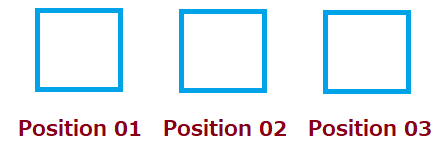

## Permutation

In how many ways can we arrange 3 letters A, B, C?

- ABC
- ACB
- BAC
- BCA
- CAB
- CBA

> - That is, 6 ways. In short $3!=3 \times 2 \times 1 = 6$

## Arranging Subset

In how many ways can we arrange 2 letters from A, B, C?

- AB
- BA
- AC
- CA
- BC
- CB

> - Again 6 ways, but we get it using $^3P_2 = \frac{3!}{(3-2)!}=\frac {6}{1!}=6$

## What is 0!

Why is $3!\ne 3 \times 2 \times 1 \times 0$?

## Rule of Counting

How the counting rule works? 

```{r crule, echo=FALSE, fig.cap = "Counting Rule", fig.align = 'center', out.width = '80%'}
knitr:: include_graphics("img/counting_rule.png")
```

How many possible routes, from A to B, are there?

## Example

1.a. In how many ways can you select a team of 15 cricketers from a team of 23 cricketers and then from them a final team of 11 cricketers? 

1.b. Afterwards, if you arrange the cricketers in the field, in how many ways can you do the entire process? 

# Exercises

## 1(a)

Find the value of n

$^{n-1}P_3:^{n+1}P_3=5:12$

## 1(b)

Find the value of n

$4 \times ^nP_3 = 5 \times ^{n-1} P_3$


## 1(c)

How many different arrangements can you make by using any 3 items from n different items, without using the general formula and without using an item more than once? What if you can use one item multiple times?




## 2(a)

How many words can be formed using the letters of the word **EQUATION**?

> - Answer = 8! = `r factorial(8)`

## 2(c)

Find the n(arrangements) of the words

i. committee
ii. infinitesimal
iii. proportion

## Extra 01

How many arrangements can be made using the letters from the word COURAGE? What if the arrangements must contain a vowel in the beginning? 

> - $4 \times 6!$

## Extra Problem 02

How many arrangements are possible using the words

- **EYE**
- **CARAVAN**?


## 3(a)

There are (p+q) items, of which p items are homogeneous and q items are heterogeneous. How many arrangements are possible?

## 2(j)

There are 10 letters, of which some are homogeneous while others are heterogeneous. The letters can be arranged in 30240 ways. How many homogeneous letters are there?

Let, $m = \text{number of homogeneous items}$
 
> -  n(arrangements) = 30240 = $\frac {10!}{m!}$
> - $m! = \frac{10!}{30240}=`r factorial(10)/30240`$
> - m = 5

## 2(k)

A library has 8 copies of one book, 3 copies of another two books each, 5 copies of another two books each and single copy of 10 books. In how many ways can they be arranged?

Total books = $1 \times 8+3 \times 2+5 \times 2 + 8 \times 1 + 10$ = `r (a=8+2*3+5*2+8+10)`

> - n(arrangements) = $\frac{`r a`}{8!(3!)^2(5!)^2}$

## 2(l)

A man has one white, two red, and three green flags; how many different signals can he produce, each containing five flags and one above another?

Flags: W = 2, R = 2, G = 3, Total = 7

<div onclick="klikaj('flag1')"><span>Answer</span></div>
<div id="flag1" style="visibility: hidden">
<div class="container">
<div class="col">

</div>
<div class="col">
Total arrangements = `r 12+12+4+4+6` 
</div>
</div>
</div>
<script>
function klikaj(i) {
    document.getElementById(i).style.visibility='visible';
}
</script>

## 2 (m)

A man has one white, two red, and three green flags. How many different signals can he make, if he uses five flags, one above another?

## 3(a)

How many different arragnements can be made using the letters of the word ENGINEERING? In how many of them do the three E's stand together? In how many do the E's stand first? 

<div class="container">
<div class="col">
<div onclick="klikaj('3a1')"><span>i</span></div>
<div id="3a1" style="visibility: hidden">
Answer:
</div>
<script>
function klikaj(i) {
    document.getElementById(i).style.visibility='visible';
}
</script>
</div>
<div class="col">
<div onclick="klikaj('3a2')"><span>ii</span></div>
<div id="3a2" style="visibility: hidden">
Consider E's to be a single word
$\frac{9!}{3!2!2!}=$ `r factorial(9)/(3*2*2*2)`
</div>
<script>
function klikaj(i) {
    document.getElementById(i).style.visibility='visible';
}
</script>
</div>
<div class="col">
<div onclick="klikaj('3a3')"><span>iii</span></div>
<div id="3a3" style="visibility: hidden">
<small>
They stand still; don't get shuffled at all. 

Answer $=\frac{8!}{3!2!2!}=$ `r factorial(8)/(3*2*2*2)`

What if in last position or in middle?
</small>
</div>
<script>
function klikaj(i) {
    document.getElementById(i).style.visibility='visible';
}
</script> 
</div>
</div>

## 3(b)

In how many ways can the letters of the word CHITTAGONG be arranged, so that all vowels are together?

> - Vowels are like one single letter
> - They can switch places between themselves
> - Answer = $\frac{8!}{2!2!} \times 3!=$ `r factorial(8)*6/4`
> - What about TECHNOLOGY, DEPRESSION?

## 3(e)

In how many ways may 7 green, 4 blue, and 2 red counters be arranged in a row? How many arrangements will have two red counters side by side?

<div class="container">
<div class="col">
<div onclick="klikaj('3e1')"><span>i</span></div>
<div id="3e1" style="visibility: hidden">
As usually  = `r factorial(13)/(factorial(7)*factorial(4)*factorial(2))`
</div>
<script>
function klikaj(i) {
    document.getElementById(i).style.visibility='visible';
}
</script>
</div>
<div class="col">
<div onclick="klikaj('3e2')"><span>ii</span></div>
<div id="3e2" style="visibility: hidden">
> - Consider reds to be one
> - `r factorial(12)/(factorial(7)*factorial(4))`
</div>
<script>
function klikaj(i) {
    document.getElementById(i).style.visibility='visible';
}
</script>
</div>
</div>

## 3(f)

Five Math books, three Physics books, and two Statistics books are to be arranged in a shelf. In how many ways can they be arranged, if books on same subject are put together?

> - They are like 3 books.
> - Books on individual subjects can still be arranged among themselves.
> - $3!5!3!2!=$ `r factorial(3)*factorial(5)*factorial(3)*factorial(2)`

## 4 (a)

Arrange the letters of the word ARRANGE so that two R's are not together.

> - n(total arrangements) - n(arrangements with T's together)
> - $\frac{7!}{2!2!}-\frac{6!}{2!}=$ `r factorial(7)/4-factorial(6)/2`