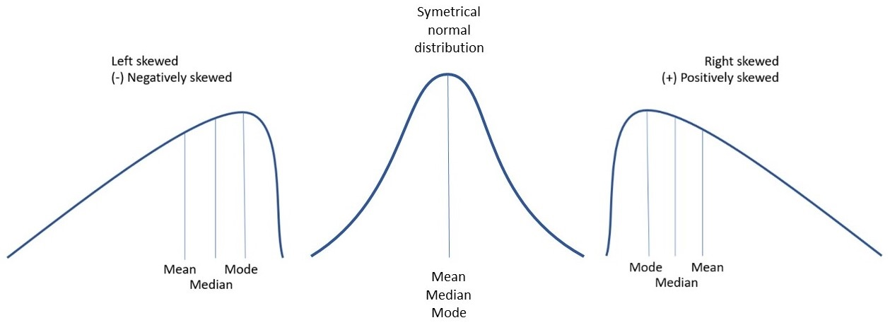
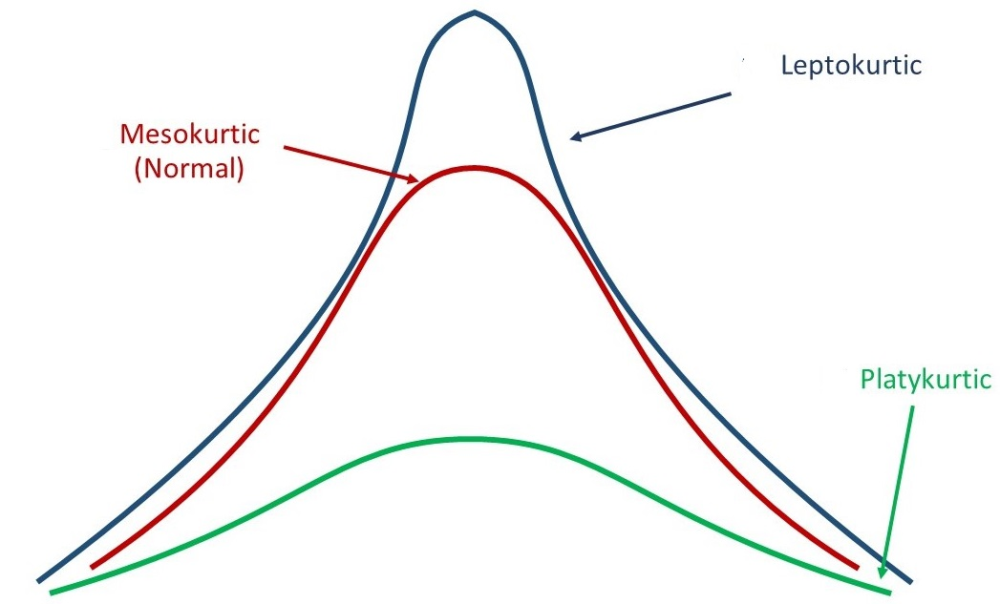

# Moments

## Central Moments

Central Moments: $\mu_r=\frac{\sum(x_i-\bar x)^r}{n}$

> - $\mu_1=\frac{\sum(x_i-\bar x)}{n}=\frac{\sum x_i}{n}-\frac{n \bar x}{n}=\frac{n \bar x}{n}-\frac{n \bar x}{n}=0$

> - $\mu_2=\frac{\sum(x_i-\bar x)^2}{n}=\sigma^2$
> - $\mu_3=\frac{\sum(x_i-\bar x)^3}{n}$
> - $\mu_4=\frac{\sum(x_i-\bar x)^4}{n}$
> - For grouped data: $\mu_r=\frac{\sum f_i(x_i-\bar x)^3}{n}$

## Raw Moments

 $\mu_r'=\frac{\sum(x_i-a)^r}{n}$; a is arbitrary number
 
 $\mu_1'=\frac{\sum(x_i-a)}{n}=\frac{\sum x_i}{n}-\frac{na}{n}=\bar x-a$
 
## Raw & Central Moments: Relationship

- $\mu_2 = \mu_2'-\mu_1'^2$
- $\mu_3 = \mu_3'-3\mu_2'\mu_1'+2\mu_1'^3$
- $\mu_4 = \mu_4'-4\mu_3'\mu_1' + 6 \mu_2'\mu_1'^2-3\mu_1'^4$

How to Remember??

$\downarrow$

## How to Remember

<small>

$(a-b)^3=a^3-3a^2b+3ab^2-b^3$

$(a-b)^4=a^4-4a^3b+6a^2b^2-4ab^3+b^4$ (Pascal triangle can be used)

$a^r=\mu_r'$

$b^r=\mu_1'^r$

Now,

$\mu_3 = \mu_3'-3\mu_2'\mu_1'+2\mu_1'^3$ 

- Remove the penultimate term and let coefficient of it is k
- Use (-k) as the coefficient of the last term. 

</small>

## Skewness

Lack of symmetry

## Kurtosis

## Measures of SKewness

1. Pearson's Coefficient: $SK_P=\frac{Mean-Mode}{\sigma}=\frac{3(Mean-Median)}{\sigma} ;(-3,3)$

  ($Mode=3Me-2\bar X$)
  
2.  Bowley's Coefficient: $SK_B=\frac{Q_3+Q_1-2Me}{Q_3-Q_1}; (-1,1)$
3. Kelly's Coefficient: $SK_k=\frac{D_1+D_9-2Me}{D_9-D1}$
4. Method of Moments: $\beta_1=\frac{\mu_3^2}{\mu_2^3}$