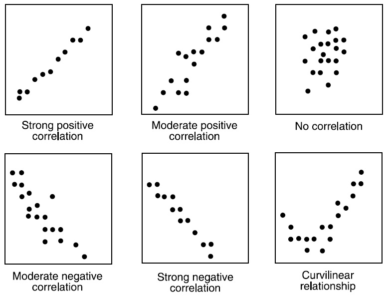

## Scatter Plot

## Sequence

Scatter Plot $\rightarrow$ Correlation $\Rightarrow$ Regression

## Correlation

Linear relationship between two variables

Corrleation, $r = \frac{\sum (x_i - \bar x)(y_i - \bar y)}{\sqrt{\frac{\sum(x_i - \bar x)^2}{n}\frac{\sum(y_i - \bar y)^2}{n}}}$