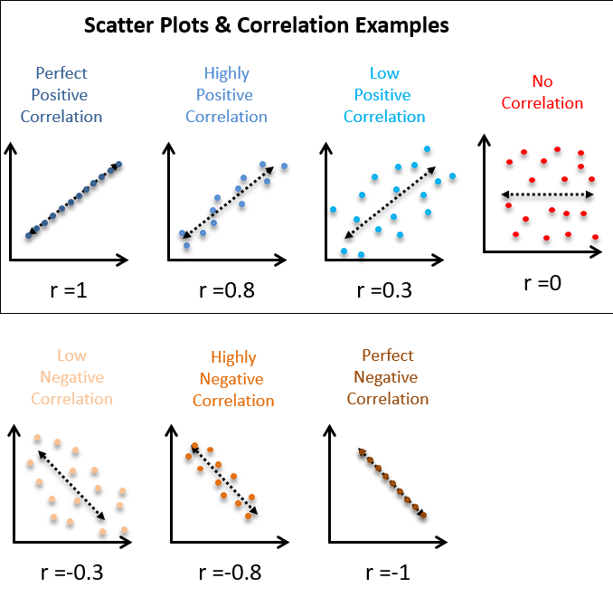

## Why This Chapter is Important

<div class="container">
<div class="col">
We knew the universe is expanding from the knowledge of this chapter! 


</div>
<div class="col">
We learn in this chapter

- How to make bread without wheat/flour
- 
</div>
</div>

## Scatter Plot

 

## Sequence

Scatter Plot $\rightarrow$ Correlation $\rightarrow$ Regression

| Scatter Plot                                  | Correlation                  | Regression                                            |
|-----------------------------------------------|------------------------------|-------------------------------------------------------|
| Preliminary idea  about relationship          | Measures linear relationship | Measures Influence                                    |
| Either variable can be  independent (usually) | Does not clarify dependency  | Predicts dependent variable based on independent one. |

## Correlation

Linear relationship between two variables

Corrleation, $r = \frac{\sum (x_i - \bar x)(y_i - \bar y)}{\sqrt{\frac{\sum(x_i - \bar x)^2}{n}\frac{\sum(y_i - \bar y)^2}{n}}}; -1 \le r \le 1$

> - $r = \frac{Cov(x,y)}{\sigma_x \sigma_y}$

> - Compare with $$\sigma ^2 = \sum_{i=1}^n \frac{(x_i-\bar x)^2}{n}$$

## Scatter Plot And Correlation

<div class="container">
<div class="col">

</div>
<div class="col">
$r^2=R^2 \rightarrow$ Coefficient of determination

$R^2 = 80\% \rightarrow$ 80% of total variation in Y (say, brightness of stars) can be explained by X (say, distance).
</div>
</div>

## r: Estimating Mechanism

Make a table with columns for

- $(x_i-\bar x)$ 
- $(y_i-\bar y)$
- $(x_i-\bar x)(y_i-\bar y)$
- $(x_i-\bar x)^2$
- $(y_i-\bar y)^2$

Then sum them and put in the formula

## Example of r

## Features of r

> - Independent of origin and scale
> - $-1 \le r \le 1$
> - $r = \sqrt{b_{yx} \cdot b_{xy}}$ (Concerning GM of regression coeff)
> - $\frac{b_{yx}+b_{xy}}{2} \ge r$ (About AM)
> - $r = 0 \rightarrow$ no linear relationship

## Rank Correlation

```{r, echo=FALSE}
set.seed(10)
rank <- data.frame(Competitor = 1:10,
                   Judge_1 = sample(10:20, 10))
rank$Judge_2 <- sample(8:20, 10)
rank$rank_1 <- rank(-rank$Judge_1)
rank$rank_2 <- rank(-rank$Judge_2)
knitr:: kable(
  head(rank, 10, booktabs = TRUE)
)
```

Coefficient, $\rho = 1- \frac{6 \sum d_i^2}{n(n^2-1)}$

## Linear Equation/ Straight Lines

$Y = c + mx;$ m is slope c is intercept

$m = \frac{dy}{dx} = tan \theta=$ Change in y due to change in x. 

Bread without sour or wheat! 

## Regression Coefficient

$b_{yx} = \frac{\sum(x_i-\bar x)(y_i-\bar y)}{\sum(x_i-\bar x)^2} = \frac{Cov(x,y)}{\sigma_x^2}$

SImpler, $b_{yx} = \frac{\sum xy- \frac{\sum x \sum y}{n}}{\sum x^2 - \frac{(\sum x)^2}{n}}$

$b_{xy}=?$

## Example

<div class="container">
<div class="col">

```{r, echo=F}
set.seed(10)
price <- sample(20,10)
demand <- sample(20,10)
data <- data.frame(price, demand)
knitr:: kable(
  data)
corr <- cor(price,demand)
model <- lm(demand~price)
```

</div>
<div class="col">
- Make a scatter plot and explain
- Find correlation and regression coefficient (r, a, & b) and explain

> - Correlation, r = `r round(corr,2)` 
> - Regression (a, b): `r round(model$coefficients,2)`
</div>
</div>

## Properties of b

> - independent of origin and scale
> - $r = \sqrt{b_{yx} \cdot b_{xy}}$
> - $\frac{b_{yx}+b_{xy}}{2} \ge r$
> - If $b_{yx} > 1, b_{xy} < 1$
> - If regression lines coincide, r = 1
> - If $\theta = 90^o, r = 0$

## Purity of Coefficients

- $r = \frac{\sum (x_i - \bar x)(y_i - \bar y)}{\sqrt{\frac{\sum(x_i - \bar x)^2}{n}\frac{\sum(y_i - \bar y)^2}{n}}}$
- $\rho = 1- \frac{6 \sum d_i^2}{n(n^2-1)}$
- b or $\beta$


