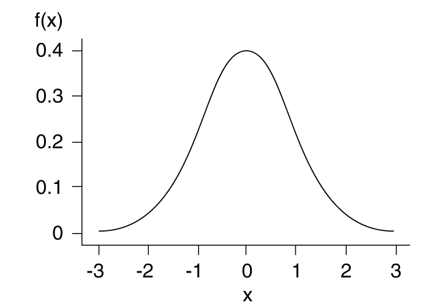

<h5>Pabna Cadet College</h5>

Test Examination - 2021

Class: XII

Subject: Statistics 2^nd^ Paper (Creative)
 

Time: 2 hours and 35 minutes

Full Marks: 50

Sub Code: 130

Figures in the right indicate full marks. Answer five questions, taking at least two from each group

.

:::: {style="display: grid; grid-template-columns: 1fr 1fr; grid-column-gap: 10px;"}

::: {}

1. Mutually exclusive events are

a. always independent
b. always dependent*
c. the relationship cannot be determined
d. dependent or independent, depending on scenario.

2. $P(A \cup B) = P(A) + P(B)$ is true for

a. independent events
b. independent events
c. mutually exclusive events*
d. complementary events

3. If a coin is tossed $n$ times, how many outcomes are generated?

a. $n$
b. 

1. Which one is a correct condition of a pdf?

a. $\displaystyle \int_0^1 f(x) dx =1$
b. $P(X)\ge0$
c. $\displaystyle \int_a^b f(x) dx =1 ; a\le x \le b$ *
d. $\displaystyle \int_0^{Median} f(x) dx =0.55$

2. What are highest and lowest possible values of F(x)?

a. $0, 1$*
b. $-1, 1$
c. $-\infty, +\infty$
d. $0, \infty$

3. How mnay types of random variable are there?

a. 1
b. 2*
c. 3
d. 4

4. The figure is an example of a 

a. probability density function
b. probability mass function
c. could be both
d. none

Answer the questions 5-7 according the following information.

$f(x)=\frac{x+1}{14}; x = 1,2,3,4$

5. What is P(X=2)?

a. $\frac{2}{13}$
b. $\frac{4}{14}$*
c. $\frac{3}{14}$
d. $\frac{1}{7}$

6. What is P(X=5)

a.  $\frac{5}{14}$
b.  $\frac{1}{7}$
c.  0*
d. 1

7. $P(2\le X \le 5)=?$

a. $\frac{6}{7}$*
b. $\frac{5}{7}$
c. 1
d. $\frac{14}{17}$

Answer the questions 9-10 according to the following information.

$P(x,y)=\frac{x+2y}{16}$

9. $P(X)=?$

a. $\frac{x+2y}{3}$
b. $\frac{2x+y}{3}$
c. $\frac{2x+3y}{3}$
d. $\frac{x+3}{4}$*

10. $P(X|Y=0)=?$

a. $\frac{x+2y}{4y+1}$
b. $1$
c. $x$
d. 0

:::

::: {}

13. The figure is an example of a 

a. probability density function
b. probability mass function
c. could be both
d. none
:::

::::

---Good Luck---
