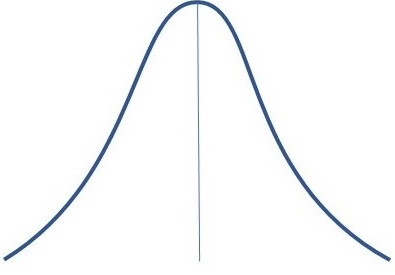

\begin{center}
\begin{large}
Pabna Cadet College
\end{large}

Second Term-End Exam - 2021

Subject: Statistics

Class: XI
\end{center}

Time: -
\hfill
Full Marks: 80

Answer all the question.

MCQ

1. Who invented Stem and Leaf display?

a. Karl Pearson
b. R.A. Fisher
c. W.I. King
d. John Tukey *** 

2. H.G. Sturges rule for determining number of classes (k)- 

a. $K = 1 + 3.322 \log N$ *** 
b. $K = 1 + 2.322 \log N$
c. $K = 1 + 3.222 \log N$
d. $K = 1 - 3.322 \log N$

3. Formula to measure angles for a pie-chart-

a. $\theta_i = \frac{f_i}{N} \times 360^o$ *** 
b. $\theta_i = \frac{N}{f_i} \times 360^o$ 
c. $\theta_i = \frac{f_i}{N-1} \times 360^o$
d. $\theta_i = \frac{N-1}{f_i} \times 360^o$

4. If there are numerous categories in a data, which graph would be perfect? 

a. Histogram
b. Pie chart
c. Bar Diagram *** 
d. Frequency polygon 

5. Which graph requires cumulative frequencies?

a. Histogram 
b. Ogive ***
c. Frequency polygon
d. Pie chart

6. "50 students scored less than or equal to 60 marks"- which of the following can directly give such information? 

a. Histogram
b. Pie chart
c. Bar diagram
d. Ogive ***

7. Which diagram shows times series data?

a. Histogram 
b. Frequency curve
c. Bar diagram
d. Historigram *** 

8. Consider the following table

|      District     | Rajshahi | Chapainawabganj | Rangpur | Pabna | Natore |
|:-----------------:|:--------:|:---------------:|:-------:|:-----:|:------:|
| Mango  Production |    750   |       800       |   500   |  450  |   380  |

Which diagram is suitable for displaying data? 

i. Histogram
ii. Pie chart
iii. Bar chart

a. i 
b. i & ii
c. ii & iii
d. i, ii, & iii

9. Which of the following is NOT an attribute of a good classification?

a. Stability
b. Unambiguity
c. Flexibility 
d. Attractiveness *** 

10. Which is a characteristic of secondary data?

a. It is very reliable 
b. It provides data in the form the researcher desires
c. It is less costly *** 
d. It does not require precautions by the user.

11. Which one is correct for positive skewness

a. Mean > Median < Mode
b. Mean = Median = Mode
c. Mean < Median < Mode 
d. Mean > Median > Mode *** 

12. Skewness of a symmetrical distribution is - 

a. 1 
b. 0 *** 
c. -1
d. Median

13. The first raw moment about 2 is 6. What is value of the arithmetic mean? (2 marks)  

a. 4 
b. 12 
c. 8 *** 
d. 2

14. Karl Pearson's method of coefficient of skewness- (2 marks)

a. $SK_p = \frac{\bar X - Mo}{\sigma}$ *** 
b. $SK_p = \frac{Q_3 + Q_1 - 2Me}{Q_3 - Q_1}$
c. $SK_p = \frac{D_9 + D_1 - 2Me}{D_9 - D_1)}$
d. $Sk_p = \frac{\bar X - \sigma}{Mo}$ 

15. What is value of $\beta_1$ for a symmetrical distribution? 

a. -1 
b. 3 
c. 1
d. 0 *** 

16. Second central moment of first n natural numbers

a. $\frac{n^2+1}{12}$
b. $\frac{n^2-1}{12}$ *** 
c. $\frac{n^2}{n+1}$
d. $\frac{n^2-2}{12}$

17. First moment about 2 is -1. What is the moment about 5? (2 marks)

a. -4 *** 
b. 4 
c. 7 
d. 6

18. In a distribution, Mean = 65, Median = 70 and coefficient of skewness = -0.5. What is coefficient of variation? (2 marks)

a. 50% 
b. 41.65% 
c. 46.15% *** 
d. 65.14%

19. Five number summary consist of- 

a. Arithmetic mean, three quartiles, and median
b. Range, three quartiles, and variance
c. Lowest value, mean, median, mode, and highest value
d. Lowest value, three quartiles, and highest value *** 

20. Which is not true about this graph? (2 marks)

a. Most values have small frequencies *** 
b. Most numbers lie around the average value
c. A representation of symmetric distribution
d. Few values have small frequencies

21. What is the correct relationship? 

a. $\frac{b_{yx} + b_{xy}}{2} \le r$ *** 
b. $\frac{b_{yx} + b_{xy}}{2} \ge r$
c. $\frac{b_{yx} + b_{xy}}{2} = r$
d. $\frac{b_{yx} \times b_{xy}}{2} \ge r$

22. $\beta = 0.25$; What is not a correct interpretation? 

a. $\beta$ is equivalent to slope of a straight line
b. $\beta$ represents average increase in dependent variable due to independent variable.
c. If independent variable increases 1 unit, dependent variable increase 0.25 units, on average. 
d. The relationship between dependent and independent variable is weak ***

23. 

a.
b.
c.
d.

24. 

a.
b.
c.
d.

25. 

a.
b.
c.
d.

26. 

a.
b.
c.
d.

27. 

a.
b.
c.
d.

28. 

a.
b.
c.
d.

29. 

a.
b.
c.
d.

30. 

a.
b.
c.
d.

31. 

a.
b.
c.
d.

32. 

a.
b.
c.
d.

33. 

a.
b.
c.
d.

34. 

a.
b.
c.
d.

35. 

a.
b.
c.
d.

36. 

a.
b.
c.
d.

37. 

a.
b.
c.
d.

38. 

a.
b.
c.
d.

39. 

a.
b.
c.
d.

40. 

a.
b.
c.
d.

