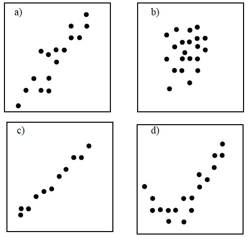
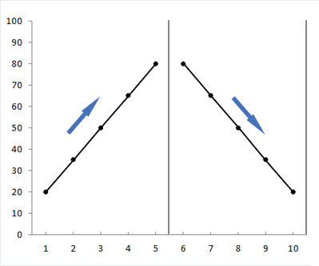

\begin{center}
\begin{large}
Pabna Cadet College
\end{large}

Second Term-End Exam - 2021

Subject: Statistics

Class: XI
\end{center}

Time: 3 hours
\hfill
Full Marks: 80

Answer all the questions.

Creative Questions
---

1. **A researcher has determined the first four central moments about 3, and the values are -1, 5, 20, and 90.**

a. Write one use of moments. \hfill 1
b. Find the relationship between first raw moment and arithmetic mean. \hfill 2
c. Find the second and third central moments using information from the stem. \hfill 3 

    [*You are free to use techniques from [**this link-click to open**](https://lecture.statmania.info/stat/ch5_xi_stat_moments_skewness_kurtosis.html#/changing-origin-of-moments)*]

d. Estimate the skewness of the distribution and explain. \hfill 4

2. **Height and Weight of 10 people are:** 

```{r, echo=FALSE}
reg = data.frame(
  height = c(142, 150, 152, 155, 157, 160, 165, 167, 172, 175),
  weight = c(50, 48, 49, 52, 56, 61, 56, 65, 58, 67)
  )

knitr::kable(
reg, booktabs = TRUE,
  caption = "Height and weight of 10 random people")
```

a. Which variable should be the dependent one?
b. Is the regression coefficient always unit-free? Briefly explain.
c. Fit a regression line from the above data (i.e., find the regression coefficients and write the fitted model)
d. If the regression model with the above data is $Y = \alpha + \beta X + \epsilon$, what is the value of $\alpha$? Explain

3. Export amount of a product followed the pattern:

```{r, echo = FALSE}
ts = data.frame(
  year = c(2001:2010),
  amount = c(112, 115, 120, 125, 132, 144, 150, 160, 162, 165)
)

knitr::kable(
ts, booktabs = TRUE,
  caption = "Time-series data")
```

a. What is time series data?
b. What does a negative trend imply?
c. From the stem, find the trend using semi-average method.
d. Does moving average method look better for finding trend of this data? Explain. 


MCQ
---

1. Who invented Stem and Leaf display? 

a. Karl Pearson
b. R.A. Fisher
c. W.I. King
d. John Tukey  

2. H.G. Sturges rule for determining number of classes (k)- 

a. $K = 1 + 3.322 \log N$
b. $K = 1 + 2.322 \log N$
c. $K = 1 + 3.222 \log N$
d. $K = 1 - 3.322 \log N$

3. Formula to measure angles for a pie-chart-

a. $\theta_i = \frac{f_i}{N} \times 360^o$
b. $\theta_i = \frac{N}{f_i} \times 360^o$ 
c. $\theta_i = \frac{f_i}{N-1} \times 360^o$
d. $\theta_i = \frac{N-1}{f_i} \times 360^o$

4. If there are numerous categories in a data, which graph would be perfect? 
a. Histogram
b. Pie chart
c. Bar Diagram
d. Frequency polygon 

5. Which graph requires cumulative frequencies?

a. Histogram 
b. Ogive
c. Frequency polygon
d. Pie chart

6. "50 students scored less than or equal to 60 marks"- which of the following can directly give such information? 

a. Histogram
b. Pie chart
c. Bar diagram
d. Ogive

7. Which diagram shows times series data?

a. Histogram 
b. Frequency curve
c. Bar diagram
d. Historigram

8. Which diagram is suitable for displaying the data? 

|      District     | Rajshahi | Chapainawabganj | Rangpur | Pabna | Natore |
|:-----------------:|:--------:|:---------------:|:-------:|:-----:|:------:|
| Mango  Production |    750   |       800       |   500   |  450  |   380  |


i. Histogram
ii. Pie chart
iii. Bar chart

a. i 
b. i & ii
c. ii & iii
d. i, ii, & iii

9. Which of the following is NOT an attribute of a good classification?

a. Stability
b. Unambiguity
c. Flexibility 
d. Attractiveness

10. Which is a characteristic of secondary data?

a. It is very reliable 
b. It provides data in the form the researcher desires
c. It is less costly
d. It does not require precautions by the user.

11. Which one is correct for positive skewness

a. Mean > Median < Mode
b. Mean = Median = Mode
c. Mean < Median < Mode 
d. Mean > Median > Mode

12. Skewness of a symmetrical distribution is - 

a. 1 
b. 0
c. -1
d. Infinity

13. The first raw moment about 2 is 6. What is value of the arithmetic mean? (2 marks)

a. 4 
b. 12 
c. 8
d. 2

14. Karl Pearson's method of coefficient of skewness- (2 marks)

a. $SK_p = \frac{\bar X - Mo}{\sigma}$
b. $SK_p = \frac{Q_3 + Q_1 - 2Me}{Q_3 - Q_1}$
c. $SK_p = \frac{D_9 + D_1 - 2Me}{D_9 - D_1)}$
d. $SK_p = \frac{\bar X - \sigma}{Mo}$ 

15. What is value of $\beta_1$ for a symmetrical distribution? 

a. -1 
b. 3 
c. 1
d. 0

16. Second central moment of first n natural numbers

a. $\frac{n^2+1}{12}$
b. $\frac{n^2-1}{12}$
c. $\frac{n^2}{n+1}$
d. $\frac{n^2-2}{12}$

17. First moment about 2 is -1. What is the moment about 5? (2 marks)

a. -4
b. 4 
c. 7 
d. 6

18. In a distribution, Mean = 65, Median = 70 and coefficient of skewness = -0.5. What is coefficient of variation? (2 marks)

a. 50% 
b. 41.65% 
c. 46.15%
d. 65.14%

19. Five number summary consist of- 

a. Arithmetic mean, three quartiles, and median
b. Range, three quartiles, and variance
c. Lowest value, mean, median, mode, and highest value
d. Lowest value, three quartiles, and highest value

20. Which is not true about this graph? (2 marks)

```{r sym, echo=FALSE, fig.cap = "Example curve", fig.align = 'center', out.width = '30%'}
knitr:: include_graphics("img/sym.jpg")
```

a. Most values have small frequencies
b. Most numbers lie around the average value
c. A representation of a symmetric distribution
d. Few values have small frequencies

21. What is the correct relationship?

a. $\frac{b_{yx} + b_{xy}}{2} \le r$
b. $\frac{b_{yx} + b_{xy}}{2} \ge r$
c. $\frac{b_{yx} + b_{xy}}{2} = r$
d. $\frac{b_{yx} \times b_{xy}}{2} \ge r$

22. Regression coefficient, $\beta = 0.25$; What is not a correct interpretation? (2 marks)

a. $\beta$ is equivalent to slope of a straight line
b. $\beta$ represents average increase in dependent variable due to independent variable.
c. If independent variable increases 1 unit, dependent variable increase 0.25 units, on average. 
d. The relationship between dependent and independent variable is weak

23. Range of regression coefficient lies between -  

a. $(-1, 1)$
b. $(-\infty, +\infty)$
c. $(0, \infty)$
d. $[0, \infty)$

24. What is the value of r in the equation 4x + 3y = 60

a. 1
b. -1
c. 0
d. 0.75

25. If $b_{yx} = -2$ and $_{xy} = -0.4, r =$

a. -2.4
b. 2.4 
c. -0.89
d. 0.89

26. Which graph shows the highest linear association?

```{r scat, echo=FALSE, fig.cap = "Sactter Plots", fig.align = 'center', out.width = '30%'}
knitr:: 
```

a. a 
b. b 
c. c
d. d

Answer questions 27-28 according to the following information.

ax + by + c = 0, where a and b are non-zero values. 

27. If a = 2 and b = 15, r = ? 

a. -1
b. -0.8
c. 0 
d. 1

28. If a = 20 and b = - 6, r = ? 

a. -1
b. 1
c. 0 
d. 3.33

29. Which is true? (2 marks)

a. Correlation can assess linear and non-linear relationships.
b. Regression analysis cannot make predictions. 
c. Regression coefficient may or may not be unit-free.
d. Correlation coefficient depends on origin and scale. 

30. The correct formula to measure rank correlation 

a. $\rho = 1 - \frac{6 \Sigma d_i^2}{n(n^2-1)}$
b. $\rho = 1 - \frac{6 \Sigma d_i^2}{(n^2-1)}$
c. $\rho = 1 - \frac{6 \Sigma d_i^2}{n(n^2+1)}$
d. $\rho = 1 - \frac{\Sigma d_i^2}{n(n^2-1)}$

31. If there is an unpredictable/sudden effect in a time series data, it is called- 

a. Trend
b. Seasonal variation
c. Cyclic variation
d. Random variation

32. Which one is the correct additive model? 

a. $Y_t = T_t + S_t + C_t$
b. $Y_t = T_t + S_t + C_t + R_t$
c. $Y_t = T_t + S_t + C_t - R_t$
d. $Y_t = T_t - S_t + C_t - R_t$

33. The curve shows examples of- (2 marks)

```{r trnd, echo=FALSE, fig.cap = "Example", fig.align = 'center', out.width = '30%'}
knitr:: 
```

a. Trend
b. Seasonal variation
c. Cyclic variation
d. Irregular variation

34. Which is not true of graphical method to find trend? (2 marks)

a. Easy and simple
b. Flexible for linear and non-linear trend
c. Subjective (depends on personal judgment)
d. Always measurable

35. As far as semi-average method of finding trend is concerned, when number of observations is odd, which is true? 

a. Middle-most value is omitted.
b. Middle-most value is divided into two parts and each part is added to semi-totals.
c. Middle-most value is added to both semi-totals.
d. None of the above

Answer the questions 36-38 according to the following table

|          Year         | 1992 | 1993 | 1994 | 1995 | 1996 | 1997 | 1998 | 1999 | 2000 |
|:---------------------:|:----:|:----:|:----:|:----:|:----:|:----:|:----:|:----:|:----:|
| Production (in m ton) |  6.0 |  6.5 |  7.0 |  7.2 |  7.3 |  7.0 |  8.0 |  8.2 |  8.4 |

36. What is first semi-average?

a. 6.665
b. 6.675
c. 6.776 
d. 6.566

37. What is second semi-average?

a. 7.912
b. 7.925
c. 7.900
d. 7.907

38. If two semi-averages are plotted on a graph paper, how many original points fall on the trend line? (2 marks)

a. 1
b. 2 
c. 3 
d. 4

39. Which applies to the method of moving average? 

a. Simplicity
b. Flexibility
c. Biasness in non-linear trend
d. Suitable for future prediction

40. In the question 36, what is the first 3-yearly moving average? 

a. 6.67
b. 6
c. 6.5
d. 6.95

Answers to Creative Questions 
--- 
a. Moments can be used to find characteristics of a distribution. 
b. Relationship between first raw moment and arithmetic mean.
	
	First raw moment, $\mu_1' = \frac{\Sigma(x_i-a)}{n} = \frac{\Sigma x_i - na}{n} = \bar X - a$
	
	Thus, $\mu_1' = \bar X - a$

c. Second and third central moments from their raw counterparts
	
	Uisng the techniques from [*here*](https://lecture.statmania.info/stat/ch5_xi_stat_moments_skewness_kurtosis.html#/changing-origin-of-moments), 
	We have to use the formulae $a^2+2ab+b^2$ for the 2nd central moment and $a^3+3a^2b+3ab^2+b^3$ for the 3rd central moment. 
	
	Here, $b = a - k$ (since we are dealing with central moments, $k=\bar X$
	
	From (b), $\bar X = \mu _1 + a = -1 + 3 = 2$
	
	$\therefore b = 3 - 2 = 1$
	
	\begin{equation} 
	\begin{split}
	\therefore \mu _2 & =\mu _2'(a) + 2 \mu _1'b + b^2\\
	& =5 + 2(-1) \times 1 + 1^2 \\
	& =5-2+1 \\
	& =4
	\end{split}
	(\#eq:cm2)
	\end{equation}
	

MCQ Answers
---
| 1 | 2 | 3 | 4 | 5 | 6 | 7 | 8 | 9 | 10 | 11 | 12 | 13 | 14 | 15 | 16 | 17 | 18 | 19 | 20 |
|:-:|:-:|:-:|:-:|:-:|:-:|:-:|:-:|:-:|:--:|:--:|:--:|:--:|:--:|:--:|:--:|:--:|:--:|:--:|:--:|
| d | a | a | c | b | d | d | c | d |c |  d |  b |  c |  a |  d |  b |  a |  c |  d |  a |

| 21 | 22 | 23 | 24 | 25 | 26 | 27 | 28 | 29 | 30 | 31 | 32 | 33 | 34 | 35 | 36 | 37 | 38 | 39 | 40 |   |
|:--:|:--:|:--:|:--:|:--:|:--:|:--:|:--:|:--:|:--:|:--:|:--:|:--:|:--:|:--:|:--:|:--:|:--:|:--:|:--:|:-:|
|  a |  d |  b |  a |  d |  c |  a |  b |  c |  a |  d |  b |  a |  d |  a |  b |  c |  a |  d |  c |   |