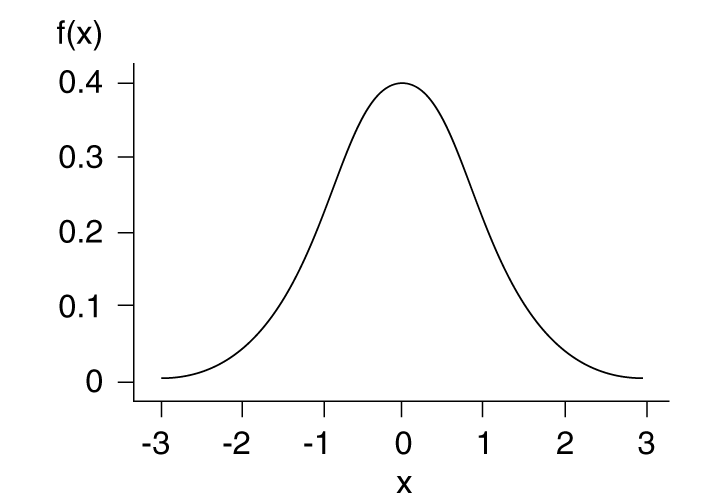

\begin{center}
\begin{large}
Pabna Cadet College
\end{large}

Fortnightly Examination - 2021

Third Term Second Phase 

Subject: Statistics

Class: XII
\end{center}

Time: 40 minutes
\hfill
Full Marks: 20

Answer all the questions.

## Creative Question

1. The probability density function of x is given below

$$
  f(x) =
\begin{cases}
\frac 3 4 (x^2+1),  & 0 \le x \le 1 \\
0, & otherwise
\end{cases}
$$
a. In a probability density function (pdf), what is the probability of a single value?
b. Verify whether the given function is a probability density function.
c. Find $P(0\le X \le 0.6)$
d. Find the first quartile of the pdf.

## MCQ Quetions

1. Which one is a correct condition of a pdf?

a. $\displaystyle \int_0^1 f(x) dx =1$
b. $P(X)\ge0$
c. $\displaystyle \int_a^b f(x) dx =1 ; a\le x \le b$ *
d. $\displaystyle \int_0^{Median} f(x) dx =0.55$

2. What are highest and lowest possible values of F(x)?

a. $0, 1$*
b. $-1, 1$
c. $-\infty, +\infty$
d. $0, \infty$

3. How mnay types of random variable are there?

a. 1
b. 2*
c. 3
d. 4

4. The figure is an example of a 

a. probability density function
b. probability mass function
c. could be both
d. none

5. 

a. 
b. 
c. 
d. 

6. 

a. 
b. 
c. 
d. 

7. 

a. 
b. 
c. 
d. 

8. 

a. 
b. 
c. 
d. 

9. 

a. 
b. 
c. 
d. 

10. 

a. 
b. 
c. 
d. 