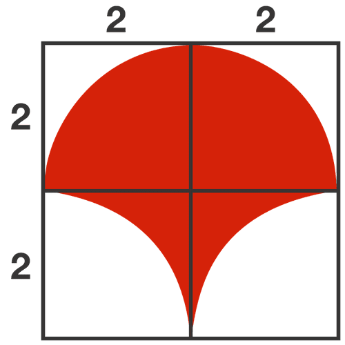

# Find the red portion of circle



# Find The Item

## A Tourist Place in bangladesh

<div onclick="klikaj('tour')"><span>See Answer</span></div>
<div id="tour" style="visibility: hidden">
The Sundarbans
</div>
<script>
function klikaj(i) {
    document.getElementById(i).style.visibility='visible';
}
</script>

```{r, echo=FALSE}
library(countdown)
countdown(1,0, style = "font-size:80px;")
```

## A Scientist

<div onclick="klikaj('Scientist')"><span>See Answer</span></div>
<div id="Scientist" style="visibility: hidden">
Galileo Galilei
</div>
<script>
function klikaj(i) {
    document.getElementById(i).style.visibility='visible';
}
</script>

```{r, echo=FALSE}
library(countdown)
countdown(1,0, style = "font-size:80px;")
```

# References

- [Conversation](https://theconversation.com/paradoxes-of-probability-and-other-statistical-strangeness-74440)