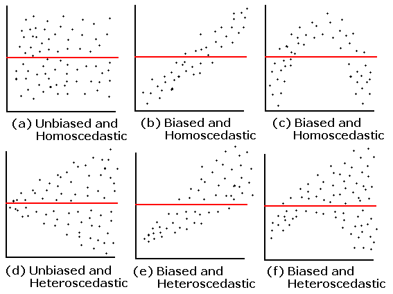

## Keywords

Autocorrelation
: Relationship of the observations between the different points in time

Baseline survey
: A survey which measures key conditions (indicators) before a project begins against which change and progress can be assessed.

Collinearity
: A linear association between two explanatory variables.

Confounder
: A variable that influences both the dependent variable and independent variable

Data
: Information expressed using numbers, characters, or symbols on which operations can be performed, which may be stored and transmitted. 

Dummy variable trap
: A scenario in which the independent variables are multicollinear - a scenario in which two or more variables are highly correlated; in simple terms one variable can be predicted from the others.


Multicollinearity
: A situation in which more than two explanatory variables in a multiple regression model are highly linearly related

Power
: The chance that the study will be able to demonstrate a significant difference or effect if it is present.

Orthogonal
: (of an experiment) Having variates which can be treated as statistically independent.

Selection Bias
: Any difference between groups can be attributed to both the impact of a program or pre-existing difference (the "selection bias").

## Formulae

Covariance, $Cov(X,Y) = \frac{\sum(X_i- \bar X)(Y_i - \bar Y)}{n}$

## Regression

Let, $Y = \alpha + \beta X + \epsilon$

$E[Y|X] = \alpha + \beta X$

$\beta = E(Y|X = x+1) - E(Y|X=x)$

### Assumptions of simple linear regression

- Condition of Y given X is a linear function of the parameter, i.e., $E(Y|X) = \alpha + \beta X$.
- $E(\epsilon _i)=0 \forall i = 1, 2, 3, \cdots, n$
- $Var(\epsilon _i) = E(\epsilon_i^2) = \sigma^2 \forall i = 1, 2, 3, \cdots, n$
- $\epsilon \sim NID(0, \sigma^2)$
- $Cov(\epsilon_i, \epsilon_j) = 0 \forall i\ne j = 1, 2, \cdots, n$ (if not, autocorrelation)
- X is non-stochastic (non-random) variable

N:B: $Cov(\epsilon_i, \epsilon_j) = E(\epsilon_i, \epsilon_j)- E(\epsilon_i) E(\epsilon_j)$

\begin{eqnarray} 
Y = \alpha + \beta X + \epsilon      \nonumber \\
&\Rightarrow& \hat Y_i = \hat \alpha + \hat \beta X \nonumber \\
&\Rightarrow& \epsilon_i = Y_i - \hat Y_i   \nonumber \\
\end{eqnarray}

\begin{equation} 
\begin{split}
\mathrm Cov(x,x) & =\mathrm E(x,x) - [E(x)]^2\\
& =E(x^2) - [E(x)]^2\\
& =Var(x)
\end{split}
(\#eq:covxx)
\end{equation}

See \@ref(eq:covxx)

### Heteroskedasticity

```{r skedas, echo=FALSE, fig.cap = "Bias and Heteroskedasticity", fig.align = 'center', out.width = '60%'}
knitr:: 
```

### OLS estimates

$Y = \alpha + \beta X + \epsilon$

$\epsilon_i = Y_i - \hat Y_i$

$\sigma  \sum$

\begin{eqnarray} 
&\Rightarrow& SSE =\Sigma \epsilon_i^2 = \sum(Y_i-\alpha -\beta X)^2      \nonumber \\
&\Rightarrow& \frac{\delta SSE}{\delta \alpha} = 0 \nonumber \\
&\Rightarrow& -2 \Sigma (Y_i - \alpha - \beta X_i) \nonumber \\
&\Rightarrow& \frac{\delta SSE}{\delta \beta} = 0 \nonumber \\
&\Rightarrow& 2 \Sigma(Y_i - \alpha - \beta X_i(-X_i)) = 0 \nonumber \\
&\Rightarrow& \Sigma (Y_i - \alpha - \beta X_i) \nonumber \\
\end{eqnarray}

\begin{equation} 
  \Sigma Y_i = n \alpha + \beta X_i
  (\#eq:reg1)
\end{equation} 

\begin{equation} 
  \Sigma Y_i X_i = \alpha \sum X_i + \beta X_i^2
  (\#eq:reg2)
\end{equation}

By doing this operation: \@ref(eq:reg2) $\times$ n - \@ref(eq:reg1) $\times \Sigma X_i \Rightarrow$

\begin{equation} 
  \hat \beta = \frac{\Sigma X_i Y_i - n \bar X \bar Y}{\Sigma X_i^2 - n \bar X^2}
  (\#eq:betahat)
\end{equation}

### Properties of Residual 

$\Sigma e_i = 0$

\begin{equation} 
\begin{split}
\mathrm \Sigma e_i & =\mathrm \Sigma(Y_i-\hat Y_i)\\
& =\Sigma(Y_i-(\hat \alpha + \hat \beta X_i))\\
& =\Sigma(Y_i-\bar Y + \hat \beta \bar X - \hat \beta X_i\\
& =\Sigma(Y_i- \bar Y -\hat \beta (X_i-\bar X))\\
& =0
\end{split}
(\#eq:res-zero)
\end{equation} 

### Total Sum of Squares

\begin{equation} 
\begin{split}
\mathrm SST & =\mathrm \Sigma (Y_i-\bar Y)^2\\
& =\Sigma[(Y_i - \hat Y_i) + (\hat Y_i - \bar Y)]\\
& =\Sigma(Y_i-\hat Y_i)^2 + \Sigma (\hat Y_i - \bar Y)^2 + 2 \Sigma(Y_i-\hat Y_i)(\hat Y_i - \bar Y)\\
& =SSE + SSR
\end{split}
(\#eq:sst)
\end{equation}

## Econometrics


### Model Misspecification


#### Omission of independent variable

Assume the model is $Y_i = \beta_2 x_{2i} + \beta_3 x_{3i} + \epsilon$

Estimated model: $Y_i = \beta_2^* x_{2i} +  + \epsilon^*$

Now, $\beta_2^* = \frac{\Sigma x_{2i}y_i}{\Sigma x_{2i}^2}$

Finally, $E(\beta_2^*) = \beta_2 + \beta_3 \frac{Cov(x_{2i},x_{3i})}{V(x_{2i})}$

Thus, $\beta_2^*$ is biased and inconsistent.

**Some other consequences**

- $V(\epsilon_i)$ would be incorrectly estimated. 
- $V(\hat\beta_2^*)$ would be biased
- CI and hypothesis testing will give misleading conclusion

### Autocorrelation

OLS estimators are

- linear
- unbiased
- asymptotically normally distributed

### Heteroskedasticity

The elements of regression parameters are unbiased but inefficient.

### Multicollinearity

- Estimates become indeterminate and $SE$ of estimates becomes large
- Large cI


#### Inclusion of extra variable

## Epidemiology

### Study Types

#### Case-control study

If we are studying the relationship between high alcohol consumption and pancreatic cancer in the general population, the incidence of pancreatic cancer would be very low, so it would require a very large population sample to get a modest number of pancreatic cancer cases. However we could use data from hospitals to contact most or all of their pancreatic cancer patients, and then randomly sample an equal number of subjects without pancreatic cancer (this is called a "case-control study").


### Odds Ratio (OR)

$OR = \frac{P(D|E)}{P(\bar D|E)}/\frac{P(D|\bar E)}{P(\bar D|\bar E)}$

|              |          | Disease |          |     |
|:------------:|:--------:|:-------:|:--------:|:---:|
|              |          |   $D$   | $\bar D$ |     |
|     Exposure |    $E$   |    a    |     b    | a+b |
|              | $\bar E$ |    c    |     d    | c+d |
|              |          |   a+c   |    b+d   |     |

$\hat {OR} = \frac{\frac a {a+b}}{\frac b{a+b}}/\frac{\frac c {c+d}}{\frac d{c+d}} = \frac {ad}{bc}$

Can be calculated for 

- Population-based study
- Cohort study

Cannot be calculated for case-control study

### Relative Risk (RR)

$RR = \frac{P(D|E)}{P(D|\bar E)}$

$\hat {RR} = \frac{a/{(a+b)}}{c/(c+d)}$

- RR = 1 means that exposure does not affect the outcome
- RR < 1 means that the risk of the outcome is decreased by the exposure, which can be called a "protective factor"
- RR > 1 means that the risk of the outcome is increased by the exposure

The relative risk is different from the odds ratio, although the odds ratio asymptotically approaches the relative risk for small probabilities of outcomes. If a is much smaller than b, then $a/{(a+b)} \approx a/b$. Similarly, if c is much smaller than d, then $c/(c+d) \approx c/d$

$\hat {RR} = \frac{a/{(a+b)}}{c/(c+d)} \approx \frac{a/b}{c/d} = \frac{ad}{bc} = \hat {OR}$

In practice the odds ratio is commonly used for case-control studies, as the relative risk cannot be estimated. 

### Excess Risk

(also called risk difference or attributable risk)

$\hat {ER} = \frac{a}{a+b} - \frac{c}{c+d}$ (- instead of $\div$ from RR)

### Validity and Precision

```{r val-prec, echo=FALSE, fig.cap = "Validity and Precision", fig.align = 'center', out.width = '35%'}
knitr:: include_graphics("img/validity_precision.png")
```

### Randomized Controlled Trial

A randomized controlled trial is a prospective, comparative, quantitative study experiment performed under controlled conditions with random allocation of interventions to comparison groups.

The randomized controlled trial is the most rigorous and robust research method of determining whether a cause-effect relation exists between an intervention and an outcome. It is considered to be at the top of the evidence pyramid. 

#### Why
The main reason for this is that evidence based on observational data is prone to bias. Bias is defined as the systematic tendency of any factors
associated with the design, conduct, analysis, evaluation and interpretation of the results of a study to make the estimate of the effect of a treatment or intervention deviate from its true value.

If two or more groups are being compared in an observational study, there are often systematic differences between the groups, so much so that
the outcome of the groups may be different because of these differences rather than actual exposure or intervention. This is known as confounding.

IN RCT, all the factors influential in the outcome are likely to be distributed equally between the groups, because the allocation was at random. Therefore, any difference in the observed outcome between the groups is likely to be due to the intervention rather than any other factors.

#### Designing RCT

The first step is to assess if an RCT is
the best research design for the research question.

The key components of a sound research question 2018 Nordic Federation of Societies of Obstetrics and Gynecology, Acta Obstetricia et Gynecologica Scandinavica 97 (2018) 380–387 381
A. Bhide et al. Randomized controlled trials
should include: P (population of interest), I (Intervention
to be studied), C (comparator intervention), O (outcomes
to be evaluated) and T (is there a time duration for intervention/
outcome ascertainment time). Adequate time
needs to be devoted to converting a “free form” question
arising from a clinical or nonclinical context to convert it
into a properly answerable “PICOT” format question.

#### Random allocation
Each of the eligible participants should have an equal
chance to be allocated the intervention or not. The simplest
way of achieving this is by parallel group design, in
which each group of participants is exposed to only one
of the study interventions. In a crossover design, all the
trial participants receive both interventions in a sequential
manner and only the order of intervention is randomly
assigned. In this way, each participant serves as his/her
own control, thereby eliminating individual participant
differences. However, this design is more vulnerable to
drop out and attrition. If a particular baseline characteristic
is of such fundamental importance as to have a big
influence on the outcome, it can be taken into account at
randomization. Participants with or without that baseline
characteristic are randomized separately (stratified randomization).
Block randomization is used to maintain a
balance between the intervention group and control, so
that the numbers are not too dissimilar, which could
rarely happen by chance. Cluster randomization can be
used when randomization of individual participants is
not feasible/practical, in which case hospitals, clinics, geographic
areas etc. can be used as units for the allocation
of intervention or control groups.

#### Trial Phases

There are four sequential phases of clinical trial that have the objective
of: studying human pharmacology of the agent (phase I); exploring therapeutic potential (phase II); confirming therapeutic effect (phase III); and evaluating it for therapeutic use (phase IV). Phase I trials are conducted
in a small number of healthy participants (20–80)
to determine the absorption, distribution, metabolism
and toxicity of a new drug in humans for the first time.
Phase II trials are designed to estimate dose and test the
safety and therapeutic efficacy in a slightly larger population
(100–300) afflicted with the condition for which the
drug was developed. Phase III is a definitive study of efficacy
of the drug after sample size estimation for proper
evaluation. Data on side effects are collected meticulously.
Phase IV trials are post marketing studies after a drug has
been approved by a regulatory body such as the US Food
and Drug Administration in the USA or the European
Medicines Agency in Europe. Such trials provide additional
information including the benefits, optimal dose,
effectiveness and adverse events of the drug in different
patient populations.

#### Power

The chance that the study will be
able to demonstrate a significant difference if it is present,
is known as the power of the study