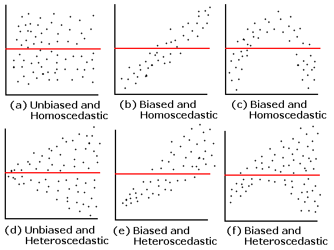
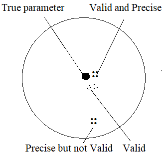

## Keywords

Autocorrelation
: relationship of the observations between the different points in time

Baseline survey
: a survey which measures key conditions (indicators) before a project begins against which change and progress can be assessed.

Collinearity
: a linear association between two explanatory variables.

Confounder
: a variable that influences both the dependent variable and independent variable

Multicollinearity
: a situation in which more than two explanatory variables in a multiple regression model are highly linearly related

Power
: The chance that the study will be able to demonstrate a significant difference or effect if it is present.

Orthogonal
: (of an experiment) having variates which can be treated as statistically independent.

## Formulae

Covariance, $Cov(X,Y) = \frac{\sum(X_i- \bar X)(Y_i - \bar Y)}{n}$

## Regression

Let, $Y = \alpha + \beta X + \epsilon$

$E[Y|X] = \alpha + \beta X$

$\beta = E(Y|X = x+1) - E(Y|X=x)$

### Assumptions of simple linear regression

- Condition of Y given X is a linear function of the parameter, i.e., $E(Y|X) = \alpha + \beta X$.
- $E(\epsilon _i)=0 \forall i = 1, 2, 3, \cdots, n$
- $Var(\epsilon _i) = E(\epsilon_i^2) = \sigma^2 \forall i = 1, 2, 3, \cdots, n$
- $\epsilon \sim NID(0, \sigma^2)$
- $Cov(\epsilon_i, \epsilon_j) = 0 \forall i\ne j = 1, 2, \cdots, n$ (if not, autocorrelation)
- X is non-stochastic (non-random) variable

N:B: $Cov(\epsilon_i, \epsilon_j) = E(\epsilon_i, \epsilon_j)- E(\epsilon_i) E(\epsilon_j)$

\begin{eqnarray} 
Y = \alpha + \beta X + \epsilon      \nonumber \\
&\Rightarrow& \hat Y_i = \hat \alpha + \hat \beta X \nonumber \\
&\Rightarrow& \epsilon_i = Y_i - \hat Y_i   \nonumber \\
\end{eqnarray}

\begin{equation} 
\begin{split}
\mathrm Cov(x,x) & =\mathrm E(x,x) - [E(x)]^2\\
& =E(x^2) - [E(x)]^2\\
& =Var(x)
\end{split}
(\#eq:covxx)
\end{equation}

See \@ref(eq:covxx)

### Heteroskedasticity

```{r skedas, echo=FALSE, fig.cap = "Bias and Heteroskedasticity", fig.align = 'center', out.width = '60%'}
knitr:: 
```

### OLS estimates

$Y = \alpha + \beta X + \epsilon$

$\epsilon_i = Y_i - \hat Y_i$

$\sigma  \sum$

\begin{eqnarray} 
&\Rightarrow& SSE =\Sigma \epsilon_i^2 = \sum(Y_i-\alpha -\beta X)^2      \nonumber \\
&\Rightarrow& \frac{\delta SSE}{\delta \alpha} = 0 \nonumber \\
&\Rightarrow& -2 \Sigma (Y_i - \alpha - \beta X_i) \nonumber \\
&\Rightarrow& \frac{\delta SSE}{\delta \beta} = 0 \nonumber \\
&\Rightarrow& 2 \Sigma(Y_i - \alpha - \beta X_i(-X_i)) = 0 \nonumber \\
&\Rightarrow& \Sigma (Y_i - \alpha - \beta X_i) \nonumber \\
\end{eqnarray}

\begin{equation} 
  \Sigma Y_i = n \alpha + \beta X_i
  (\#eq:reg1)
\end{equation} 

\begin{equation} 
  \Sigma Y_i X_i = \alpha \sum X_i + \beta X_i^2
  (\#eq:reg2)
\end{equation}

By doing this operation: \@ref(eq:reg2) $\times$ n - \@ref(eq:reg1) $\times \Sigma X_i \Rightarrow$

\begin{equation} 
  \hat \beta = \frac{\Sigma X_i Y_i - n \bar X \bar Y}{\Sigma X_i^2 - n \bar X^2}
  (\#eq:betahat)
\end{equation}

### Properties of Residual 

$\Sigma e_i = 0$

\begin{equation} 
\begin{split}
\mathrm \Sigma e_i & =\mathrm \Sigma(Y_i-\hat Y_i)\\
& =\Sigma(Y_i-(\hat \alpha + \hat \beta X_i))\\
& =\Sigma(Y_i-\bar Y + \hat \beta \bar X - \hat \beta X_i\\
& =\Sigma(Y_i- \bar Y -\hat \beta (X_i-\bar X))\\
& =0
\end{split}
(\#eq:res-zero)
\end{equation} 

### Total Sum of Squares

\begin{equation} 
\begin{split}
\mathrm SST & =\mathrm \Sigma (Y_i-\bar Y)^2\\
& =\Sigma[(Y_i - \hat Y_i) + (\hat Y_i - \bar Y)]\\
& =\Sigma(Y_i-\hat Y_i)^2 + \Sigma (\hat Y_i - \bar Y)^2 + 2 \Sigma(Y_i-\hat Y_i)(\hat Y_i - \bar Y)\\
& =SSE + SSR
\end{split}
(\#eq:sst)
\end{equation}

## Econometrics


### Model Misspecification


#### Omission of independent variable

Assume the model is $Y_i = \beta_2 x_{2i} + \beta_3 x_{3i} + \epsilon$

Estimated model: $Y_i = \beta_2^* x_{2i} +  + \epsilon^*$

Now, $\beta_2^* = \frac{\Sigma x_{2i}y_i}{\Sigma x_{2i}^2}$

Finally, $E(\beta_2^*) = \beta_2 + \beta_3 \frac{Cov(x_{2i},x_{3i})}{V(x_{2i})}$

Thus, $\beta_2^*$ is biased and inconsistent.

**Some other consequences**

- $V(\epsilon_i)$ would be incorrectly estimated. 
- $V(\hat\beta_2^*)$ would be biased
- CI and hypothesis testing will give misleading conclusion


#### Inclusion of extra variable

## Epidemiology

### Odds Ratio (OR)

$OR = \frac{P(D|E)}{P(\bar D|E)}/\frac{P(D|\bar E)}{P(\bar D|\bar E)}$

Can be calculated for 

- Population-based study
- Cohort study

Cannot be calculated for case-control study


### Validity and Precision

```{r val-prec, echo=FALSE, fig.cap = "Validity and Precision", fig.align = 'center', out.width = '60%'}
knitr:: 
```

