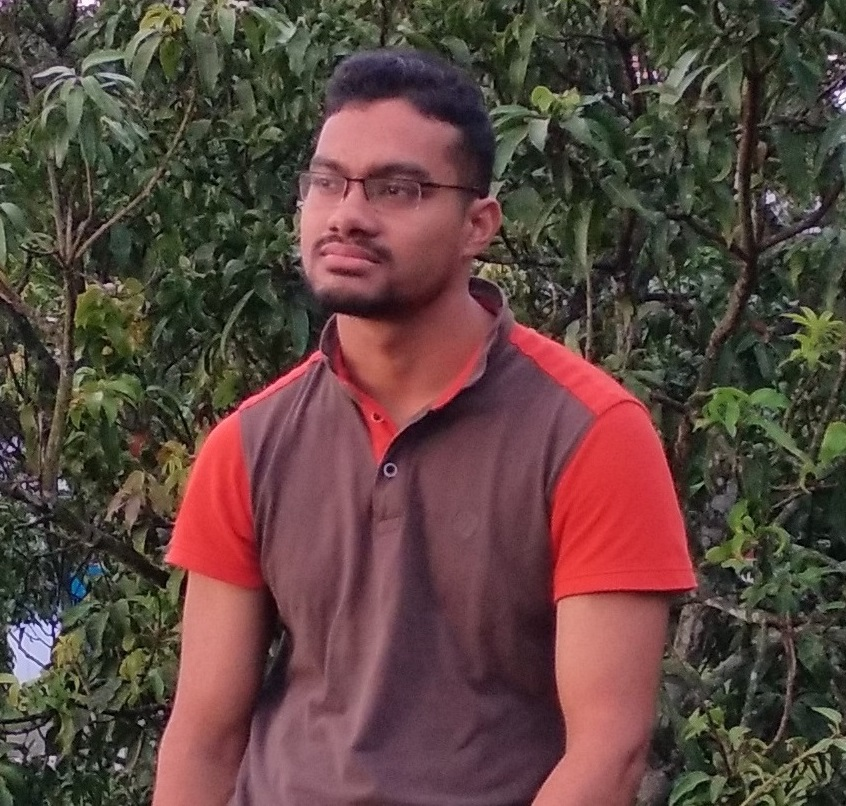

--- 
title: "Statistics and Mathematics Lectures"
author: "Abdullah Al Mahmud"
date: "2021-03-03"
site: bookdown::bookdown_site
output: bookdown::gitbook(split_by="section")
documentclass: book
biblio-style: apalike
link-citations: yes
github-repo: rstudio/bookdown-demo
description: "Lectures on Statistics And Mathematics"
---

# About {-}

This websites contains lectures on statistics and mathematics. All the lectures are made using R programming language inside Rstudio IDE. The presentations were made using the revealjs package. This page was generated using the bookdown package. 

<!--chapter:end:index.Rmd-->

# Statistics {- #pres}

## First Paper

### Preliminary Concepts

### Collection, Presentation, and Organization of Data

### Measures of Central Tendency

### Measures of Dispersion

### Moments, Skewness, and Kurtosis

#### Central Moments

Central Moments: $\mu_r=\frac{\sum(x_i-\bar x)^r}{n}$

- $\mu_1=\frac{\sum(x_i-\bar x)}{n}=\frac{\sum x_i}{n}-\frac{n \bar x}{n}=\frac{n \bar x}{n}-\frac{n \bar x}{n}=0$

- $\mu_2=\frac{\sum(x_i-\bar x)^2}{n}=\sigma^2$
- $\mu_3=\frac{\sum(x_i-\bar x)^3}{n}$
- $\mu_4=\frac{\sum(x_i-\bar x)^4}{n}$
- For grouped data: $\mu_r=\frac{\sum f_i(x_i-\bar x)^3}{n}$

#### Raw Moments

 $\mu_r=\frac{\sum(x_i-a)^r}{n}$; a is arbitrary number

<!--chapter:end:01-stat.Rmd-->

# Presentations {- #pres}

## How to Use {- #how}

- Press `space` to go the next slide.
- Press up-arrow ($\uparrow$) or `P` to go the previous slide.

See more [here](https://defkey.com/reveal-js-shortcuts)

## Statistics {- #stat}

### First Part {-}

- [Chapter 01: Introduction](https://lecture.statmania.info/stat/ch1_xi_stat.html)
- [Chapter 02: Collection, Presentation, and Organization of Data](https://lecture.statmania.info/stat/ch2_xi_stat.html)
- [Chapter 03: Measures of Central Tendency](https://lecture.statmania.info/stat/ch3_xi_stat.html)
- [Chapter 04: Measures of Dispersion](https://lecture.statmania.info/stat/ch4_xi_stat_dispersion.html)

### Elementary Statistics {-}

- [Elementary Statistics](https://lecture.statmania.info/stat/stat_preliminaries.html)

## Mathematics {- #math}

### Higher Secondary {-}
 
- [Dispersion and Probability](https://lecture.statmania.info/math/xi_math_probability.html)
- [Permutation and Combination](https://lecture.statmania.info/math/xi_math_perm_comb.html)

### Class IX-X {-}

- [Statistics](https://lecture.statmania.info/math/x_stat.html)
- [Probability](https://lecture.statmania.info/math/x_prob.html)

### Class Eight {-}

- [Mathematics Exercises](https://lecture.statmania.info/math/viii_math_exercise.html)
- [Algebra](https://lecture.statmania.info/math/viii_math_algebra.html)

### Class Seven {-}

- [Mathematics Exercises](https://lecture.statmania.info/math/vii_math_exercise.html)
- [Chapter 7.3](https://lecture.statmania.info/math/vii_math_7.3.html)

# About me {-}

I am a **lecturer in statistics** at *Pabna Cadet College*, Pabna, where I joined on 19 October, 2019. Before joining here, I was employed as a research assistant at *EAL*, Dhaka. I also worked as a science contributor for *The Daily Prothom Alo*. 

I have, with the pen name *Abdullah Adil Mahmud (আব্দুল্যাহ আদিল মাহমুদ)*, written **three science books**, which are all available for purchase on [Rokomari.com](https://www.rokomari.com/book/author/47631).

Hailing from Lakshmipur Sadar Upazila, I graduated with **B.S.** and **M.S.** degrees from the **University of Dhaka**.

I founded [Bishwo.com](https://www.bishwo.com) and serve as the editor and contributor of [মহাবিশ্ব](https://sky.bishwo.com) and [Stat Mania](https://www.statmania.info).

I am very passionate about teaching, writing, programming, and data analysis, and I continue doing all of them.

**Learning** is by far my best hobby. In my free time, I love to roam around, connect with people, and watch sky.

**Learn more about me at my website (<https://mahmud.statmania.info>)**

<!--chapter:end:02-pres.Rmd-->

