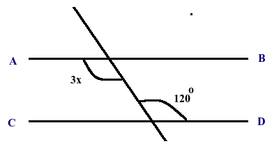

\begin{center}
\begin{large}
Pabna Cadet College
\end{large}

4th Tutorial Examination Solution

Subject: Mathematics

Class: VII
\end{center}

Time: 40 minutes
\hfill
Full Marks: 20

\textbf{Answer all the questions}

1. If the area of a square is 29.16 sq. meters, what is length of its each side? 
i.  5.40 ii. 4.50  iii.  5.42 iv. 5.44

**Answer:** i.  5.40

2. Consider a = 2 and b = 7. Consider an expression ab - 1. What is the smallest numbers that is to be added to or subtracted from this expression to make it a perfect square number? 
i. 3 ii. 2  iii.  4 iv. 5

**Answer:** i. 3 

3. The square root of which fraction is a perfect square? 
i.  $\frac{9}{16}$ ii. $\frac{16}{25}$  iii.  $\frac{25}{36}$ iv. $\frac{16}{81}$

**Answer:** iv. $\frac{16}{81}$

4. What is the square root of 0.067 up to three digits? 
i.  0.257 ii. 0.259  iii.  1.259 iv. 0.359

**Answer:** ii. 0.259

5. A canoe can travel 6 km per 30 minutes in still water. What is the speed of the vehicle in kph?  
i.  15 kph ii. 16 kph  iii.  12 kph iv. 9 kph

**Answer:** iii.  12 kph

6. A cistern has two pipes. The first and second pipes can fill the empty cistern in 10 and 12 hours, respectively. In 1 hour, how many parts of the cistern is to be filled by two pipes?  
i.  $\frac{11}{60}$ ii. $\frac{11}{66}$  iii.  $\frac{11}{12}$ iv. $\frac{10}{12}$

**Answer:** i.  $\frac{11}{60}$

7. 15 Persons can complete a work in 20 days; how many persons can do it in 1 day?  
i.  240 ii. 300  iii.  425 iv. 320

**Answer:** ii. 300

8. A vehicle consumes 1o liters of diesel to go 80 km. How much diesel (in ml) does it require to go 1 kilometer?  
i.  8 ii. 80  iii.  25 iv. 125

**Answer:** iv. 125

9. A merchant sells 30,500 gm lentil per day. How many kgs of lentil does he sell in 30 days? 
i.  915 ii. 550 iii.  815 iv. 519

**Answer:** i.  915

10. $x^2+9=0$; What is value of x?
i.  3 ii. -3  iii.  $\pm3$ iv. No Real values

**Answer:** iv. No Real values

11. What is the root of the equation $\frac{z}{3}- \frac{z-1}{4}=1$
i.  8 ii. 9  iii.  7 iv. 5

**Answer:** ii. 9

12. What is the number, if 27 is subtracted from it, the difference will be -21? 
i.  6 ii. 8  iii.  -6 iv. 21

**Answer:** i.  6

13. The sum of three successive numbers is 201; what is the largest number?
i.  70 ii. 67  iii.  68 iv. 66

**Answer:** iii.  68

14. Sakib collects some stamps; he gives half of them to his friends and one third to his brother. He still has 10 stamps with himself. How many stamps did he collect? 
i.  30 ii. 20  iii.  50 iv. 60

**Answer:** iv. 60

15. In which quadrant is (-1, 3) situated?  
i.  Second ii. First  iii.  Third iv. Fourth

**Answer:** i.  Second

16. In which of the following point of x-axis, the equation 4x - 7 = 0 will intersect? 
i.  $(\frac 4 7,0)$ ii. $(\frac 7 4,0)$  iii.  $(0, \frac 4 7)$ iv. $(0, \frac 7 4,0)$

**Answer:** ii. $(\frac 7 4,0)$

17. Consider these points: A (0,2); B(5,5); C(5,3); and D(5,0). Put them on graph paper, and draw lines from A to B, from B to C, from C to D, and from D to A. What is the shape that has been generated? 
i.  Triangle ii. Parallelogram  iii.  Square iv. Rhombus

**Answer:** i.  Triangle

18. If a line intersects two other lines, how many pairs of corresponding angle are made?
i.  2 ii. 4  iii.  3 iv. 6

**Answer:** ii. 4

19. 
 

In the figure, AB || CD. What is the value of x?

i.  45 ii. 50  iii.  40 iv. 20

**Answer:** iii.  40

20. If the side of a triangle is 6 cm and adjoining angles are 60 degrees and 30 degrees, how will the triangle be? 
i.  Right-angled ii. Isosceles  iii.  Equilateral iv. Acute-angled

**Answer:** i.  Right-angled

\begin{center}
---Good Luck---
\end{center}
