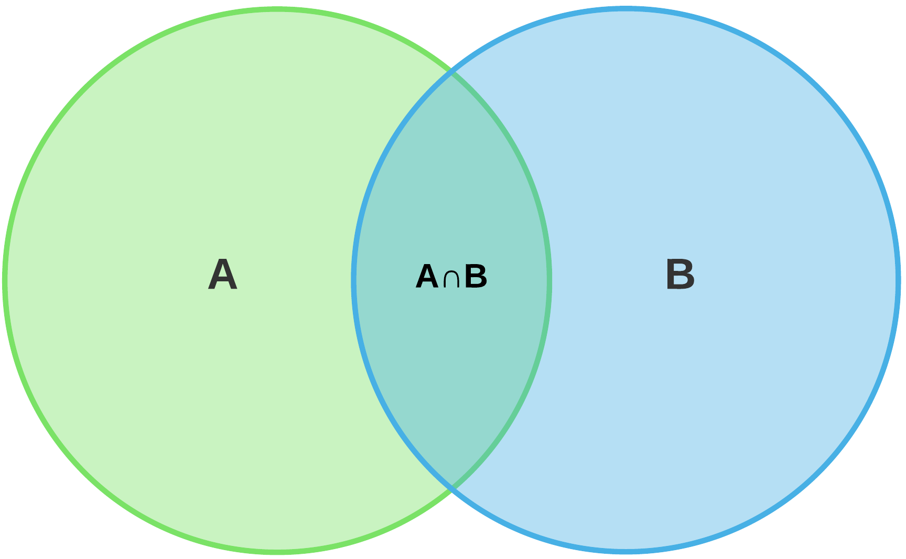

# Concept of dispersion

## What is Dispersion? {data-background=white}


<div class="container">
<div class="col">
```{r, echo=F, fig.width=6, fig.height=6}
par(bg="white")
source('../r/sketch_circle.R')
sketch_circle()
``` 
</div>
<div class="col">
</br>
</br>

- Which plot has the largest dispersion?
- Which plot has the smallest dispersion?

</div>
</div>

## Why?

To

- estimate reliability
- compare variability of several sets of data
- enable further analysis
- have a perception of probability

## Criteria of A Good Measure

- Well-defined
- Easy to understand and compute
- Based on all observations
- Suitable for for further mathematical/statistical analysis
- Less affected by sample fluctuation
- Unaffected by outliers

## Types of Measure{data-background=white}

```{r, echo=FALSE}
DiagrammeR::grViz("digraph {

graph [layout = dot, rankdir = TB]

node [shape = rectangle, style = filled, fillcolor = white, fontcolor = blue]
msr [label = 'Measures of Dispersion']
abs [label = 'Absolute Measure']
rel [label = 'Relative Measure']
md [label =  'Mean \n Deviation']
rng [label = 'Range']
sd [label = 'Stanard Deviation']
qd [label= 'Quartile deviation']
abt [label= 'About']
coef [label ='Coefficient of']
var [label ='Variance']
med [label ='Median']
mean [label = 'Mean']
mod [label ='Mode']


{msr}  -> {abs, rel} 
abs -> rng
abs -> {md, sd, qd}
rel -> coef
coef -> {rng, md, qd, var}
md -> abt
abt -> {mean, med, mod}
}")
```

## Range

<div class="container">
<div class="col">
Ungrouped Data
Range, $R = X_H - X_L$
</div>
<div class="col">
Grouped Data
Range, $R = R_u - R_l$

$L_u$ = Upper boundary of the highest class

$L_l$ = Lower boundary of the lowest class

</div>
</div>

$X=$ `r set.seed(300);(x=sample(30,15))`

> - Range = `r range(x)[2]-range(x)[1]`

## Dis(advantages) of Range

- [x] Simple & quick
- [ ] <span style="color: red;">Influenced by outliers</span>
- [ ] <span style="color: red;">Not suitable for for further mathematical analysis</span>
- [ ] <span style="color: red;">Cannot be computed for open-ended distribution</span>

## Mean Deviation (MD)

<div class="container">
<div class="col">
Ungrouped Data

$MD(k)=\frac{\sum_{i=1}^n |x_i-k|} n$

</div>
<div class="col">
Grouped Data
$MD(k)=\frac{\sum_{i=1}^n f_i|x_i-k|} n$ 
</div>
</div>
 k =
\begin{cases}
\bar x, & \text{for MD about mean} \\
\tilde x, & \text{for MD about median} \\
Mo, & \text{for MD about Mode}
\end{cases}

## Compute MD 

Compute about mean, median and mode 
> - X = `r x`

## Dis(advantages) of MD

- [x] Simple
- [x] Unaffected by outliers 
- [ ] <span style="color: red;">Useful for symmetric data only</span>
- [ ] <span style="color: red;">Not suitable for for further mathematical analysis</span>

## Variance and SD


<div class="container">
<div class="col">
### Variance 

$$\sigma ^2 = \sum_{i=1}^n \frac{(x_i-\bar x)^2}{n}$$

$\quad$ = $\sum \frac{x_i^2}{n}-(\frac{\sum x_i}{n})^2$

$\quad$ =  Mean of square - square of mean
</div>
<div class="col">
### *Standard Deviation* ($\sigma$)

Positive square root of variance

> - $$\sigma  = \sqrt{\sum_{i=1}^n \frac{(x_i-\bar x)^2}{n}}$$
> - For grouped data? 
</div>
</div>

## Variance Estimation

| $x$ | $x^2$ |
|------:|:-----:|
|   12  |  144  |  
|  11  |  121 |  
|  3   |    9 |  
|$\sum x = 26$ |$\sum x^2 = 274$|

$\sigma^2$=Mean of square - square of mean

$\quad$ =$\bar {x^2}-{\bar x}^2$

> - $\therefore \sigma^2 = \frac{274}{3}-(\frac{26}{3})^2 =$ `r (x=c(3,11,12)); round(var(x),3)`
> - $\sigma =$ `r round(sd(x),3)`

## Why Variance?

### <span style="color: blue;">Think</span>

- What is the unit of variance
- What is the unit of sd?
- Why is variance determined before sd? 
- What do variance and sd mean?

## Dis(advantages) of SD

- [x] Well-defined
- [x] Less affected by sample fluctuation
- [x] Useful for further mathematical analysis
- [x] Measures consistency
- [ ] <span style="color: red;">Difficult to compute</span>
- [ ] <span style="color: red;">Affected by outliers</span>

## Variance Example

X = `r set.seed(30); (v=sample(20:35,8))`

Find variance and stand deviation

> - Variance, $\sigma^2=$ `r round(var(v),3)`
> - SD, $\sigma$ = `r round(sd(v),3)`

## Quartile Deviation(QD)

<div class="container">
<div class="col">
$QD=\frac{Q_3-Q_1} 2$

$Q_3-Q_1$ is called Interquartile range. 
</div>
<div class="col">
### Dis(advantages)

- [x] Simple
- [x] Unaffected by outliers
- [x] Can work with open-ended distribution
- [ ] <span style="color: red;">Not based on all observations</span>
- [ ] <span style="color: red;">Not suitable for for further mathematical analysis</span>
</div>
</div>

## Coefficients 
<small>
- Coefficient of Range,$CR=\frac{X_H-X_L}{X_H+X_L}\times 100= \frac{\text{Range}}{X_H+X_L}\times 100=\frac{X_u-X_l}{X_u+X_l}\times 100$ (grouped)

> - Coefficient of Mean Deviation, $CMD=\frac{MD(\bar x)}{\bar x} \times 100$ (about mean, median and mode similarly)
> - Coefficient of Variance, $CV=\frac{\sigma}{\bar x} \times 100$
> - Coefficient of Quartile Deviation, $CQD=\frac{Q_3-Q_1}{Q_3+Q_1} \times 100$

</small>

## Compute Coefficients

X = `r v`

```{r, echo=F}
source('../r/dispersion.R')
```

> - CR = `r cr(v)`
> - $CMD(\bar x)$ = `r round(cmdm(v),3)`
> - CV = `r round(cv(v),3)`
> - CQD = `r round(cqd(v),3)`

## SD vs CV

<div class="container">
<div class="col">
- 60 students earned GPA 5 from VNC
- 45 students earned GPA 5 from Udayan college. 

 Which college is better?
</div>
<div class="col">
- Average batting score of Soumya = 35
- Average batting score of Mushfiq = 34

Who is better?
</div>
</div>

## Image {data-background=white}


