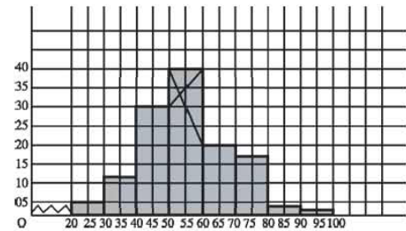

## What is Statistics

Statistics has three meanings:

i. Data (table or a series of values)

  ```{r,echo=F}
  knitr::kable(
  morley[1:6, ], booktabs = TRUE,
  caption = 'Light speed experiment'
)
  ```
ii. Plural of statistic (formula)
iii. Method of analyzing and predicting data

## Data 

Data: Information expressed in numbers (usually)

`r set.seed(100);  sample(30,15) `

## Types of Data

i. Primary Data: Collected directly
ii. Secondary Data: Fetched from someone else


<div onclick="klikaj('rad1')"><span style="color: blue;">Examples</span></div>
<div id="rad1" style="visibility: hidden">
i. A researcher collects rainfall data everyday for predicting future rainfall.
ii. An investigator collects family and geographical information of criminals.
iii. WHO tracks information of Covid-19 patients.
iv. An independent researcher uses information collected by WHO. 
v. A teachers borrowes marks graded by another teacher. 
</div>
<script>
function klikaj(i) {
    document.getElementById(i).style.visibility='visible';
}
</script>

## Unorganized and Organized Data

<div class="container">
<div class="col">
`r set.seed(190); (x=sample(30:40, 20, replace=T))`
</div>
<div class="col">
  ```{r,echo=F}
  knitr::kable(
  as.data.frame(table(x))
  ) 
  ``` 
</div>
</div>

## Frequency Distribution

X = 11, 15, 16, 18, 20, 22, 25 

| Class |  Tally | Frequency |
|:-----:|:------:|:---------:|
| 11-15 |  \|\|  |     2     |
| 16-20 | \|\|\| |     3     |
| 21-25 |  \|\|  |     2     |

## Construction

Range = (Highest value - Lowest value) + 1

X = 11, 15, 16, 18, 20, 22, 25 

Range of X = ?

Class Interval

$(11-15) \rightarrow (15-11+1)=  5$, not 4

> - $(20-24) \rightarrow ?$
> - Number of class = $\frac{Range}{Interval}$ 
> - Interval = ? 

## Example of Frequency Distribution

X = `r set.seed(90); (x = sample(50, 30))`

Distribution

Range = ?

Let, class interval = 5

Number of class = ? 

> - Now, construct

## Interpretation

<div class="container">
<div class="col">
| Class | Frequency |
|:-----:|:---------:|
| 11-15 |     2     |
| 16-20 |     5     |
| 21-25 |     9     |
| 26-30 |     10    |
| 31-35 |     3     |
</div>
<div class="col">
- What have you known from this frequency distribution? 
- What is the benefit of organizing? 
</div>
</div>

## Histogram

<div class="container">
<div class="col">
- Make sure class intervals are continuous

  **Continuous or exclusive:** (10-15); (15-20); (20-25)
  **Discontinuous/Inclusive:** (10-14); (15-19)
  
> - If discontinuous $\rightarrow$ convert
> - Add 0.5 to upper limit and subtract 0.5 from lower limit
</div>
<div class="col">
<div onclick="klikaj('rad2')"><span>$\downarrow$</span></div>
<div id="rad2" style="visibility: hidden">
Conversion

| Continuous CI | Discontinuous CI |
|:-------------:|:----------------:|
|     10-14     |     9.5-14.5     |
|     15-19     |     14.5-19.5    |
|     20-24     |     19.5-24.5    |
|     25-29     |     24.5-29.5    | 
</div>
<script>
function klikaj(i) {
    document.getElementById(i).style.visibility='visible';
}
</script>
</div>
</div>

## Histogram Example

<div class="container">
<div class="col">
| Interval | Frequency |
|:-:|:-:|
| 20-30 | 5 |
| 30-40 | 12 |
| 40-50 | 30 |
| 50-60 | 40 |
| 60-70 | 20 |
| 70-80 | 13 |
| 80-90 | 3 |
| 90-100 | 2 |
</div>
<div class="col">

Write its interpretation in 3-5 sentences.

</div>
</div>


## Make a Histogram

<div class="container">
<div class="col">
| Class Interval | Continuous CI | Frequency |
|:-:|:-:|:-:|
| 11-20 |  | 10 |
| 21-30 |  | 20 |
| 31-40 |  | 35 |
| 41-50 |  | 20 |
| 51-60 |  | 15 |
| 61-70 |  | 10 |
| 71-80 |  | 8 |
| 81-90 |  | 5 |
| 91-100 |  | 3 |
</div>
<div class="col">
Histogram 
</div>
</div>


