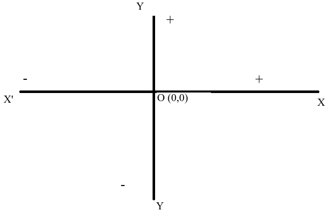
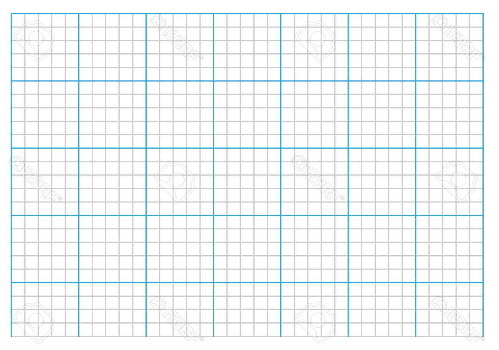

# Chapter 7.3 (Graphs)

## What We Learn from This Plot

## Coccept of graph 
Imagine you are at your home. You came out and went 10m eastward and 5m southward. Where is you current location? 

> - This point is called (10,5)

## Know this man? 

## Quadrants and Axes

Where would these points be?

Mention that "lengths of the side of the smallest square as unit along both axes." 

- (10,2)
- (-10,2)
- (10,-5)
- (-10,-5)

## Put on graph paper

- A (5,3)
- B (5,-3)
- C (-5,3)
- D (-5,-3)

## Find the geometric shape from this coordinates

i. (3,2); (6,2); (6,4); (3,4)
ii. (0,4); (2,2); (4,0)
iii. (2,0); (3,4); (4,0)

Draw these points. What are the shapes?

## Plotting an Equation

y = 3x + 5

If x = 2, 3, 4, 5

$y=3 \times 2 + 5 = 11$...

## Solving Equation with Graph

First solve manually 

13. Solve and show solutions using graphs

i. x-4=0
ii. 2x+1 = x-3 

> - Classwork: 3x+4 = 5x

 

## Exercise 7.3 (14)
Length of three sides of a triangle are (x+2), (x+4), and (x+6) cm (x>0). Perimeter of the triangle is 18 cm. 

i. Draw a proportional figure using the conditions. 
ii. Formulate and solve. 
iii. Draw the graph of the solution. 

 

## Exercise 7.3 (15)