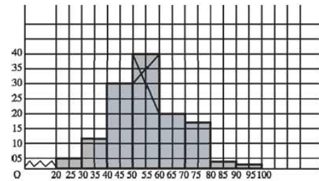

Statistics has three meanings:

i. Data (table or a series of values)

  ```{r,echo=F}
  knitr::kable(
  morley[1:6, ], booktabs = TRUE,
  caption = 'Light speed experiment'
)
  ```
  
> - ii. Plural of statistic (formula)
> - iii. Method of analyzing and predicting data

## Unorganized and Organized Data

<div class="container">
<div class="col">
`r set.seed(190); (x=sample(30:40, 20, replace=T))`
</div>
<div class="col">
  ```{r,echo=F}
  knitr::kable(
  as.data.frame(table(x))
  ) 
  ``` 
</div>
</div>

## Frequency Distribution

X = 11, 15, 16, 18, 20, 22, 25 

| Class |  Tally | Frequency |
|:-----:|:------:|:---------:|
| 11-15 |  \|\|  |     2     |
| 16-20 | \|\|\| |     3     |
| 21-25 |  \|\|  |     2     |

## Construction

Range = (Highest value - Lowest value) + 1

X = 11, 15, 16, 18, 20, 22, 25 

Range of X = ?

Class Interval

$(11-15) \rightarrow (15-11+1)=  5$, not 4

> - $(20-24) \rightarrow ?$
> - Number of class = $\frac{Range}{Interval}$ 
> - Interval = ? 

## Example of Frequency Distribution

X = `r set.seed(90); (x = sample(50, 30))`

Range = ?

Let, class interval = 5

Number of class = ? 

> - Now, construct

## Interpretation

<div class="container">
<div class="col">
| Class (Marks out of 40) | Frequency |
|:-----:|:---------:|
| 11-15 |     2     |
| 16-20 |     5     |
| 21-25 |     9     |
| 26-30 |     10    |
| 31-35 |     3     |
</div>
<div class="col">
- What have you known from this frequency distribution? 
- What is the benefit of organizing? 
</div>
</div>

## Cumulative Frequency

| Class (Marks out of 40) | Frequency | Cumulative Frequency |
|:-----:|:---------:|:---------:|
| 11-15 |     2     |     2     |
| 16-20 |     5     |     7     |
| 21-25 |     9     |    16     |
| 26-30 |     10    |     26    |
| 31-35 |     3     |     29    |

- **Why Useful??**
- How to interpret?

## Variable 


<div class="container">
<div class="col">
- Discrete: Any of the pre-specified number
- Continuous/Indiscrete: Any number between any two other numbers. 
</div>
<div class="col">
> - Temperature
> - Result of a die throw
> - Mark of a subject
> - GPA of a student
> - Radius of screws 
</div>
</div>

# Diagram


## Histogram

<div class="container">
<div class="col">
- Make sure class intervals are continuous

  **Continuous or exclusive:** (10-15); (15-20); (20-25)
  **Discontinuous/Inclusive:** (10-14); (15-19)
  
> - If discontinuous $\rightarrow$ convert
> - Add 0.5 to upper limit and subtract 0.5 from lower limit
</div>
<div class="col">
<div onclick="klikaj('rad2')"><span>$\downarrow$</span></div>
<div id="rad2" style="visibility: hidden">
Conversion

| Continuous CI | Discontinuous CI |
|:-------------:|:----------------:|
|     10-14     |     9.5-14.5     |
|     15-19     |     14.5-19.5    |
|     20-24     |     19.5-24.5    |
|     25-29     |     24.5-29.5    | 
</div>
<script>
function klikaj(i) {
    document.getElementById(i).style.visibility='visible';
}
</script>
</div>
</div>

## Histogram Example

<div class="container">
<div class="col">
| Interval | Frequency |
|:-:|:-:|
| 20-30 | 5 |
| 30-40 | 12 |
| 40-50 | 30 |
| 50-60 | 40 |
| 60-70 | 20 |
| 70-80 | 13 |
| 80-90 | 3 |
| 90-100 | 2 |
</div>
<div class="col">

Write its interpretation in 3-5 sentences.

</div>
</div>


## Make a Histogram

<div class="container">
<div class="col">
| Class Interval | Continuous CI | Frequency |
|:-:|:-:|:-:|
| 11-20 |  | 10 |
| 21-30 |  | 20 |
| 31-40 |  | 35 |
| 41-50 |  | 20 |
| 51-60 |  | 15 |
| 61-70 |  | 10 |
| 71-80 |  | 8 |
| 81-90 |  | 5 |
| 91-100 |  | 3 |
</div>
<div class="col">
Histogram 
</div>
</div>


## Frequency Polygon

- Locate top midpoints of each bar of histogram
- Join the points by straight lines. 

> - How to draw without drawing a histogram first?

<div onclick="klikaj('fpol')"><span>Answer</span></div>
<div id="fpol" style="visibility: hidden">
- Find midpoints of class intervals
- Join the tops of all frequencies. 
</div>
<script>
function klikaj(i) {
    document.getElementById(i).style.visibility='visible';
}
</script>

## Frequency Curve

Somoothed version of frequency polygon

```{r fpol, echo=FALSE, fig.cap = "Frequency Polygon", fig.align = 'center', out.width = '50%'}
knitr:: 
```

## Ogives

```{r, echo=F, fig.show='hide'}
data <- c(16, 26, 12, 10, 27, 30, 14,  1, 25, 20)
h <- hist(data)
intervals <- seq(from = min(h$breaks), to = max(h$breaks), by = h$breaks[2] - h$breaks[1])
intervals <- c(0, intervals[-1])
# Cumulative sums
cf = c(0, cumsum(h$counts))
df <- data.frame(intervals = c("0-5", "5-10", "10-15",
                               "15-20", "20-25", "25-30"), CF = cf[-1])
```

<div class="container">
<div class="col">
```{r, echo=FALSE}
knitr::kable(df, booktabs = TRUE,
  caption = 'Cumulative Frequency (CF) for Ogive'
)
```
</div>
<div class="col">
```{r, echo=F, out.width= '98%'}
plot(intervals, cf, type = "b", col = "blue", pch = 20)
```
</div>
</div>

# Central Tendency

## Arithmetic Mean (AM) 

- From Frequency Distribution: Use mid-values and multiply with frequencies

$$AM = \frac 1 n \sum_{i=n}^n f_ix_i $$

## AM in Short-cut Method

- WHY?
- Is this method really *SHORT*?

## Shortcut Method for AM

<div class="container">
<div class="col">
Calculate the mean in a smart way

```{r, echo=FALSE}
set.seed(100)
x <- sample(1000:1050, 6)
x
```
</div>
<div class="col">
<div onclick="klikaj('rad4')"><span>Show</span></div>
<div id="rad4" style="visibility: hidden">
<small>Subtract a number from all, say 1020</small>
```{r, echo=F}
y <- x-1020
print("The new values are")
y
```

```{r, echo=F}
paste0("Mean of y is ", round(mean(y),2))
paste0("Mean of x is ", round(mean(y)+1020,2))
```
</div>
<script>
function klikaj(i) {
    document.getElementById(i).style.visibility='visible';
}
</script> 

</div>
</div>

## Shortcut Method Formula

<div class="container">
<div class="col">
Consider the values: 1005, 1010, 1015 

If 1000 is subtracted: 5, 10, 15

If again divided by 5: 1, 2, 3

Converted Mean = 2 

Original Mean = $2 \times 5 + 1000=1010$
</div>
<div class="col">
<div onclick="klikaj('rad5')"><span style="color: blue;">Show</span></div>
<div id="rad5" style="visibility: hidden">
x = 1005, 1010, 1015 

> - a = 1000
> - c = 5 
> - y = 1, 2, 3
> - $\bar x = 2 \times 5 + 1000=1010 = a+\bar y \times c$
> - $\bar x = a+\frac{\sum y}{n} \times c$
</div>
<script>
function klikaj(i) {
    document.getElementById(i).style.visibility='visible';
}
</script>
</div>
</div>

## Short-cut Method on Organized Data

```{r short, echo=FALSE, fig.cap = "", fig.align = 'center', out.width = '70%'}
knitr:: 
```