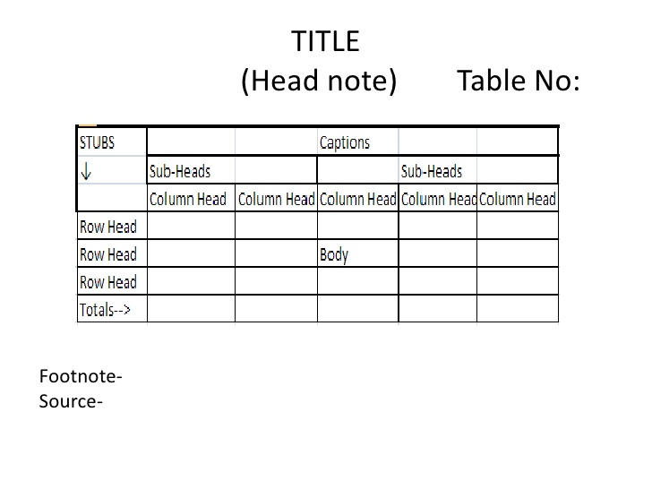

## Types of Data

> - Qualitative
> - Quantitative

## Sources of Data

Primary: Obtained directly (not collected from someone else)

> - Secondary: Using pre-collected data from someone else/some organization

> - <dev>**Example**

> - A researcher buys data from BMD to build a model of rainfall behavior
> - A researcher runs an experiment to measure speed of light using a novel technique.
> - A researcher makes use of the data generated by the one in example 2
</dev>

## Method of Data Collection

> - Direct personal Inquiry
> - Indirect oral inquiry
> - Mail
> - Telephone etc.

> - <div class ="bluetext">Each method has its own advantages and disadvantages;</div>

## Sources of Secondary Data

> - Published: Journal, Newspaper etc.
> - Unpublished: BBS, WHO, IMF, FAO, ICDDR,B

## DIsadvantages of Secondary Data
> - Purpose might be different
> - Suitability
> - Reliability
> - Unit 

## Tabluation


## Data Classification
> - Geographical
> - Chronological
> - Quantitative
> - Qualitative

## Example
<section>
Geographical
  <table>
      <thead><tr>
            <th>Country</th>
            <th>Bangladesh</th>
            <th>USA</th>
        </tr></thead>
        <tbody><tr>
            <td>GDP(m)</td>
            <td>120</td>
            <td>500</td>
        </tr>
</tbody>
    </table>
</section>

<section>
*Chronological (Time series data)*
  <table>
      <thead><tr>
            <th>Year</th>
            <th>2015</th>
            <th>2016</th>
        </tr></thead>
        <tbody><tr>
            <td>GDP(m)</td>
            <td>120</td>
            <td>500</td>
        </tr>
</tbody>
    </table>
    </section>
    
<section>
*Quantitative Classification*
  <table>
      <thead><tr>
            <th>Income level</th>
            <th>40,000-50,000</th>
            <th>50,000-1,00,000</th>
        </tr></thead>
        <tbody><tr>
            <td>Frequency</td>
            <td>120</td>
            <td>34</td>
        </tr>
</tbody>
    </table>
    </section>
    
## Chapter Overview

> - Inclusive vs exclusive 

## Stem and Leaf

- key in stem and leaf plot 
- How to interpret stem and leaf plot 

```{r}
data <- c(16, 26, 12, 10, 27, 30, 14,  1, 25, 20)
stem(data)
```

## How to interpret cf and rf

| Class | Frequency | Cumulative <br><br>Frequency (cf) | Relative <br><br>Frequency (rf) | Cumulative <br><br>Relative <br><br>Frequency (crf) |
|:-:|:-:|:-:|:-:|:-:|
| 30-35 | 4 | 4 | 0.09 | 0.09 |
| 35-40 | 10 | 14 | 0.23 | 0.32 |
| 40-45 | 20 | 34 | 0.45 | 0.77 |
| 45-50 | 8 | 42 | 0.18 | 0.95 |
| 50-55 | 2 | 44 | 0.04 | 1 |
|  | n=44 | n=44 |  |  |
    
## Histogram

Can these intervals be readily used? 
(5-10); (10-15); (15-20)

(5-9); (10-14); (15-20)

If not, what should we do? 

## What Ogives tell us

```{r, echo=F, fig.show='hide'}
data <- c(16, 26, 12, 10, 27, 30, 14,  1, 25, 20)
h <- hist(data)
```

```{r, echo=F}
intervals <- seq(from = min(h$breaks), to = max(h$breaks), by = h$breaks[2] - h$breaks[1])
intervals <- c(0, intervals[-1])
# Cumulative sums
cf = c(0, cumsum(h$counts))
plot(intervals, cf, type = "b", col = "blue", pch = 20)
```

## Bar vs Pie
- When to use which? 
- How to calculate angles? 
- Can we draw on 180 degrees?

# Bar or Pie?
| year | Sales ($) |
|-|-|
| 1996 | 76 |
| 1997 | 58 |
| 1998 | 95 |
| 1999 | 85 |

For this?

| Category | Cost(Tk.) |
|-|-|
| House rent | 10,000 |
| Utility Bill | 3,000 |
| Telecom | 2000 |